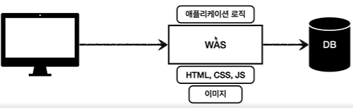
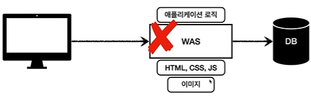
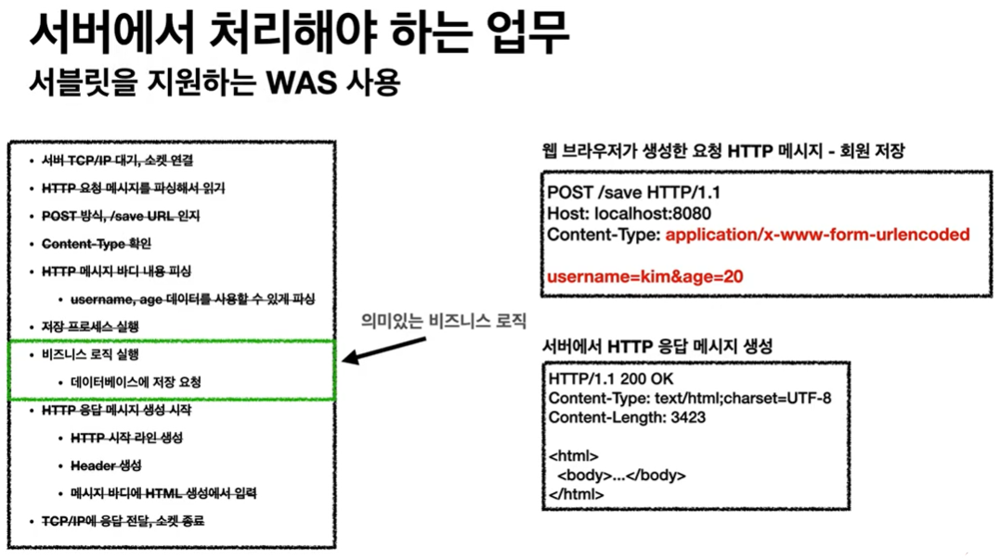
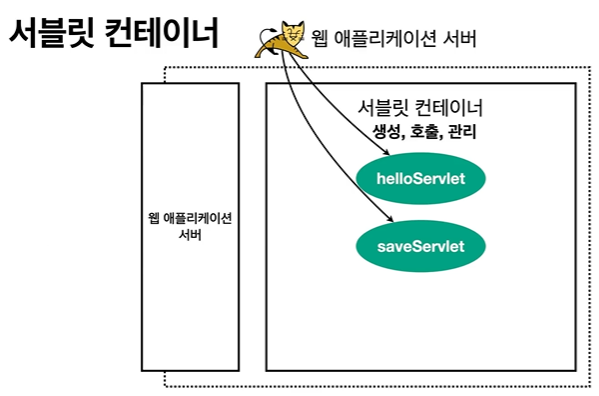
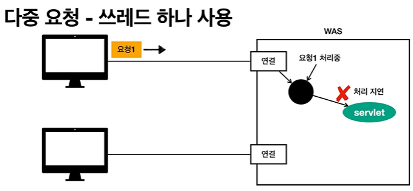

# 웹 어플리케이션 이해

## 1. 웹 서버, 웹 애플리케이션 서버

### 웹 - HTTP 기반


- 예를들어 웹 브라우저에서 url을 치면 인터넷을 통해 서버에 접속을 하고 서버에서는 html을 만들어서 client에 돌려주면 유저는 화면을 볼 수 있다
- 이럴때 전부 http 라는 프로토콜 기반으로 동작한다

### 모든 것이 HTTP
HTTP 메세지에 모든 것을 전송
- HTML, TEXT
- img, 음성, 영상, 파일
- JSON, XML
- 거의 모든 형태의 데이터 전송 가능
- 서버간의 데이터를 주고 받을 때도 거의 HTTP 사용
- 지금은 HTTP 시대

### 웹 서버 (Web Server)
- HTTP 기반으로 동작
- 정적 리소스 제공, 기타 부가 기능
- 정적 파일인 HTML, CSS, JS, 이미지, 영상
- 정적인 리소스를 제공하기 때문에 html을 특정 사용자마다 다르게 보여줄 수 없다
- ex) NGINX, APACHE


만약에 유저가 index.html 주세요 라고 HTTP 요청을 보내면 웹 서버가 index.html을 HTTP로 응답 해준다

### 웹 애플리케이션 서버 (WAS - Web Application - Server)
- HTTP 기반으로 동작
- 웹 서버 기능 포함 + (정적 리소스 제공 가능) 
- 프로그램 코드를 실행해서 애플리케이션 로직 수행 ->이게 웹 서버와의 차이점
  - 동적 HTML, HTTP API(JSON)
  - 서블릿, JSP, 스프링 MVC
  - 프로그램 코드를 사용해서 로직을 사용할 수 있기 때문에 사용자에 따라서 다르게 보여줄 수 있다
- 예) 톰캣(Tomcat) Jetty, Undertow


### 웹 서버, 웹 애플리케시연 서버(WAS) 의 차이
- 웹 서버는 정적 리소스(파일), WAS는 애플리케이션 로직 
- 사실은 둘의 용어도 경계도 모호함 
  - 웹 서버도 프로그램을 실행하는 기능을 포함하기도 함 
  - 웹 애플리케이션 서버도 웹 서버의 기능을 제공함
- 자바는 서블릿 컨테이너 기능을 제공하면 WAS 
  - 서블릿 없이 자바코드를 실행하는 서버 프레임워크도 있음
- WAS는 애플리케이션 코드를 실행하는데 더 특화

### 웹 시스템 구성 - WAS, DB
- 최소한으로 보면 WAS, DB 만으로 시스템 구성 가능
- WAS는 정적 리소스, 애플리케이션 로직 모두 제공 가능

- 하지만 이렇게 하면 WAS가 너무 많은 역할을 담당, 서버 과부하 우려
- 가장 비싼 애플리케이션 로직이 정적 리소스 때문에 수행이 어려울 수 있음
- WAS 장애시 오류 화면도 노출 불가능

- WAS만 가지고 작은 시스템을 구성할 수 있지만 큰 시스템은 좀 힘들다

### 웹 시스템 구성 - WEB, WAS, DB
- 정적 리소스는 웹 서버가 처리 
- 웹 서버는 애플리케이션 로직같은 동적인 처리가 필요하면 WAS에 요청을 위임
- WAS는 중요한 애플리케이션 로직 처리 전담


### 웹 시스템 구성 - WEB, WAS, DB
- 효율적인 리소스 관리
  - 정적 리소스가 많이 사용되면 Web 서버만 증설 
  - 애플리케이션 리소스가 많이 사용되면 WAS만 증설


### 웹 시스템 구성 - WEB, WAS, DB
- 정적 리소스만 제공하는 웹 서버는 잘 죽지 않음 -> 정적 리소스는 가벼우니까
- 애플리케이션 로직이 동작하는 WAS 서버는 잘 죽음 -> 동적 리소스는 무거우니까
- WAS, DB 장애시 WEB 서버가 오류 화면 제공 가능


## 2. 서블릿

### HTML Form 데이터 전송
- 회원 이름과 나이를 넣고 전송을 누르면 회원이 가입되는 방식이라 치면
- 이렇게 http Post 메소드로 서버에 전송한다


### 서버에서 처리해야 하는 업무
만약에 우리가 웹 애플리케이션 서버를 다 구현해야 한다면
- 위 사진의 http 요청 메세지를 전부 파싱해야 한다
- 메소드 방식이 어떤건지, 컨텐트 타입이 뭔지, 메시지 바디엔 어떤 데이터가 들어왔고 그 데이터가 뭔지 전부 파싱해야 된다
- 해석이 완료되면 그에 따른 비지니스 로직을 수행 해야 한다
- 저장 후 http 응답 메세지를 전송한다
진짜 복잡하다 -> 그래서 서블릿이 나왔다 왼쪽에 있는 비지니스 로직을 제외하고 전부 해준다


### 서블릿

```java
@WebServlet(name = "helloServlet", urlPatterns = "/hello")
public class HelloServlet extends HttpServlet {
    @Override
    protected void service(HttpServletRequest request, HttpServletResponse response) {
        //애플리케이션 로직
    }
}
```

- urlPatterns(/hello)의 URL이 호출되면 서블릿 코드가 실행 
- HTTP 요청 정보를 편리하게 사용할 수 있는 HttpServletRequest
- HTTP 응답 정보를 편리하게 제공할 수 있는 HttpServletResponse
- 개발자는 HTTP 스펙을 매우 편리하게 사용


- 웹 브라우저에서 localhost:8080/hello 요청을 때린다
- WAS 에서 요청 메세지를 기반으로 request response 객체를 만든다
- 방금 만든 request, response를 파라미터로 넘겨서 helloServlet을 실행 해준다
- helloServlet이 끝나면 이미 만들었던 response객체를 바탕으로 웹 브라우저에 hello 라는 응답을 보낸

### HTTP 요청, 응답 흐름

- WAS는 Request, Response 객체를 새로 만들어서 서블릿 객체 호출 
- 개발자는 Request 객체에서 HTTP 요청 정보를 편리하게 꺼내서 사용 
- 개발자는 Response 객체에 HTTP 응답 정보를 편리하게 입력 
- WAS는 Response 객체에 담겨있는 내용으로 HTTP 응답 정보를 생성

### 서블릿 컨테이너

컨테이너란 helloServlet 를 자동으로 생성, 호출, 관리 를 해줘서 우리는 다른 곳에 집중할 수 있게 해준다

- 톰캣처럼 서블릿을 지원하는 WAS를 서블릿 컨테이너라고 함 
- 서블릿 컨테이너는 서블릿 객체를 생성, 초기화, 호출, 종료하는 생명주기 관리 
- 서블릿 객체는 싱글톤으로 관리 
  - 고객의 요청이 올 때 마다 계속 객체를 생성하는 것은 비효율
  - 최초 로딩 시점에 서블릿 객체를 미리 만들어두고 재활용
  - 모든 고객 요청은 동일한 서블릿 객체 인스턴스에 접근
  - 공유 변수 사용 주의
  - 서블릿 컨테이너 종료시 함께 종료
- JSP도 서블릿으로 변환 되어서 사용
- 동시 요청을 위한 멀티 쓰레드 처리 지원

## 3. 동시 요청 - 멀티 쓰레드


클라이언트에서 서버로 요청을 보냈다 그럼 서블릿 객체는 누가 호출할까? -> 쓰레드가 호출한다

### 쓰레드
- 애플리케이션 코드를 하나하나 순차적으로 실행하는 것은 쓰레드
- 자바 메인 메서드를 처음 실행하면 main이라는 이름의 쓰레드가 실행
- 쓰레드가 없다면 자바 애플리케이션 실행이 불가능 
- 쓰레드는 한번에 하나의 코드 라인만 수행 
- 동시 처리가 필요하면 쓰레드를 추가로 생성

### 단일 요청 - 쓰레드 하나 사용

쓰레드가 하나 있다고 가정해보자


요청이 오면 쓰레드를 할당해주고 쓰레드가 servlet을 호출해 준다 그리고 나서 응답까지 하고 응답이 끝나면 쓰레드가 휴식한다
근데 쓰레드를 하나 사용하는데 다중 요청이 들어왔다고 쳐보자


하나의 클라이언트가 요청을 했는데 서블릿 안에서 코드가 지연됬다
그사이에 두번째 클라이언트가 요청을하면 쓰레드를 써야되는데? 이러면 쓰레드는 대기한다
이러면 기다리다가 둘다 죽어버린다


이러면 그냥 요청마다 쓰레드를 생성하면 된다 그리고 종료되면 쓰레드 버리면 된다

### 요청 마다 쓰레드 생성 
장점
- 동시 요청을 처리할 수 있다. 
- 리소스(CPU, 메모리)가 허용할 때 까지 처리가능 
- 하나의 쓰레드가 지연 되어도, 나머지 쓰레드는 정상 동작한다

단점
- 쓰레드는 생성 비용은 매우 비싸다. 
  - 고객의 요청이 올 때 마다 쓰레드를 생성하면, 응답 속도가 늦어진다. 
- 쓰레드는 컨텍스트 스위칭 비용이 발생한다. 
- 쓰레드 생성에 제한이 없다. 
  - 고객 요청이 너무 많이 오면, CPU, 메모리 임계점을 넘어서 서버가 죽을 수 있다.

### 쓰레드 풀
요청 마다 쓰레드 생성의 단점을 보안하기 위해 쓰레드 풀을 만든다

- 요청이 올때 마다 쓰레드 풀에서 각자 쓰레드를 할당 받고 쓰레드를 다 쓰면 쓰레드를 죽이는게 아니라 다시 쓰레드 풀에 반납한다
- 근데 200개를 전부 쓰고있다면? 쓰레드 풀은 대기하거나 거절할 수 있다

### 쓰레드 풀 (정리)

필요한 쓰레드를 쓰레드 풀에 보관하고 관리한다.
특징
- 필요한 쓰레드를 쓰레드 풀에 보관하고 관리한다.
- 쓰레드 풀에 생성 가능한 쓰레드의 최대치를 관리한다. 톰캣은 최대 200개 기본 설정 (변경 가능)

사용
- 쓰레드가 필요하면, 이미 생성되어 있는 쓰레드를 쓰레드 풀에서 꺼내서 사용한다. 
- 사용을 종료하면 쓰레드 풀에 해당 쓰레드를 반납한다. 
- 최대 쓰레드가 모두 사용중이어서 쓰레드 풀에 쓰레드가 없으면? 
  - 기다리는 요청은 거절하거나 특정 숫자만큼만 대기하도록 설정할 수 있다.
  
장점 
- 쓰레드가 미리 생성되어 있으므로, 쓰레드를 생성하고 종료하는 비용(CPU)이 절약되고, 응답 시간이 빠르다. 
- 생성 가능한 쓰레드의 최대치가 있으므로 너무 많은 요청이 들어와도 기존 요청은 안전하게 처리할 수 있다.

### 쓰레드 풀 (실무 팁)

- WAS의 주요 튜닝 포인트는 최대 쓰레드(max thread) 수이다. 
- 이 값을 너무 낮게 설정하면? 
  - 동시 요청이 많으면, 서버 리소스는 여유롭지만, 클라이언트는 금방 응답 지연 
- 이 값을 너무 높게 설정하면? 
  - 동시 요청이 많으면, CPU, 메모리 리소스 임계점 초과로 서버 다운 
- 장애 발생시? 
  - 클라우드면 일단 서버부터 늘리고, 이후에 튜닝 
  - 클라우드가 아니면 열심히 튜닝

### 쓰레드 풀의 적정 숫자
- 적정 숫자는 어떻게 찾나요? 
- 애플리케이션 로직의 복잡도, CPU, 메모리, IO 리소스 상황에 따라 모두 다름
- 성능 테스트 
  - 최대한 실제 서비스와 유사하게 성능 테스트 시도 
  - 툴: 아파치 ab, 제이미터, nGrinder

### WAS의 멀티 쓰레드 지원
- 멀티 쓰레드에 대한 부분은 WAS가 처리 
- 개발자가 멀티 쓰레드 관련 코드를 신경쓰지 않아도 됨 
- 개발자는 마치 싱글 쓰레드 프로그래밍을 하듯이 편리하게 소스 코드를 개발
- 멀티 쓰레드 환경이므로 싱글톤 객체(서블릿, 스프링 빈)는 주의해서 사용

## 4. HTML, HTTP API, CSR, SSR

### 정적 리소스
- 고정된 HTML 파일, CSS, JS, 이미지, 영상 등을 제공
- 주로 웹 브라우저
- 이미 생성된 리소스 파일

### HTML 페이지
- 동적으로 필요한 HTML 파일을 생성해서 전달
- 웹 브라우저: HTML 해석

### HTTP API
- HTML이 아니라 데이터를 전달
- 주로 JSON 형식 사용
- 다양한 시스템에서 호출
- 데이터만 주고 받음, UI 화면이 필요하면, 클라이언트가 별도 처리
- 앱, 웹 클라이언트, 서버 to 서버
- 보통 플젝

- 주로 JSON 형태로 데이터 통신
- UI 클라이언트 접점 
  - 앱 클라이언트(아이폰, 안드로이드, PC 앱)
  - 웹 브라우저에서 자바스크립트를 통한 HTTP API 호출
  - React, Vue.js 같은 웹 클라이언트

- 서버 to 서버 
  - 주문 서버 -> 결제 서버 
  - 기업간 데이터 통신

### 서버사이드 랜더링, 클라이언트 사이드 랜더링

SSR - 서버 사이드 렌더링 
- 서버에서 최종 HTML을 생성해서 클라이언트에 전달
- HTML 최종 결과를 서버에서 만들어서 웹 브라우저에 전달 
  - 주로 정적인 화면에 사용 
  - 관련기술: JSP, 타임리프 -> 백엔드 개발자


CSR - 클라이언트 사이드 렌더링
- 
- HTML 결과를 자바스크립트를 사용해 웹 브라우저에서 동적으로 생성해서 적용
- 주로 동적인 화면에 사용, 웹 환경을 마치 앱 처럼 필요한 부분부분 변경할 수 있음
- 예) 구글 지도, Gmail, 구글 캘린더 
- 관련기술: React, Vue.js -> 웹 프론트엔드 개발자

참고    
- React, Vue.js를 CSR + SSR 동시에 지원하는 웹 프레임워크도 있음 
- SSR을 사용하더라도, 자바스크립트를 사용해서 화면 일부를 동적으로 변경 가능

## 5. 자바 백엔드 웹 기술 역사

### 자바 웹 기술 역사
과거

- 서블릿 - 1997 
  - HTML 생성이 어려움
- JSP - 1999 
  - HTML 생성은 편리하지만, 비즈니스 로직까지 너무 많은 역할 담당
- 서블릿, JSP 조합 MVC 패턴 사용 
  - 모델, 뷰 컨트롤러로 역할을 나누어 개발
- MVC 프레임워크 춘추 전국 시대 - 2000년 초 ~ 2010년 초 
  - MVC 패턴 자동화, 복잡한 웹 기술을 편리하게 사용할 수 있는 다양한 기능 지원 
  - 스트럿츠, 웹워크, 스프링 MVC(과거 버전)

현재
- 애노테이션 기반의 스프링 MVC 등장
  - @Controller 
  - MVC 프레임워크의 춘추 전국 시대 마무리
- 스프링 부트의 등장 
  - 스프링 부트는 서버를 내장 
  - 과거에는 서버에 WAS를 직접 설치하고, 소스는 War 파일을 만들어서 설치한 WAS에 배포
  - 스프링 부트는 빌드 결과(Jar)에 WAS 서버 포함 -> 빌드 배포 단순화

최신 기술 - 스프링 웹 기술의 분화
- Web Servlet - Spring MVC -> 서블릿 기반의 스팩, 웹 컨테이너의 멀티 쓰레드
- Web Reactive - Spring WebFlux
  - 특징:
    - 완전한 비동기 넌 블러킹 처리
    - 최소 쓰레드로 최대 성능 - 쓰레드 컨텍스트 스위칭 비용 효율화
    - 함수형 스타일로 개발 - 동시처리 코드 효율화
    - 서블릿 기술 사용X
  - 단점
    - 웹 플럭스는 기술적 난이도 매우 높음
    - 아직은 RDB 지원 부족
    - 일반 MVC의 쓰레드 모델도 충분히 빠름
    - 실무에서 아직 많이 사용하지 않음 1퍼 이하

### 자바 뷰 템플릿 역사
- JSP
  - 속도 느림, 기능 부족

- 타임리프
  - 네추럴 템플릿: html 모양을 유지하면서 뷰 템플릿 적용 가능
  - 스프링 MVC와 강력한 기능 통합
  - 최선의 선택