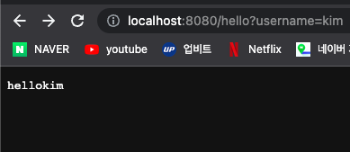
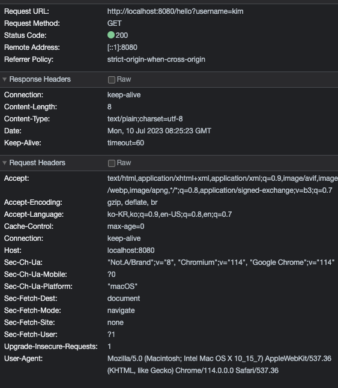
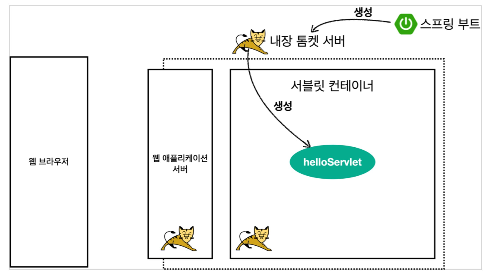
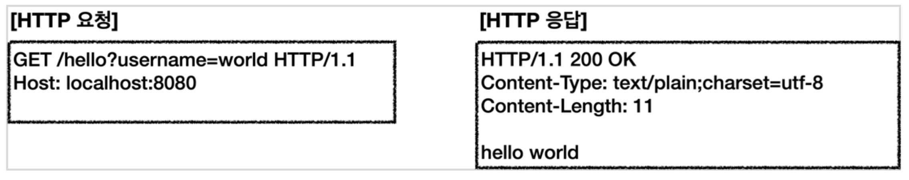
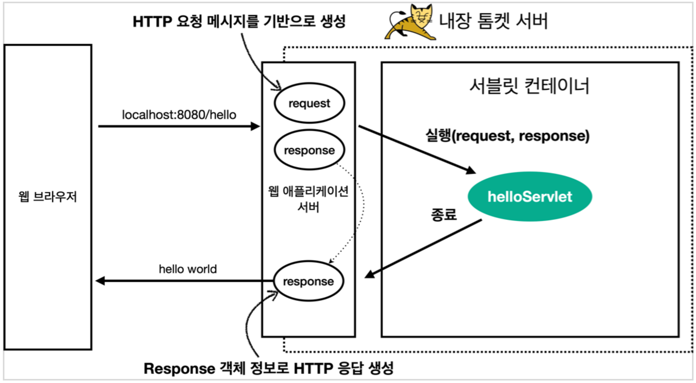
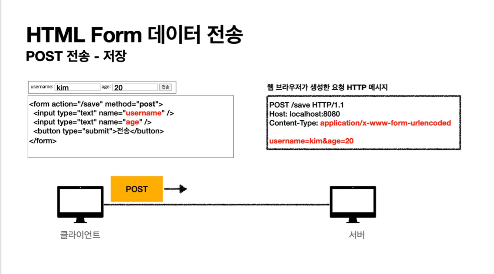

# 2. 서블릿

## 1. Hello 서블릿
스프링 부트 환경에서 서블릿 등록하고 사용

> 사실 스프링 부트와 서블릿은 큰 관련이 없다 톰캣을 직접 설치하고 그 위에 서블릿 코드를 클래스 파일로 빌드해서 올리고 톰캣 서버를 실행하면
> 된다 하지만 번거로우니까 톰캣을 내장하고 있는 스프링 부트를 사용해서 편리하게 사용해보자


@ServletComponentScan	//스프링이 자동으로 현재 패키지를 포함해서 하위 패키지를 뒤져서 서블릿들을 찾는다 그리고 자동으로 서블릿에 등록해서 실행할 수 있게

```java
@ServletComponentScan
@SpringBootApplication
public class ServletStudyApplication {

	public static void main(String[] args) {
		SpringApplication.run(ServletStudyApplication.class, args);
	}

}

```

### 서블릿 등록하기
처음으로 실제 동작하는 서블릿 코드를 등록해보자

http 요청이 오면 was 서블릿 컨테이너가 res, rep 객체를 만들어서 서블릿에 준다고 배웠다


```java
@WebServlet(name = "helloServlet", urlPatterns = "/hello")
public class HelloServlet extends HttpServlet {

    @Override
    protected void service(HttpServletRequest request, HttpServletResponse response) throws ServletException, IOException {

        System.out.println("request = " + request);
        System.out.println("response = " + response);

    }
}


```
- @WebServlet 서블릿 어노테이션
  - name = 서블릿 이름
  - urlPatterns: URL 매핑

Http 요청을 통해 매핑된 url이 호출되면 서블릿 컨테이너는 다음 메서드를 실행한다.

protected void service(HttpServletRequest request, HttpServletResponse response)

localhost:8080/이렇게 요청하면 http 요청 메세지를 만들어서 서버에 던진다

그럼 콘솔에
```java
request = org.apache.catalina.connector.RequestFacade@3a5f4b84
response = org.apache.catalina.connector.ResponseFacade@49966e44
```
이렇게 뜬다 이게 뭐냐면 매개변수에 HttpServletRequest, HttpServletResponse 둘다 인터페이스로 되어있다 여러가지 was서버 (톰캣, 제티, 언더토...)
들이 서블릿 표준 스팩을 구현한다 그 구현체들 이다

```java
@WebServlet(name = "helloServlet", urlPatterns = "/hello")
public class HelloServlet extends HttpServlet {

    @Override
    protected void service(HttpServletRequest request, HttpServletResponse response) throws ServletException, IOException {

        System.out.println("request = " + request);
        System.out.println("response = " + response);

        String username = request.getParameter("username");
        System.out.println("username = " + username);

    }
}

```
이렇게 코드를 짜고 localhost:8080/hello?username=kim -> 이렇게 쿼리 파라미터로 username 던져주면 
```java
request = org.apache.catalina.connector.RequestFacade@3a5f4b84
response = org.apache.catalina.connector.ResponseFacade@49966e44
username = kim
```
이렇게 콘솔에 뜬다 request.getParameter로 쿼리 파라미터를 조회할 수 있다

```java
@WebServlet(name = "helloServlet", urlPatterns = "/hello")
public class HelloServlet extends HttpServlet {

    @Override
    protected void service(HttpServletRequest request, HttpServletResponse response) throws ServletException, IOException {

        System.out.println("request = " + request);
        System.out.println("response = " + response);

        String username = request.getParameter("username");
        System.out.println("username = " + username);

        response.setContentType("text/plain"); // 단순 문자를 보낼거다
        response.setCharacterEncoding("utf-8");
        response.getWriter().write("hello" + username);
    }
}

```

response를 보내는 건데 response.getWriter().write("hello" + username); http 메시지 바디에 데이터가 들어간다

response.setContentType("text/plain"); response.setCharacterEncoding("utf-8"); 이 2개는 content type 헤더정보에 들어간다



그리고 개발자 도구 키고 네트워크 보면 


response header에 content-type에 우리가 했던 정보들이 들어있다

### HTTP 요청 메시지 로그로 확인하기
```properties
logging.level.org.apache.coyote.http11=debug
```

http 요청 메시지를 출력해준다 근데 이거 운영 환경에서 사용하면 성능 저하 생긴다 (우리 배포에 이렇게 한거같은데...)

### 동작 과정 정리
1. 내장 톰캣 서버 생성


2. HTTP 요청, HTTP 응답


3. 웹 애플리케이션 서버의 요청 응답 구조



## 2. HttpServletRequest - 개요
### HttpServletRequest 역할
HTTP 요청 메시지를 개발자가 직접 파싱해서 사용해도 되지만, 매우 불편할 것이다. 
서블릿은 개발자가 HTTP 요청 메시지를 편리하게 사용할 수 있도록 개발자 대신에 HTTP 요청 메시지를 파싱한다.
그리고 그 결과를 HttpServletRequest 객체에 담아서 제공한다.

HttpServletRequest를 사용하면 다음과 같은 HTTP 요청 메시지를 편리하게 조회할 수 있다.

### HTTP 요청 메시지
```text
POST /save HTTP/1.1
Host: localhost:8080
Content-Type: application/x-www-form-urlencoded

username=kim&age=20
```
- START LINE
  - HTTP 메소드 
  - URL 
  - 쿼리 스트링 
  - 스키마, 프로토콜 
- 헤더
  - 헤더 조회
- 바디 
  - form 파라미터 형식 조회 
  - message body 데이터 직접 조회

### 임시 저장소 기능
- 해당 HTTP 요청이 시작부터 끝날 때 까지 유지되는 임시 저장소 기능
  - 저장: request.setAttribute(name, value)
  - 조회: request.getAttribute(name)

### 세션 관리 기능
- request.getSession(craete: true)

### 중요
>  HttpServletRequest, HttpServletResponse를 사용할 때 가장 중요한 점은
> 이 객체들이 HTTP 요청 메시지, HTTP 응답 메시지를 편리하게 사용하도록 도와주는 객체라는 점이다.
> 따라서 이 기능에 대해서 깊이있는 이해를 하려면 **HTTP 스펙이 제공하는 요청, 응답 메시지 자체를 이해**해야 한다.

## 3. HttpServletRequest - 기본 사용법

```java
@WebServlet(name = "requestHeaderServlet", urlPatterns = "/request-header")
public class RequestHeaderServlet extends HttpServlet {
    @Override 
    protected void service(HttpServletRequest request, HttpServletResponse response) throws ServletException, IOException {
        printStartLine(request);
        printHeaders(request);
        printHeaderUtils(request);
        printEtc(request);
        response.getWriter().write("ok");
    }
}
```

### start-line 정보
```java
//start line 정보
private void printStartLine(HttpServletRequest request) {
      System.out.println("--- REQUEST-LINE - start ---");
      System.out.println("request.getMethod() = " + request.getMethod()); //GET
      System.out.println("request.getProtocol() = " + request.getProtocol()); //HTTP/1.1
      System.out.println("request.getScheme() = " + request.getScheme()); //http
      // http://localhost:8080/request-header
      System.out.println("request.getRequestURL() = " + request.getRequestURL());
       // /request-header
      System.out.println("request.getRequestURI() = " + request.getRequestURI());
      //username=hi
      System.out.println("request.getQueryString() = " + request.getQueryString());
      System.out.println("request.isSecure() = " + request.isSecure()); //https사용 유무
      System.out.println("--- REQUEST-LINE - end ---");
      System.out.println();
  }
```

### 결과
```text
  --- REQUEST-LINE - start ---
  request.getMethod() = GET
  request.getProtocol() = HTTP/1.1
  request.getScheme() = http
  request.getRequestURL() = http://localhost:8080/request-header
  request.getRequestURI() = /request-header
  request.getQueryString() = username=hello
  request.isSecure() = false
  --- REQUEST-LINE - end ---
```

### 헤더 정보
```java
//Header 모든 정보
private void printHeaders(HttpServletRequest request) {
      System.out.println("--- Headers - start ---");
  /*
      Enumeration<String> headerNames = request.getHeaderNames();
      while (headerNames.hasMoreElements()) {
          String headerName = headerNames.nextElement();
          System.out.println(headerName + ": " + request.getHeader(headerName));
      }
  */
        request.getHeaderNames().asIterator()forEachRemaining(headerName -> System.out.println(headerName + ": " + request.getHeader(headerName)));
        System.out.println("--- Headers - end ---");
        System.out.println();
}

```

```text
--- Headers - start ---
  host: localhost:8080
  connection: keep-alive
  cache-control: max-age=0
  sec-ch-ua: "Chromium";v="88", "Google Chrome";v="88", ";Not A Brand";v="99"
  sec-ch-ua-mobile: ?0
  upgrade-insecure-requests: 1
  user-agent: Mozilla/5.0 (Macintosh; Intel Mac OS X 11_2_0) AppleWebKit/537.36
  (KHTML, like Gecko) Chrome/88.0.4324.150 Safari/537.36
  accept: text/html,application/xhtml+xml,application/xml;q=0.9,image/avif,image/
  webp,image/apng,*/*;q=0.8,application/signed-exchange;v=b3;q=0.9
  sec-fetch-site: none
  sec-fetch-mode: navigate
  sec-fetch-user: ?1
  sec-fetch-dest: document
  accept-encoding: gzip, deflate, br
  accept-language: ko,en-US;q=0.9,en;q=0.8,ko-KR;q=0.7
  --- Headers - end ---
```

### Header 편리한 조회
```java
private void printHeaderUtils(HttpServletRequest request) { 
    System.out.println("--- Header 편의 조회 start ---"); 
    System.out.println("[Host 편의 조회]"); 
    System.out.println("request.getServerName() = " + request.getServerName());  //Host 헤더
    System.out.println("request.getServerPort() = " + request.getServerPort()); //Host 헤더
    System.out.println();
    
    System.out.println("[Accept-Language 편의 조회]"); request.getLocales().asIterator()
        .forEachRemaining(locale -> System.out.println("locale = " + locale));
    
    System.out.println("request.getLocale() = " + request.getLocale());
    System.out.println();
    System.out.println("[cookie 편의 조회]"); 
    if (request.getCookies() != null) {
        for (Cookie cookie : request.getCookies()) {
            System.out.println(cookie.getName() + ": " + cookie.getValue());
        } 
    }
    
    System.out.println();
    System.out.println("[Content 편의 조회]");
    System.out.println("request.getContentType() = " + request.getContentType());
    System.out.println("request.getContentLength() = " + request.getContentLength());
    System.out.println("request.getCharacterEncoding() = " + request.getCharacterEncoding());
    System.out.println("--- Header 편의 조회 end ---");
    System.out.println();
}

```

```text

--- Header 편의 조회 start ---
[Host 편의 조회] 
request.getServerName() = localhost
request.getServerPort() = 8080

[Accept-Language 편의 조회]
locale = ko
locale = en_US
locale = en
locale = ko_KR
request.getLocale() = ko

[cookie 편의 조회]

[Content 편의 조회]
request.getContentType() = null
request.getContentLength() = -1 
request.getCharacterEncoding() = UTF-8 
--- Header 편의 조회 end ---
```

저거 다 전부 개발자 도구에 잘 있다

Accepted-Language는 http 강의때 배웠던대로 선호하는 언어의 순위를 나타낸 것이다

쿠키 또한 헤더에 담긴다 지금은 쿠키가 없어서 값이 안나온다

request는 null이다 get방식이니까...
Postman으로 post메서드로 보내면 잘 나온다

### 기타 정보
기타 정보는 http 메시지 정보는 아님
```java
private void printEtc(HttpServletRequest request) { 
    System.out.println("--- 기타 조회 start ---");
    
    System.out.println("[Remote 정보]");
    System.out.println("request.getRemoteHost() = " + request.getRemoteHost());
    System.out.println("request.getRemoteAddr() = " + request.getRemoteAddr()); 
    System.out.println("request.getRemotePort() = " + request.getRemotePort()); 
    System.out.println();
    
    System.out.println("[Local 정보]");
    System.out.println("request.getLocalName() = " + request.getLocalName()); 
    System.out.println("request.getLocalAddr() = " + request.getLocalAddr()); 
    System.out.println("request.getLocalPort() = " + request.getLocalPort());
    System.out.println("--- 기타 조회 end ---");
    System.out.println();
  }

```

리모트 정보는 요청이 온것에 대한 정보고 로컬 정보는 현재 나의 서버에 대한 정보이다 이건 내부에서 커넥션이 맺어진 정보이다

```text
--- 기타 조회 start ---
[Remote 정보]
request.getRemoteHost() = 0:0:0:0:0:0:0:1 
request.getRemoteAddr() = 0:0:0:0:0:0:0:1 
request.getRemotePort() = 54305
[Local 정보]
request.getLocalName() = localhost 
request.getLocalAddr() = 0:0:0:0:0:0:0:1 
request.getLocalPort() = 8080
--- 기타 조회 end ---
```

## 4. HTTP 요청 데이터 - 개요
HTTP 요청 메시지를 통해 클라이언트에서 서버로 데이터를 전달하는 방법을 알아보자.

### 주로 다음 3가지 방법을 사용한다. 
- GET - 쿼리 파라미터 
  - /url?username=hello&age=20  
  - 메시지 바디 없이, URL의 쿼리 파라미터에 데이터를 포함해서 전달 
  - 예) 검색, 필터, 페이징등에서 많이 사용하는 방식
- POST - HTML Form 
  - content-type: application/x-www-form-urlencoded 
  - 메시지 바디에 쿼리 파리미터 형식으로 전달 username=hello&age=20 
  - 예) 회원 가입, 상품 주문, HTML Form 사용 
- HTTP message body에 데이터를 직접 담아서 요청 
  - HTTP API에서 주로 사용, JSON, XML, TEXT 
  - 데이터 형식은 주로 JSON 사용 
    - POST, PUT, PATCH

### HTML-POST FORM 예시 

여기서 content type은 바디에 관한 정보를 설명하는 것이다 위 사진은 html form으로 전송하겠다는 뜻이다

## 5. HTTP 요청 데이터 - GET 쿼리 파라미터
다음 데이터를 클라이언트에서 서버로 전송해보자
- username=hello
- age=20

이걸 메시지 바디 없이 url의 쿼리 파라미터를 사용해서 데이터를 전달해보자

**쿼리파라미터는 URL에 다음과 같이 ?를 시작으로 보낼 수 있다. 추가 파라미터는 &로 구분하면 된다.**

ex) http://localhost:8080/request-param?username=hello&age=20

서버에서는 HttpServletRequest 가 제공하는 다음 메서드를 통해 쿼리 파라미터를 편리하게 조회할 수 있다.

```java
@WebServlet(name = "requestParamServlet", urlPatterns = "/request-param")
public class RequestParamServlet extends HttpServlet {

    @Override
    protected void service(HttpServletRequest request, HttpServletResponse response) throws ServletException, IOException {

        System.out.println("[전체 파라미터 조회] - start");
        request.getParameterNames().asIterator()
                .forEachRemaining(paramName -> System.out.println(paramName +
                        "=" + request.getParameter(paramName)));
        System.out.println("[전체 파라미터 조회] - end");

        System.out.println();

        System.out.println("[단일 파라미터 조회]");
        String username = request.getParameter("username");
        System.out.println("request.getParameter(username) = " + username);
        String age = request.getParameter("age");
        System.out.println("request.getParameter(age) = " + age);
        System.out.println();

        System.out.println("[이름이 같은 복수 파라미터 조회]");
        System.out.println("request.getParameterValues(username)");
        String[] usernames = request.getParameterValues("username");
        for (String name : usernames) {
            System.out.println("username=" + name);
        }
        response.getWriter().write("ok");
        
    }
}
```

여기서 http://localhost:8080/request-param?username=hello&age=20 이렇게 드가면

```text
[전체 파라미터 조회] - start
username=hello
age=20
[전체 파라미터 조회] - end

[단일 파라미터 조회] 
request.getParameter(username) = hello 
request.getParameter(age) = 20

[이름이 같은 복수 파라미터 조회]
request.getParameterValues(username)
username=hello
```

이런 결과가 콘솔에 출력된다

근데 만약에 http://localhost:8080/request-param?username=hello&username=kim&age=20 이렇게 파라미터를 여러개 전송하면

```text
[전체 파라미터 조회] - start
username=hello
age=20
[전체 파라미터 조회] - end

[단일 파라미터 조회] 
request.getParameter(username) = hello 
request.getParameter(age) = 20

[이름이 같은 복수 파라미터 조회] 
request.getParameterValues(username) 
username=hello
username=kim
```
이렇게 된다

### 복수 파라미터에서 단일 파라미터 조회
username=hello&username=kim 과 같이 username 은 하난데 값이 복수면 어캐될까?
request.getParameter() 는 하나의 파라미터 이름에 대해서 단 하나의 값만 있을 때 사용해야 한다. 
지금처럼 중복일 때는 request.getParameterValues() 를 사용해야 한다.
참고로 이렇게 중복일 때 request.getParameter() 를 사용하면 request.getParameterValues() 의 첫 번째 값을 반환한다.

## 6. HTTP 요청 데이터 - POST HTML Form
이번에는 HTML의 Form을 사용해서 클라이언트에서 서버로 데이터를 전송해보자.
주로 회원 가입, 상품 주문 등에서 사용하는 방식이다.

### 특징
- content-type: application/x-www-form-urlencoded
- 메시지 바디에 쿼리 파라미터 형식으로 데이터를 전달한다. username=hello&age=20

POST의 HTML Form을 전송하면 웹 브라우저는 다음 형식으로 HTTP 메시지를 만든다
- 요청 URL: http://localhost:8080/request-param
- content-type: application/x-www-form-urlencoded 
- message body: username=hello&age=20

post메서드로 보냈는데 앞서 GET에서 본 쿼리 파라미터 형식과 같다
웹 입장에선 두 방식에 차이가 있지만, 서버 입장에서 둘의 형식이 동일하므로 request.getParameter()로 편리하게 구분없이 조회할 수 있다
정리하면 request.getParameter() 는 GET URL 쿼리 파라미터 형식도 지원하고, POST HTML Form 형식도 둘 다 지원한다.

또한 content-type 은 HTTP 메시지 바디의 데이터 형식을 지정한다.
GET URL 쿼리 파라미터 형식으로 클라이언트에서 서버로 데이터를 전달할 떄는 HTTP 메시지 바디를 사용하지 않기 때문에 content-type 이 없다
POST HTML Form 형식으로 데이터를 전달하면 HTTP 메시지 바디에 해당 데이터를 포함해서 보내기
때문에 바디에 포함된 데이터가 어떤 형식인지 content-type을 꼭 지정해야 한다. 이렇게 폼으로 데이터를 전송하는 형식을 
application/x-www-form-urlencoded 라 한다.

## 7. HTTP 요청 데이터 - API 메시지 바디 - 단순 텍스트
- HTTP message body에 데이터를 직접 담아서 요청
  - HTTP API에서 주로 사용, JSON, XML, TEXT 
  - 데이터 형식은 주로 JSON 사용
  - POST, PUT, PATCH

- 먼저 가장 단순한 텍스트 메시지를 HTTP 메시지 바디에 담아서 전송하고, 읽어보자. 
- HTTP 메시지 바디의 데이터를 InputStream을 사용해서 직접 읽을 수 있다.

```java
@WebServlet(name = "requestBodyStringServlet", urlPatterns = "/request-body-string")
public class RequestBodyStringServlet extends HttpServlet {

    @Override
    protected void service(HttpServletRequest request, HttpServletResponse response) throws ServletException, IOException {

        ServletInputStream inputStream = request.getInputStream();
        String messageBody = StreamUtils.copyToString(inputStream, StandardCharsets.UTF_8);
        System.out.println("messageBody = " + messageBody);
        response.getWriter().write("ok");

    }
}

```

이렇게하면 메시지 바디에 text로 데이터를 주고 받을 수 있다 걍 Json 바로 알아보자

## 8. HTTP 요청 데이터 - API 메시지 바디 - JSON
이번에는 HTTP API에서 주로 사용하는 JSON 형식으로 데이터를 전달해보자. -> 실제 거의 제일 많이 씀

- POST http://localhost:8080/request-body-json 
- content-type: application/json 
- message body: {"username": "hello", "age": 20} 
- 결과: messageBody = {"username": "hello", "age": 20}

### JSON 형식 파싱 추가
JSON 형식으로 파싱할 수 있게 객체를 하나 생성하자

```java
@WebServlet(name = "requestBodyJsonServlet", urlPatterns = "/request-body-json")
public class RequestBodyJsonServlet extends HttpServlet {

    private ObjectMapper objectMapper = new ObjectMapper();
    
    @Override
    protected void service(HttpServletRequest request, HttpServletResponse response) throws ServletException, IOException {

        ServletInputStream inputStream = request.getInputStream();

        String messageBody = StreamUtils.copyToString(inputStream, StandardCharsets.UTF_8);
        System.out.println("messageBody = " + messageBody);

        HelloData helloData = objectMapper.readValue(messageBody, HelloData.class);
        System.out.println("helloData.username = " + helloData.getUsername());
        System.out.println("helloData.age = " + helloData.getAge());
        response.getWriter().write("ok");

    }
}
```

ObjectMapper 는 머냐면 jackson 라이브러리에서 제공한다 jackson 라이브러리가 json 관련 라이브러리다(이건 몰랐네)
이렇게 하면 json 데이터가 출력된다
JSON 결과를 파싱해서 사용할 수 있는 자바 객체로 변환하려면 Jackson, Gson 같은 JSON 변환 라이브러리를 추가해서 사용해야 한다. 
스프링 부트로 Spring MVC를 선택하면 기본으로 Jackson 라이브러리( ObjectMapper )를 함께 제공한다.

```text
messageBody={"username": "hello", "age": 20}
data.username=hello
data.age=20
```

라고 하는데 실제로는

```text
{
    "username": "kim",
    "age": "20"
}]
messageBody = {
    "username": "kim",
    "age": "20"
}
```
이렇게 출력된다 jackson의 ObjectMapper 가 바뀐듯...

## 9. HttpServletResponse - 기본 사용법
이번엔 응답이다

HTTP 응답 메시지 생성
- HTTP 응답 코드 지정
- 헤더 생성
- 바디 생성

편의 기능 제공
- Content-Type, 쿠키, Redirect

### 기본 사용법
```java
@WebServlet(name = "responseHeaderServlet", urlPatterns = "/response-header")
public class ResponseHeaderServlet extends HttpServlet {

    @Override
    protected void service(HttpServletRequest request, HttpServletResponse response) throws ServletException, IOException {

        //상태 코드
        response.setStatus(HttpServletResponse.SC_OK);  //200

        //[response-headers]
        response.setHeader("Content-Type", "text/plain;charset=utf-8");
        response.setHeader("Cache-Control", "no-cache, no-store, must- revalidate");
        response.setHeader("Pragma", "no-cache");
        response.setHeader("my-header","hello");

        //[Header 편의 메서드]
        content(response);
        cookie(response);
        redirect(response);

        //[message body]
        PrintWriter writer = response.getWriter();
        writer.println("ok");
    }

    private void content(HttpServletResponse response) {
        //Content-Type: text/plain;charset=utf-8
        //Content-Length: 2
        response.setHeader("Content-Type", "text/plain;charset=utf-8");
        response.setContentType("text/plain"); response.setCharacterEncoding("utf-8");
        // response.setContentLength(2); //(생략시 자동 생성)
    }

    private void cookie(HttpServletResponse response) {
        //Set-Cookie: myCookie=good; Max-Age=600;
        response.setHeader("Set-Cookie", "myCookie=good; Max-Age=600");
        Cookie cookie = new Cookie("myCookie", "good");
        cookie.setMaxAge(600); //600초
        response.addCookie(cookie);
    }
    
    private void redirect(HttpServletResponse response) throws IOException {
        //Status Code 302
        //Location: /basic/hello-form.html
        //response.setStatus(HttpServletResponse.SC_FOUND); //302
        //response.setHeader("Location", "/basic/hello-form.html");
        response.sendRedirect("/basic/hello-form.html");
    }
}
```
이렇게 헤더에 content, cookie, redirect 넣을 수 있다

## 10. HTTP 응답 데이터 - 단순 텍스트, HTML

HTTP 응답 메시지 종류
- 단순 텍스트 응답
  - writer.print("ok");
- HTML 응답
- HTML API - MessageBody Json 응답

```java
@WebServlet(name = "responseHtmlServlet", urlPatterns = "/response-html")
public class ResponseHtmlServlet extends HttpServlet {

    @Override
    protected void service(HttpServletRequest request, HttpServletResponse response) throws ServletException, IOException {

        //Content-Type: text/html;charset=utf-8
        response.setContentType("text/html");
        response.setCharacterEncoding("utf-8");
        PrintWriter writer = response.getWriter();
        writer.println("<html>");
        writer.println("<body>");
        writer.println(" <div>안녕?</div>");
        writer.println("</body>");
        writer.println("</html>");

    }
}
```
HTTP 응답으로 HTML을 반환할 때는 content-type을 text/html 로 지정해야 한다.


실행
- http://localhost:8080/response-html
- 페이지 소스보기를 사용하면 결과 HTML을 확인할 수 있다.


## 11. HTTP 응답 데이터 - API JSON

```java
@WebServlet(name = "responseJsonServlet", urlPatterns = "/response-json")
public class ResponseJsonServlet extends HelloServlet {

    private ObjectMapper objectMapper = new ObjectMapper();

    @Override
    protected void service(HttpServletRequest request, HttpServletResponse response) throws ServletException, IOException {

        //Content-Type: application/json
        response.setHeader("content-type", "application/json");
        response.setCharacterEncoding("utf-8");
        HelloData data = new HelloData();
        data.setUsername("kim");
        data.setAge(20);
        
        //{"username":"kim","age":20}
        String result = objectMapper.writeValueAsString(data);
        response.getWriter().write(result);
    }
}

```
HTTP 응답으로 JSON을 반환할 때는 content-type을 application/json 로 지정해야 한다. 
Jackson 라이브러리가 제공하는 objectMapper.writeValueAsString() 를 사용하면 객체를 JSON 문자로 변경할 수 있다.

실행 -> http://localhost:8080/response-json

> application/json 은 스펙상 utf-8 형식을 사용하도록 정의되어 있다. 그래서 스펙에서 charset=utf-8 과 같은 추가 파라미터를 지원하지 않는다.
> 따라서 application/json 이라고만 사용해야지 application/json;charset=utf-8 이라고 전달하는 것은 의미 없는 파라미터를 추가한 것이 된다.
> response.getWriter()를 사용하면 추가 파라미터를 자동으로 추가해버린다. 이때는 response.getOutputStream()으로 출력하면 그런 문제가 없다.
