# 백엔드 웹 개발 핵심 기술
## ✔ 웹 서버, 웹 애플리케이션 서버
### 1. 웹 서버(Web Server)

- HTTP 기반으로 동작 
- 정적 리소스 제공, 기타 부가기능 
- 정적 리소스(파일)이란 : HTML, CSS, JS, 이미지, 영상 
- ex) NGINX, APACHE

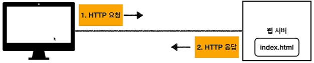

HTTP로 요청을 하면 웹 서버가 그 요청받은 것을 응답해준다.

---
### 2. 웹 애플리케이션 서버(WAS)

- 마찬가지로 HTTP 기반으로 동작
- 웹 서버 기능 포함 + (정적 리소스 제공)
- 웹 서버와의 차이점 : 프로그램 코드를 실행해 **애플리케이션 로직**을 수행한다.
  - 동적 HTML, HTTP API(JSON)
  - 서블릿, JSP, 스프링 MV/C
- ex) 톰캣(Tomcat) Jetty, Undertow

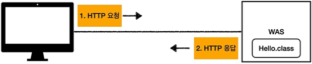

---
### 3. 웹 서버, 웹 애플리케이션 서버의 차이

- 사실은 둘의 용어와 경계가 모호하다.
  - 웹 서버도 프로그램을 실행하는 기능을 포함하기도 한다.
  - 웹 애플리케이션 서버도 웹 서버의 기능을 제공하기 때문이다.

- 자바는 서블릿 컨테이너 기능을 제공하면 WAS
  - 서블릿 없이 자바코드를 실행하는 서버 프레임워크도 있다.

- WAS는 애플리케이션 코드를 실행하는데 더 특화되어있다.

- 웹 서버는 정적 리소스(파일), WAS는 애플리케이션 로직을 실행하는 서버라고 생각하면 된다.
---
### 4. 웹 시스템 구성 - WAS, DB
- WAS, DB 만으로 시스템을 구성할 수 있다.
- WAS는 정적 리소스, 애플리케이션 로직 모두 제공 가능하기 때문이다.

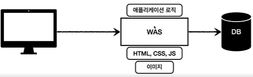

### WAS 하나로만 운영했을 때의 안 좋은 점
- WAS가 너무 많은 역할을 담당하기 때문에 서버 과부하의 우려가 있다.
- 가장 비싼 애플리케이션 로직이 정적 리소스이기 때문에 수행이 어려울 수 있다.
- (만약) WAS 장애 시, 오류 화면도 노출 불가능하다.

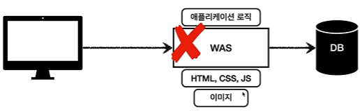

**어떻게 해결할 수 있을까?**

---
### 5. 웹 시스템 구성 - WEB, WAS, DB
- 정적 리소스는 웹 서버가 처리한다.
- 웹 서버가 처리 못하는 애플리케이션 로직 같은 동적인 처리가 필요하다면 WAS에게 위임한다.
- WAS는 중요한 애플리케이션 로직 처리를 전담한다.

📔 **이렇게 하면 좋은 점이 무엇일까?**

- 효율적인 리소스 관리가 가능하다
  - 정적 리소스가 많이 필요하면 -> 웹 서버 증설
  - 애플리케이션 리소스가 많이 사용되면 -> WAS 증설

- 정적 리소스만 제공하는 웹 서버는 잘 죽지 않는다. 애플리케이션 로직이 동작하는 WAS 서버는 잘 죽는데,
- WAS, DB 장애 시 웹 서버가 오류 화면을 제공 가능하기 때문에 좋다.

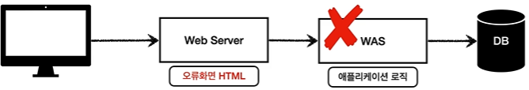

---
## ✔ 서블릿

### 서블릿 사용 전
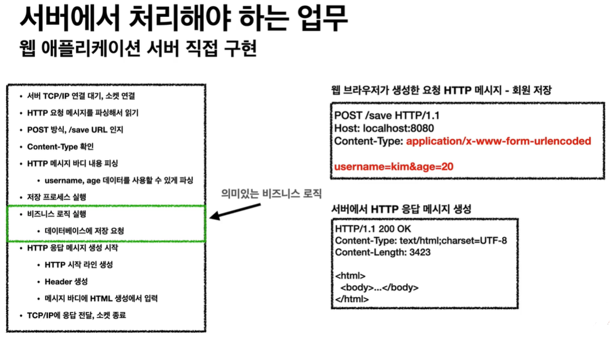

왼쪽에 비즈니스 로직 실행하기 위해서 여러 가지 과정을 거쳐 가야 한다.
사실 비즈니스 로직은 간단한 회원을 DB에 저장하는 요청만 하면 되는데 말이다.
---
### 서블릿을 사용하면
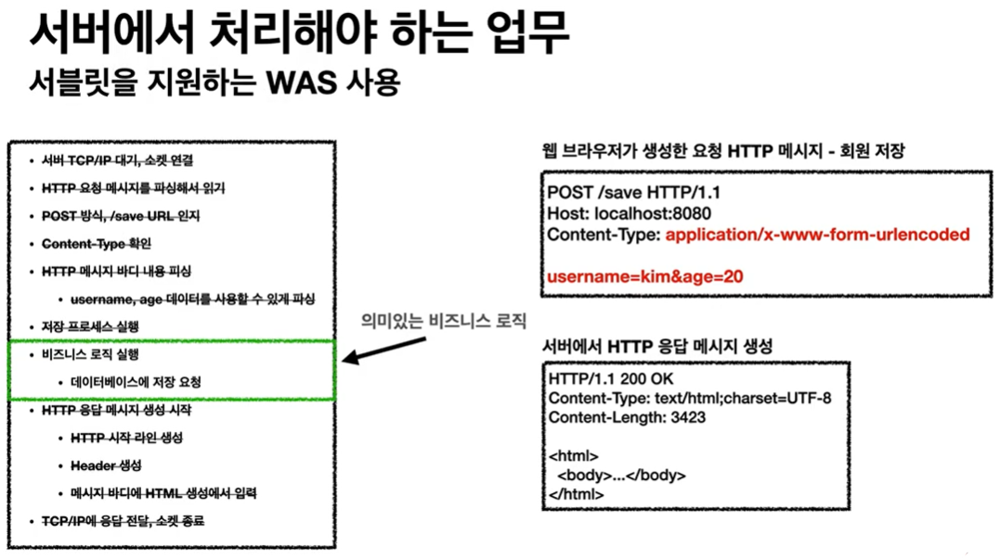

서블릿을 지원하는 WAS를 사용하면 다 자동으로 해준다.

---
### 6. 서블릿의 특징
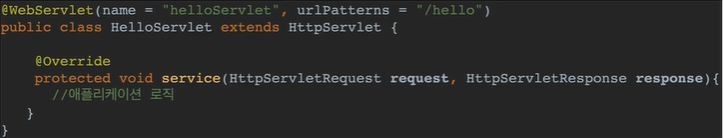

- urlPatterns(/hello)의 URL이 호출되면 서블릿 코드가 실행된다.
- HTTP 요청 정보를 편리하게 사용할 수 있는 HttpServletRequest
- HTTP 응답 정보를 편리하게 제공할 수 있는 HttpServletResponse
- 개발자는 서블릿으로 HTTP 스펙을 매우 편리하게 사용 가능하다.
- 물론 기본적인 HTTP 스펙은 알고 사용해야 한다.
---
### 7. 전체적인 흐름
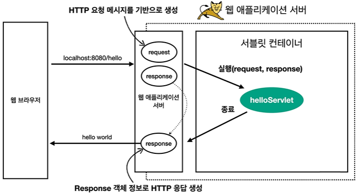

1. 요청 메세지를 기반으로 response를 생성한다.
2. 우리가 만든 helloServlet을 실행한다.
3. response로 응답 메세지를 생성해서 전달해준다.

### 서블릿 : HTTP 요청, 응답 흐름
- HTTP 요청시
  - WAS는 Request, Response 객체를 새로 만들어서 서블릿 객체 호출
  - 개발자는 Request 객체에서 요청 정보를 꺼내서 사용
  - Response 객체에 응답 정보를 입력
  - WAS는 Response 객체에 담겨있는 내용으로 HTTP 응답 정보를 생성

---
### 8. 서블릿 컨테이너
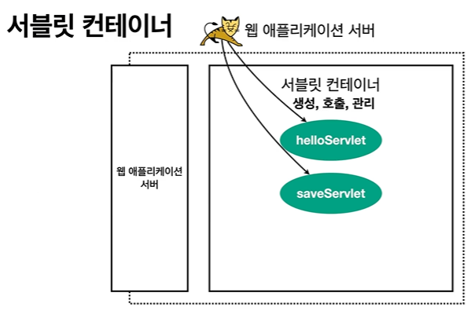

서블릿 코드만 짜면 서블릿을 지원하는 WAS 안에는 서블릿 컨테이너가 있는데, 자동으로 생성, 호출, 종료까지 다 관리해준다.

- 톰캣처럼 **서블릿을 지원하는 WAS를 서블릿 컨테이너**라고 한다.
- 서블릿 객체를 생성, 초기화, 호출, 종료하는 생명주기를 관리해준다.
- 서블릿 객체는 **싱글톤**으로 관리한다.
  - 고객의 요청이 올 때마다 계속 객체를 생성하는 것은 효율적이지 않다.
  - **최초 로딩 시점에 서블릿 객체를 미리 만들어두고 재활용**한다.
  - 모든 고객 **요청은 동일한 서블릿 객체 인스턴스에 접근**한다.
  - _**공유 변수 사용 주의**_
  - 서블릿 컨테이너 종료시 함께 종료된다.
- JSP도 서블릿으로 변환돼서 사용한다.
- ⭐ 동시 요청을 위한 멀티 쓰레드 처리를 지원한다.
---

## ✔ 쓰레드

### 9. 동시 요청 - 멀티 쓰레드
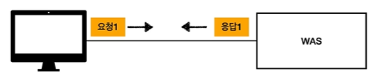

클라이언트에서 WAS에 요청을 하면? -> 서블릿 객체가 생성, 호출된다.

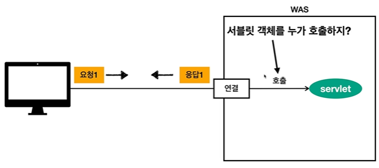

그럼 누가 호출을 할까? -> 바로 쓰레드

## 쓰레드
- 애플리케이션 코드를 하나하나 순차적으로 실행하는 것은 쓰레드
- 자바 메인 메서드를 처음 실행하면 main 이라는 이름의 쓰레드가 실행된다.
- 쓰레드가 없다면? -> 자바 애플리케이션 실행 불가능
- 쓰레드는 한 번에 하나의 코드 라인만 수행한다.
- 동시 처리가 필요하면? -> 쓰레드를 추가로 생성해주면 된다.

---
### 쓰레드 단일 요청 - 쓰레드 하나 사용
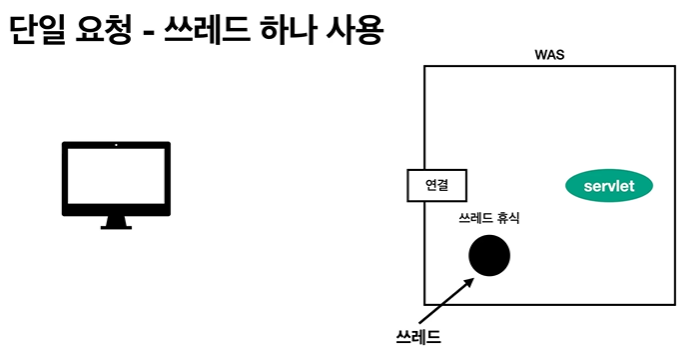

클라이언트 요청 -> 쓰레드 할당 -> 서블릿 호출 -> 서블릿 코드 실행 -> 응답 -> 쓰레드 휴식

---
### 쓰레드 다중 요청 - 쓰레드 하나 사용 시
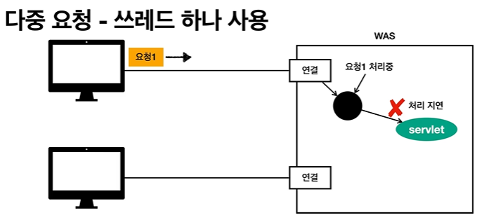

요청 1이 들어오면 -> 서블릿 호출 -> 요청 1의 처리가 지연되는 상황에서
요청 2가 들어오면? -> 결과 : 둘다 죽는다.

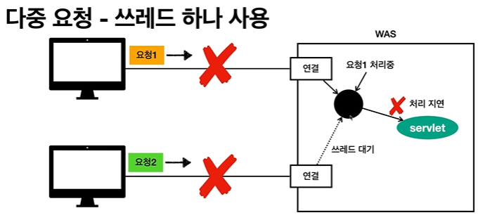

---
### 해결하기 위해선 -> 요청마다 쓰레드를 생성
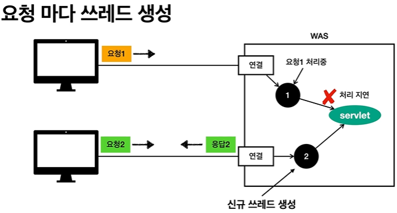

### 요청 마다 쓰레드를 생성하는 것의 장단점
장점
- 동시 요청을 처리할 수 있다.
- 리소스(CPU, 메모리)가 허용할 때까지 처리 가능하다.
- 하나의 쓰레드가 지연돼도, 나머지 쓰레드는 정상 작동한다.

단점
- 쓰레드 생성 비용은 아주 비싸다..
  - 고객의 요청이 올 때마다 쓰레드를 생성하면 -> 응답 속도가 늦어진다.
- 컨텍스트 스위칭 비용이 발생한다.
- 쓰레드 생성에 제한이 없다.
  - 고객 요청이 너무 많이 오면, CPU, 메모리 임계점을 넘어서 서버가 죽을 수 있다.

이러한 단점을 해결하기 위해? -> 쓰레드 풀

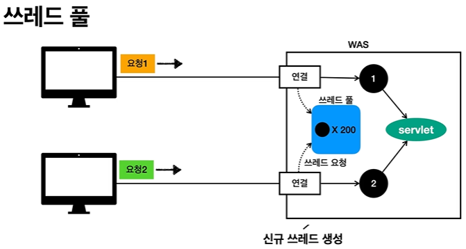

쓰레드 풀에 남아 있는 쓰레드가 없다면 쓰레드 대기하거나 거절할 수 있다.

- 특징
  - 필요한 쓰레드를 쓰레드 풀에 보관하고 관리한다.
  - 쓰레드 풀에 생성 가능한 쓰레드의 최대치를 관리한다.
- 사용
  - 쓰레드가 필요하면, 이미 생성되어 있는 것을쓰레드 풀에서 꺼내서 사용
  - 사용을 종료하면 쓰레드 풀에 해당 쓰레드를 반납
  - 남아 있는 쓰레드가 없으면? -> 기다리는 요청은 거절하거나, 특정 숫자만큼만 대기하도록 설정 가능하다.
- 장점
  - 쓰레드가 미리 생성되어 있으니, 생성, 종료하는 비용(CPU)의 절약, 응답 시간은 빨라진다.
  - 생성 가능한 쓰레드의 최대치가 있으므로, 너무 많은 요청이 들어와도 기존 요청은 안전하게 처리 가능하다.

---
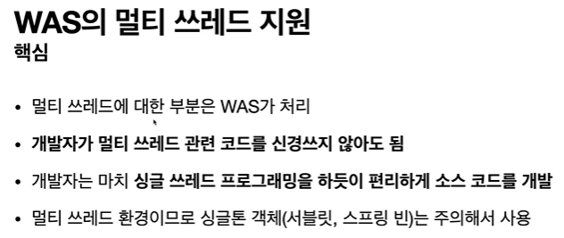

---
### 10. HTML, HTTP API, CSR, SSR
웹 서버에서 얘기했던 **정적 리소스**

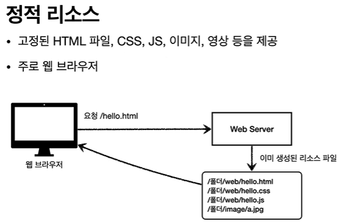

---
**동적 리소스 HTML 페이지**

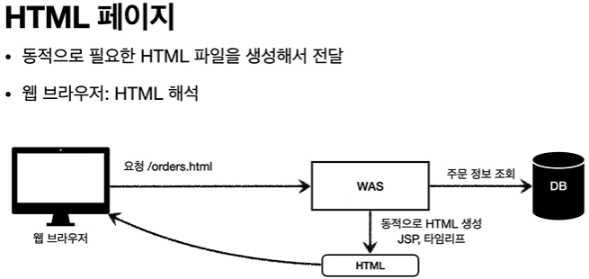

---
**HTTP API**
- 주문 정보를 조회해서 JSON 형태의 DATA를 내려준다.

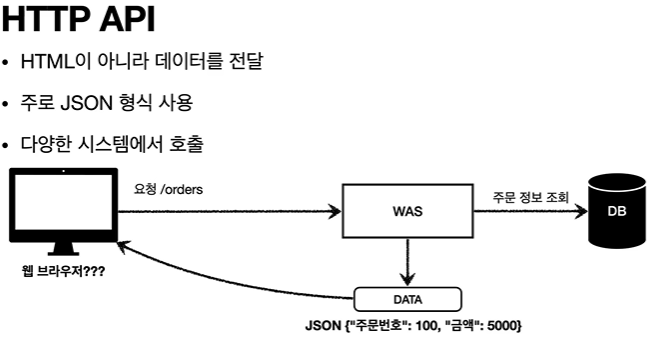

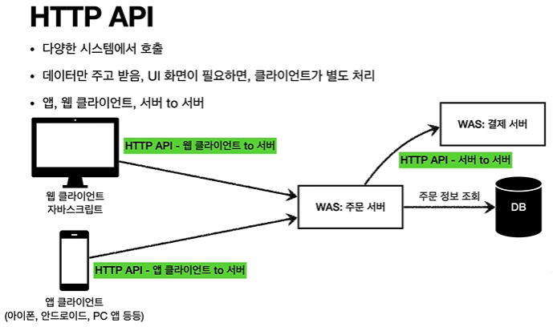

- 주로 JSON 형태로 데이터 통신
- UI 클라이언트 접점
  - 앱 클라이언트
  - 웹 브라우저에서 자바 스크립트를 통한 HTTP API 호출
  - React, Vue.js 같은 웹 클라이언트
- 서버 to 서버
  - 주문 서버 -> 결제 서버 (HTML은 필요 없기 때문에 JSON 형태로 데이터를 주고 받는다.)
  - 기업간 데이터 통신

---
**SSR - 서버 사이드 렌더링**
- HTML 최종 결과를 서버에서 만들어서 웹 브라우저(클라이언트)에 전달한다.
- 주로 정적인 화면에 사용한다.
- 관련 기술 : JSP, 타임리프 -> 백엔드 개발자

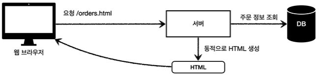

---
**CSR - 클라이언트 사이드 렌더링**

>서버 사이드 렌더링의 경우 클라이언트가 결과를 받고 그 페이지에서 무언가 동작을 하려면 새로운 페이지를 또 한번 요청해야한다.
- HTML 결과를 자바스크립트를 사용해 웹 브라우저에서 동적으로 생성해서 적용
- 주로 동적인 화면에 사용, 웹 환경을 마침 앱 처럼 필요한 부분부분 변경이 가능하다.
- ex) Google Maps, Gmail 등
- 관련 기술: React, Vue.js → 웹 프론트엔드 개발자

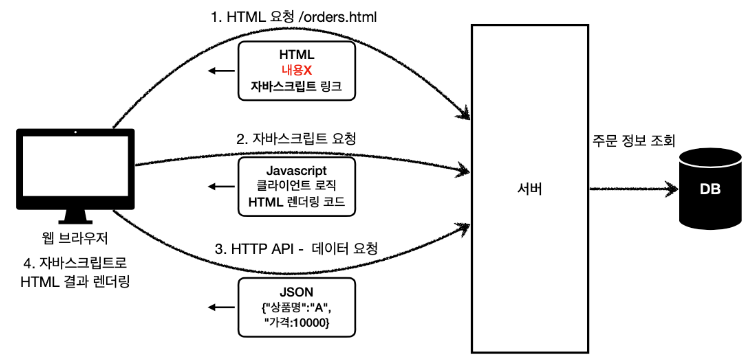

---
### 11. 자바 백엔드 웹 기술 역사

### 과거 기술
- 서블릿 - 1997
  - HTML 생성이 어려움
- JSP - 1999
  - HTML 생성은 편리하지만, 비즈니스 로직까지 너무 많은 역할 담당
- 서블릿, JSP 조합 MVC 패턴 사용
  - 모델, 뷰, 컨트롤러로 역할을 나누어 개발
- MVC 프레임워크 춘추 전국 시대 - 2000년 초 ~ 2010년 초
  - MVC 패턴 자동화, 복잡한 웹 기술을 편리하게 사용할 수 있는 다양한 기능 지원
  - 스트럿츠, 웹워크, 스프링 MVC(구버전)

### 현재 사용 기술
- 애노테이션 기반의 스프링 MVC 등장
  - `@Controller`
  - MVC 프레임워크의 춘추 전국 시대 마무리
- 스프링 부트의 등장
  - 스프링 부트는 서버를 내장
  - 과거에는 서버에 WAS를 직접 설치하고, 소스는 War 파일을 만들어서 설치한 WAS에 배포
  - 스프링 부트는 빌드 결과(Jar)에 WAS 서버 포함 → 빌드 배포 단순화

### 최신 기술 - 스프링 웹 플럭스(WebFlux)
**특징**
- 비동기 논 블로킹 처리
- 최소 쓰레드로 최대 성능 - 쓰레드 컨텍스트 스위칭 비용 효율화
- 함수형 스타일로 개발 - 동시처리 코드 효율화
- 서블릿 기술 사용 x

**단점**
- 웹 플럭스는 기술적 난이도가 매우 높다.
- 아직은 RDB 지원 부족
- 일반 MVC의 쓰레드 모델도 충분히 빠르다.
- 실무에서는 아직 많이 사용되지 않음(전체 1% 이하)