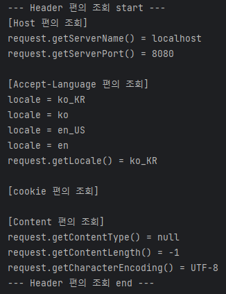

# 백엔드 웹 개발 핵심 기술
## ✔ 서블릿
### 프로젝트 생성

사전 준비물
자바 11, IDE : 인텔리제이

- 프로젝트 선택
  - Project: Gradle - Groovy Project 
  - Language: Java 
  - Spring Boot: 2.4.x 
- Project Metadata 
  - Group: hello 
  - Artifact: servlet 
  - Name: servlet 
  - Package name: hello.servlet 
  - Packaging: War (주의!)
  - Java: 11 

- Dependencies: Spring Web, Lombok

> 주의!
> Packaging는 Jar가 아니라 War를 선택. JSP를 실행하기 위해서 필요함.
---
스프링 부트 3.0을 선택하게 된다면?
1. Java 17 이상을 사용해야 합니다.
2. javax 패키지 이름을 jakarta로 변경해야 합니다.
   - 오라클과 자바 라이센스 문제로 모든 javax 패키지를 jakarta로 변경하기로 했습니다.
   
패키지 이름 변경 예)
- JPA 애노테이션 
  - javax.persistence.Entity jakarta.persistence.Entity 
- 스프링에서 자주 사용하는 @PostConstruct 애노테이션 
  - javax.annotation.PostConstruct jakarta.annotation.PostConstruct 
- 스프링에서 자주 사용하는 검증 애노테이션 
  - javax.validation jakarta.validation 

> 스프링 부트 3.0 관련 자세한 내용은 다음 링크를 확인: https://bit.ly/springboot3
---
build.gradle
```
plugins {
  id 'org.springframework.boot' version '2.4.3'
  id 'io.spring.dependency-management' version '1.0.11.RELEASE'
  id 'java'
  id 'war'
}

group = 'hello'
version = '0.0.1-SNAPSHOT'
sourceCompatibility = '11'

configurations {
    compileOnly {
        extendsFrom annotationProcessor
    }
}

repositories {
  mavenCentral()
}

dependencies {
  implementation 'org.springframework.boot:spring-boot-starter-web'
  compileOnly 'org.projectlombok:lombok'
  annotationProcessor 'org.projectlombok:lombok'
  providedRuntime 'org.springframework.boot:spring-boot-starter-tomcat'
  testImplementation 'org.springframework.boot:spring-boot-starter-test'
}

test {
  useJUnitPlatform()
}
```
**동작 확인**
- 기본 메인 클래스 실행( ServletApplication.main() )
- http://localhost:8080 호출해서 Whitelabel Error Page가 나오면 정상 동작
---

**IntelliJ Gradle 대신에 자바 직접 실행**
최근 IntelliJ 버전은 Gradle을 통해서 실행 하는 것이 기본 설정이다. 이렇게 하면 실행속도가 느리다.
다음과 같이 변경하면 자바로 바로 실행해서 실행속도가 더 빠르다

- Preferences(윈도우는 File -> Setting) -> Build, Execution, Deployment -> Build Tools -> Gradle
  - Build and run using: Gradle -> IntelliJ IDEA
  - Run tests using: Gradle -> IntelliJ IDEA
---
**롬복 적용**
1. Preferences(윈도우는 File -> Setting) -> plugin -> lombok 검색 실행 (재시작)
2. Preferences -> Annotation Processors 검색 -> Enable annotation processing 체크 (재시작)
3. 임의의 테스트 클래스를 만들고 @Getter, @Setter 확인

**Postman 설치 -> api Test할 때 좋다**

---
### 2. Hello 서블릿
#### 스프링 부트 환경에서 서블릿 등록, 사용해보기

> 참고
> 서블릿은 톰캣 같은 웹 애플리케이션 서버를 직접 설치하고,그 위에 서블릿 코드를 클래스 파일로 빌드해서
올린 다음, 톰캣 서버를 실행하면 된다. 하지만 이 과정은 매우 번거롭다.
> 스프링 부트는 톰캣 서버를 내장하고 있으므로, 톰캣 서버 설치 없이 편리하게 서블릿 코드를 실행할 수
있다.
---
#### 스프링 부트 서블릿 환경 구성

`@ServletComponentScan`
스프링 부트는 서블릿을 직접 등록해서 사용할 수 있도록 `@ServletComponentScan` 을 지원한다.
다음과 같이 추가한다.

**hello.servlet.ServletApplication**
```java
package hello.servlet;

import org.springframework.boot.SpringApplication;
import org.springframework.boot.autoconfigure.SpringBootApplication;
import org.springframework.boot.web.servlet.ServletComponentScan;

@ServletComponentScan //서블릿 자동 등록
@SpringBootApplication
public class ServletApplication {
    
    public static void main(String[] args) {
        SpringApplication.run(ServletApplication.class, args);
    }
}
```
---
#### 서블릿 등록하기
```java
package hello.servlet.basic;

import javax.servlet.ServletException;
import javax.servlet.annotation.WebServlet;
import javax.servlet.http.HttpServlet;
import javax.servlet.http.HttpServletRequest;
import javax.servlet.http.HttpServletResponse;
import java.io.IOException;

@WebServlet(name = "helloServlet", urlPatterns = "/hello")
public class HelloServlet extends HttpServlet {
    
    @Override
    protected void service(HttpServletRequest request, HttpServletResponse response) throws ServletException, IOException {
 
        System.out.println("HelloServlet.service");
        System.out.println("request = " + request);
        System.out.println("response = " + response);
        
        String username = request.getParameter("username");
        System.out.println("username = " + username);
 
        response.setContentType("text/plain");
        response.setCharacterEncoding("utf-8");
        response.getWriter().write("hello " + username);
    }
}
```

`@WebServlet` : 서블릿 애노테이션
- name : 서블릿 이름
- urlPatterns : URL 매핑
- (위 코드에서는 name = "helloServlet", urlPatterns = "/hello")

HTTP 요청을 통해 매핑된 URL이 호출되면 서블릿 컨테이너는 다음 메서드를 실행한다.
`protected void service(HttpServletRequest request, HttpServletResponse response)`

웹 브라우저 실행
  - http://localhost:8080/hello?username=jehun
  - 결과: hello jehun


콘솔 실행 결과
```
HelloServlet.service
request = org.apache.catalina.connector.RequestFacade@5e4e72
response = org.apache.catalina.connector.ResponseFacade@37d112b6
username = jehun
```
---
#### HTTP 요청 메시지 로그로 확인하기

`application.properties`파일에 설정을 추가하자
```logging.level.org.apache.coyote.http11=debug```

서버를 다시 시작하고, 요청해보면 서버가 받은 HTTP 요청 메시지를 출력하는 것을 확인할 수 있다.
```
...o.a.coyote.http11.Http11InputBuffer: Received [GET /hello?username=servlet
HTTP/1.1
Host: localhost:8080
Connection: keep-alive
Cache-Control: max-age=0
sec-ch-ua: "Chromium";v="88", "Google Chrome";v="88", ";Not A Brand";v="99"
sec-ch-ua-mobile: ?0
Upgrade-Insecure-Requests: 1
User-Agent: Mozilla/5.0 (Macintosh; Intel Mac OS X 11_2_1) AppleWebKit/537.36
(KHTML, like Gecko) Chrome/88.0.4324.150 Safari/537.36
Accept: text/html,application/xhtml+xml,application/xml;q=0.9,image/avif,image/
webp,image/apng,*/*;q=0.8,application/signed-exchange;v=b3;q=0.9
Sec-Fetch-Site: same-origin
Sec-Fetch-Mode: navigate
Sec-Fetch-User: ?1
Sec-Fetch-Dest: document
Referer: http://localhost:8080/basic.html
Accept-Encoding: gzip, deflate, br
Accept-Language: ko,en-US;q=0.9,en;q=0.8,ko-KR;q=0.7
]
```


> 참고
> 운영서버에 이렇게 모든 요청 정보를 다 남기면 성능저하가 발생할 수 있다. 개발 단계에서만 적용하자.

---
#### 서블릿 컨테이너 동작 방식 설명

**내장 톰캣 서버 생성**

- 스프링 부트를 실행하면 내장 톰켓 서버를 실행해주고, 톰켓 서버는 내부에 서블릿 컨테이너를 가지고 있다.
- 그것을 통해 서블릿을 생성해준다. (코드에서는 helloServlet)

**HTTP 요청, HTTP 응답 메시지**


**웹 애플리케이션 서버의 요청 응답 구조**

request, response 객체를 만들고, helloServlet을 호출한 뒤 작업을 하고
response 데이터에 정보를 넣게 되면 was 서버가 반환해서 웹 브라우저에 보내준다.

> 참고
> HTTP 응답에서 Content-Length는 웹 애플리케이션 서버가 자동으로 생성해준다.
---
### welcome 페이지 추가


해당 위치에 두면 http://localhost:8080 호출 시, `index.html` 페이지가 열린다.

`main/webapp/index.html`
```html
<!DOCTYPE html>
<html>
<head>
    <meta charset="UTF-8">
    <title>Title</title>
</head>
<body>
<ul>
    <li><a href="basic.html">서블릿 basic</a></li>
</ul>
</body>
</html>
```


`main/webapp/basic.html`
```html
<!DOCTYPE html>
<html>
<head>
    <meta charset="UTF-8">
    <title>Title</title>
</head>
<body>
<ul>
    <li>hello 서블릿
        <ul>
            <li><a href="/hello?username=servlet">hello 서블릿 호출</a></li>
        </ul>
    </li>
    <li>HttpServletRequest
        <ul>
            <li><a href="/request-header">기본 사용법, Header 조회</a></li>
            <li>HTTP 요청 메시지 바디 조회
                <ul>
                    <li><a href="/request-param?username=hello&age=20">GET -
                        쿼리 파라미터</a></li>
                    <li><a href="/basic/hello-form.html">POST - HTML Form</a></
                    li>
                    <li>HTTP API - MessageBody -> Postman 테스트</li>
                </ul>
            </li>
        </ul>
    </li>
    <li>HttpServletResponse
        <ul>
            <li><a href="/response-header">기본 사용법, Header 조회</a></li>
            <li>HTTP 응답 메시지 바디 조회
                <ul>
                    <li><a href="/response-html">HTML 응답</a></li>
                    <li><a href="/response-json">HTTP API JSON 응답</a></li>
                </ul>
            </li>
        </ul>
    </li>
</ul>
</body>
</html>
```


---
### HttpServletRequest - 개요

HttpServletRequest 역할
HTTP 요청 메시지를 개발자가 직접 파싱해서 사용해도 되지만, 매우 불편할 것이다.
서블릿은 개발자가 HTTP 요청 메시지를 편리하게 사용할 수 있도록 개발자 대신에 HTTP 요청 메시지를 파싱한다.
그리고 그 결과를 `HttpServletRequest` 객체에 담아서 제공한다.

HttpServletRequest를 사용하면 다음과 같은 HTTP 요청 메시지를 편리하게 조회할 수 있다.

ex) **HTTP 요청 메시지**
```
POST /save HTTP/1.1
Host: localhost:8080
Content-Type: application/x-www-form-urlencoded
username=kim&age=20
```
- START LINE 
  - HTTP 메소드 
  - URL 
  - 쿼리 스트링 
  - 스키마, 프로토콜 
- 헤더 
  - 헤더 조회 
- 바디
  - form 파라미터 형식 조회 
  - message body 데이터 직접 조회

HttpServletRequest 객체는 추가로 여러가지 부가기능도 함께 제공한다.

**1. 임시 저장소 기능**

해당 HTTP 요청이 시작부터 끝날 때 까지 유지되는 임시 저장소 기능
- 저장: `request.setAttribute(name, value)`
- 조회: `request.getAttribute(name)`

**2. 세션 관리 기능**

- `request.getSession(create: true)`

> 중요
> HttpServletRequest, HttpServletResponse를 사용할 때 가장 중요한 점은 이 객체들이 *HTTP 요청
메시지, HTTP 응답 메시지를 편리하게 사용하도록 도와주는 객체라는 점*이다. 따라서 이 기능에 대해서
깊이있는 이해를 하려면 **HTTP 스펙이 제공하는 요청, 응답 메시지 자체를 이해**해야 한다.

---
### HttpServletRequest - 기본 사용법

`hello.servlet.basic.request.RequestHeaderServlet`
```java
package hello.servlet.basic.request;

import javax.servlet.ServletException;
import javax.servlet.annotation.WebServlet;
import javax.servlet.http.*;
import java.io.IOException;

//http://localhost:8080/request-header?username=hello
@WebServlet(name = "requestHeaderServlet", urlPatterns = "/request-header")
public class RequestHeaderServlet extends HttpServlet {
    @Override 
    protected void service(HttpServletRequest request, HttpServletResponse response) throws ServletException, IOException {
        printStartLine(request);
        printHeaders(request);
        printHeaderUtils(request);
        printEtc(request);
        response.getWriter().write("ok");
    }
}
```
```java
    //start line 정보
    private void printStartLine(HttpServletRequest request) {
        System.out.println("--- REQUEST-LINE - start ---");
        System.out.println("request.getMethod() = " + request.getMethod()); //GET
        System.out.println("request.getProtocol() = " + request.getProtocol()); //HTTP/1.1
        System.out.println("request.getScheme() = " + request.getScheme()); //http// http://localhost:8080/request-header
        System.out.println("request.getRequestURL() = " + request.getRequestURL());// /request-header
        System.out.println("request.getRequestURI() = " + request.getRequestURI());//username=hi
        System.out.println("request.getQueryString() = " + request.getQueryString());
        System.out.println("request.isSecure() = " + request.isSecure()); //https사용 유무
        System.out.println("--- REQUEST-LINE - end ---");
        System.out.println();
    }
```
**실행 결과**


**만약 뒤에 `?username=hello` 를 추가한다면? -> getQueryString() 변경** 


---

```java
    //Header 모든 정보
    private void printHeaders(HttpServletRequest request) {
        System.out.println("--- Headers - start ---");
/*
        Enumeration<String> headerNames = request.getHeaderNames();
        while (headerNames.hasMoreElements()) {
            String headerName = headerNames.nextElement();
            System.out.println(headerName + ": " + request.getHeader(headerName));
        }
*/
        request.getHeaderNames().asIterator()
                .forEachRemaining(headerName -> System.out.println(headerName + ": " + request.getHeader(headerName)));
        System.out.println("--- Headers - end ---");
        System.out.println();
    }
```

**실행 결과**

본인의 웹 브라우저에서 보내는 헤더는 다른 정보들을 보낸다.


응답을 보내고 개발자모드에서 확인해보면 알 수 있다.

---

```java
    //Header 편리한 조회
    private void printHeaderUtils(HttpServletRequest request) {
        System.out.println("--- Header 편의 조회 start ---");
        System.out.println("[Host 편의 조회]");
        System.out.println("request.getServerName() = " + request.getServerName()); //Host 헤더
        System.out.println("request.getServerPort() = " + request.getServerPort()); //Host 헤더
        System.out.println();

        System.out.println("[Accept-Language 편의 조회]");
        request.getLocales().asIterator()
                .forEachRemaining(locale -> System.out.println("locale = " +
                        locale));
        System.out.println("request.getLocale() = " + request.getLocale());
        System.out.println();

        System.out.println("[cookie 편의 조회]");
        if (request.getCookies() != null) {
            for (Cookie cookie : request.getCookies()) {
                System.out.println(cookie.getName() + ": " + cookie.getValue());
            }
        }
        System.out.println();

        System.out.println("[Content 편의 조회]");
        System.out.println("request.getContentType() = " + request.getContentType());
        System.out.println("request.getContentLength() = " + request.getContentLength());
        System.out.println("request.getCharacterEncoding() = " + request.getCharacterEncoding());
        System.out.println("--- Header 편의 조회 end ---");
        System.out.println();
    }
```

**실행 결과**



쿠키도 본인이 원하는 쿠키값을 꺼내올 수는 있지만, 지금은 쿠키가 업어서 안 나온다.
왜 ContentType은 null일까?
- get 방식인데 get은 거의 content를 보내지 않는다.
- http 바디에 메시지가 담겨 있어야 하는데 그게 없으니까 null이다.
- Postman으로 확인 가능


Send 해주면 아래처럼 바뀐다.

```
request.getContentType() = text/plain
request.getContentLength() = 6
request.getCharacterEncoding() = UTF-8
```

---

```java
    // 기타 정보
    private void printEtc(HttpServletRequest request) {
        System.out.println("--- 기타 조회 start ---");
        System.out.println("[Remote 정보]");
        System.out.println("request.getRemoteHost() = " + request.getRemoteHost()); //
        System.out.println("request.getRemoteAddr() = " + request.getRemoteAddr()); //
        System.out.println("request.getRemotePort() = " + request.getRemotePort()); //
        System.out.println();

        System.out.println("[Local 정보]");
        System.out.println("request.getLocalName() = " + request.getLocalName()); //
        System.out.println("request.getLocalAddr() = " + request.getLocalAddr()); //
        System.out.println("request.getLocalPort() = " + request.getLocalPort()); //
        System.out.println("--- 기타 조회 end ---");
        System.out.println();
    }
```

**실행 결과**


- remote는 요청이 온 것에 대한 정보, Local은 현재 나의 서버에 대한 정보

---

지금까지 HttpServletRequest를 통해서 HTTP 메시지의 start-line, header 정보 조회 방법을 이해했다. 
이제 본격적으로 HTTP 요청 데이터를 어떻게 조회하는지 알아보자.

### HTTP 요청 데이터 - 개요
HTTP 요청 메시지를 통해 클라이언트에서 서버로 데이터를 전달하는 방법을 알아보자.

주로 다음 3가지 방법을 사용한다.

- **GET - 쿼리 파라미터**
  - /url**?username=hello&age=20**
  - 메시지 바디 없이, URL의 쿼리 파라미터에 데이터를 포함해서 전달
  - 예) 검색, 필터, 페이징등에서 많이 사용하는 방식
- **POST - HTML Form**
  - content-type: application/x-www-form-urlencoded
  - 메시지 바디에 쿼리 파리미터 형식으로 전달 username=hello&age=20
  - 예) 회원 가입, 상품 주문, HTML Form 사용

**POST- HTML Form 예시**


- **HTTP message body**에 데이터를 직접 담아서 요청
  - HTTP API에서 주로 사용, JSON, XML, TEXT
- 데이터 형식은 주로 JSON 사용
  - POST, PUT, PATCH

### HTTP 요청 데이터 - GET 쿼리 파라미터

다음 데이터를 클라이언트에서 서버로 전송해보자.

전달 데이터
- username=hello
- age=20

메시지 바디 없이, URL의 쿼리 파라미터를 사용해서 데이터를 전달하자.
예) 검색, 필터, 페이징등에서 많이 사용하는 방식

쿼리 파라미터는 URL에 다음과 같이 ? 를 시작으로 보낼 수 있다. 추가 파라미터는 & 로 구분하면 된다.
http://localhost:8080/request-param**?username=hello&age=20**

서버에서는 HttpServletRequest 가 제공하는 다음 메서드를 통해 쿼리 파라미터를 편리하게 조회할 수
있다.

**쿼리 파라미터 조회 메서드**
```
String username = request.getParameter("username"); //단일 파라미터 조회
Enumeration<String> parameterNames = request.getParameterNames(); //파라미터 이름들 모두 조회
Map<String, String[]> parameterMap = request.getParameterMap(); //파라미터를 Map으로 조회
String[] usernames = request.getParameterValues("username"); //복수 파라미터 조회
```

**RequestParamServlet**
```java
package hello.servlet.basic.request;

import javax.servlet.ServletException;
import javax.servlet.annotation.WebServlet;
import javax.servlet.http.HttpServlet;
import javax.servlet.http.HttpServletRequest;
import javax.servlet.http.HttpServletResponse;
import java.io.IOException;
import java.util.Enumeration;

/**
 * 1. 파라미터 전송 기능
 * http://localhost:8080/request-param?username=hello&age=20
 * <p>
 * 2. 동일한 파라미터 전송 가능
 * http://localhost:8080/request-param?username=hello&username=kim&age=20
 */

@WebServlet(name = "requestParamServlet", urlPatterns = "/request-param")
public class RequestParamServlet extends HttpServlet { 
    @Override 
    protected void service(HttpServletRequest request, HttpServletResponse resp) throws ServletException, IOException {
        System.out.println("[전체 파라미터 조회] - start");
 
        /*
        Enumeration<String> parameterNames = request.getParameterNames();
        while (parameterNames.hasMoreElements()) {
            String paramName = parameterNames.nextElement();
            System.out.println(paramName + "=" +
            request.getParameter(paramName));
        }
        */
 
      request.getParameterNames().asIterator()
              .forEachRemaining(paramName -> System.out.println(paramName + "=" + request.getParameter(paramName)));
      System.out.println("[전체 파라미터 조회] - end");
      System.out.println();
      
      System.out.println("[단일 파라미터 조회]");
      String username = request.getParameter("username");
      System.out.println("request.getParameter(username) = " + username);
      
      String age = request.getParameter("age");
      System.out.println("request.getParameter(age) = " + age);
      System.out.println();
      
      System.out.println("[이름이 같은 복수 파라미터 조회]");
      System.out.println("request.getParameterValues(username)");
      String[] usernames = request.getParameterValues("username");
      for (String name : usernames) {
          System.out.println("username=" + name);
      }
      
      resp.getWriter().write("ok");
    }
}
```

**실행 - 파라미터 전송**
http://localhost:8080/request-param?username=hello&age=20

**결과**
```
[전체 파라미터 조회] - start
username=hello
age=20
[전체 파라미터 조회] - end

[단일 파라미터 조회]
request.getParameter(username) = hello
request.getParameter(age) = 20

[이름이 같은 복수 파라미터 조회]
request.getParameterValues(username)
username=hello
```
---
**실행 - 동일 파라미터 전송**
http://localhost:8080/request-param?username=hello&username=kim&age=20
```
[전체 파라미터 조회] - start
username=hello
age=20
[전체 파라미터 조회] - end

[단일 파라미터 조회]
request.getParameter(username) = hello
request.getParameter(age) = 20

[이름이 같은 복수 파라미터 조회]
request.getParameterValues(username)
username=hello
username=kim
```
---

**복수 파라미터에서 단일 파라미터 조회**
`username=hello&username=kim` 과 같이 파라미터 이름은 하나인데, 값이 중복이면 어떻게 될까?
**`request.getParameter()` 는 하나의 파라미터 이름에 대해서 단 하나의 값만 있을 때 사용해야 한다.**
지금처럼 **중복일 때는 `request.getParameterValues()` 를 사용해야 한다.**
참고로 이렇게 중복일 때 request.getParameter() 를 사용하면 request.getParameterValues() 의 첫 번째 값을 반환한다.
---
### HTTP 요청 데이터 - POST HTML Form
HTML의 Form을 사용해서 클라이언트에서 서버로 데이터를 전송해본다.

**특징**
- content-type: application/x-www-form-urlencoded 
- 메시지 바디에 쿼리 파리미터 형식으로 데이터를 전달한다. `username=hello&age=20`

`src/main/webapp/basic/hello-form.html` **생성**
```html
<!DOCTYPE html>
<html>
<head>
    <meta charset="UTF-8">
    <title>Title</title>
</head>
<body>
<form action="/request-param" method="post">
    username: <input type="text" name="username" />
    age: <input type="text" name="age" />
    <button type="submit">전송</button>
</form>
</body>
</html>
```
실행해보자. http://localhost:8080/basic/hello-form.html
**결과**


>주의
> 웹 브라우저가 결과를 캐시하고 있어서, 과거에 작성했던 html 결과가 보이는 경우도 있다. 이때는 웹 브라우저의 새로 고침을 직접 선택해주면 된다. 물론 서버를 재시작 하지 않아서 그럴 수도 있다.

POST의 HTML Form을 전송하면 웹 브라우저는 다음 형식으로 HTTP 메시지를 만든다. (웹 브라우저 개발자 모드 확인)
**요청 URL**: http://localhost:8080/request-param
**content-type**: application/x-www-form-urlencoded
**message body**: username=hello&age=20

`application/x-www-form-urlencoded` 형식은 앞서 GET에서 살펴본 쿼리 파라미터 형식과 같다.
따라서 **쿼리 파라미터 조회 메서드를 그대로 사용**하면 된다.
클라이언트(웹 브라우저) 입장에서는 두 방식에 차이가 있지만, 서버 입장에서는 둘의 형식이 동일하므로,
`request.getParameter()` 로 편리하게 구분없이 조회할 수 있다.

**정리하면** `request.getParameter()` 는 GET URL 쿼리 파라미터 형식도 지원하고, POST HTML Form
형식도 둘 다 지원한다.

> 참고
> content-type은 HTTP 메시지 바디의 데이터 형식을 지정한다.
> **GET URL 쿼리 파라미터 형식**으로 클라이언트에서 서버로 데이터를 전달할 때는 HTTP 메시지 바디를 사용하지 않기 때문에 content-type이 없다.
> **POST HTML Form 형식**으로 데이터를 전달하면 HTTP 메시지 바디에 해당 데이터를 포함해서 보내기 때문에 바디에 포함된 데이터가 어떤 형식인지 content-type을 꼭 지정해야 한다. 이렇게 폼으로 데이터를 전송하는 형식을 `application/x-www-form-urlencoded` 라 한다.

---
### Postman을 사용한 테스트
이런 간단한 테스트에 HTML form을 만들기는 귀찮다. 이때는 Postman을 사용하면 된다.

**Postman 테스트 주의사항**
- POST 전송시
  - Body -> `x-www-form-urlencoded` 선택
  - Headers에서 content-type: `application/x-www-form-urlencoded` 로 지정된 부분 꼭 확인

---
### HTTP 요청 데이터 - API 메시지 바디 - 단순 텍스트

- **HTTP message body**에 데이터를 직접 담아서 요청
  - HTTP API에서 주로 사용, JSON, XML, TEXT
  - 데이터 형식은 주로 JSON 사용
  - POST, PUT, PATCH

- 먼저 가장 단순한 텍스트 메시지를 HTTP 메시지 바디에 담아서 전송하고, 읽어보자.
- HTTP 메시지 바디의 데이터를 InputStream을 사용해서 직접 읽을 수 있다.

**RequestBodyStringServlet**
```java
package hello.servlet.basic.request;

import org.springframework.util.StreamUtils;
import javax.servlet.ServletException;
import javax.servlet.ServletInputStream;
import javax.servlet.annotation.WebServlet;
import javax.servlet.http.HttpServlet;
import javax.servlet.http.HttpServletRequest;
import javax.servlet.http.HttpServletResponse;
import java.io.IOException;
import java.nio.charset.StandardCharsets;

@WebServlet(name = "requestBodyStringServlet", urlPatterns = "/request-bodystring")
public class RequestBodyStringServlet extends HttpServlet { 
    @Override 
    protected void service(HttpServletRequest request, HttpServletResponse response) throws ServletException, IOException {
        ServletInputStream inputStream = request.getInputStream();
        String messageBody = StreamUtils.copyToString(inputStream, StandardCharsets.UTF_8);
        
        System.out.println("messageBody = " + messageBody);
        
        response.getWriter().write("ok");
    }
}
```

Postman을 사용해서 테스트 해보자.

> 참고
> inputStream은 byte 코드를 반환한다. byte 코드를 우리가 읽을 수 있는 문자(String)로 보려면 문자표(Charset)를 지정해주어야 한다. 여기서는 UTF_8 Charset을 지정해주었다.

**문자 전송**
- POST http://localhost:8080/request-body-string
- content-type: text/plain
- message body: `hello`
- 결과: `messageBody = hello`

---
### HTTP 요청 데이터 - API 메시지 바디 - JSON
이번에는 HTTP API에서 주로 사용하는 JSON 형식으로 데이터를 전달해보자.

**JSON 형식 전송**
POST http://localhost:8080/request-body-json
content-type: **application/json**
message body: {"username": "hello", "age": 20}
결과: `messageBody = {"username": "hello", "age": 20}`

**JSON 형식 파싱 추가**
JSON 형식으로 파싱할 수 있게 객체를 하나 생성하자
**hello.servlet.basic.HelloData**
```java
package hello.servlet.basic;

import lombok.Getter;
import lombok.Setter;

@Getter @Setter
public class HelloData {
    
    private String username;
    private int age;
}
```

lombok이 제공하는 @Getter , @Setter 덕분에 다음 코드가 자동으로 추가된다.(눈에 보이지는 않는다.)
```java
package hello.servlet.basic;

public class HelloData {
    
    private String username;
    private int age;
    
    //==== lombok 생성 코드 ====//
    public String getUsername() {
        return username;
    }
    
    public void setUsername(String username) {
        this.username = username;
    }
 
    public int getAge() {
        return age;
    }
 
    public void setAge(int age) {
        this.age = age;
    }
}
```

**RequestBodyJsonServlet**
```java
package hello.servlet.basic.request;

import com.fasterxml.jackson.databind.ObjectMapper;
import hello.servlet.basic.HelloData;
import org.springframework.util.StreamUtils;

import javax.servlet.ServletException;
import javax.servlet.ServletInputStream;
import javax.servlet.annotation.WebServlet;
import javax.servlet.http.HttpServlet;
import javax.servlet.http.HttpServletRequest;
import javax.servlet.http.HttpServletResponse;
import java.io.IOException;
import java.nio.charset.StandardCharsets;

/**
 * http://localhost:8080/request-body-json
 *
 * JSON 형식 전송
 * content-type: application/json
 * message body: {"username": "hello", "age": 20}
 *
 */
@WebServlet(name = "requestBodyJsonServlet", urlPatterns = "/request-bodyjson")
public class RequestBodyJsonServlet extends HttpServlet {
 
    private ObjectMapper objectMapper = new ObjectMapper();
 
    @Override
    protected void service(HttpServletRequest request, HttpServletResponse response) throws ServletException, IOException {
        ServletInputStream inputStream = request.getInputStream();
        String messageBody = StreamUtils.copyToString(inputStream, StandardCharsets.UTF_8);
 
        System.out.println("messageBody = " + messageBody);
        
        HelloData helloData = objectMapper.readValue(messageBody, HelloData.class);
 
        System.out.println("helloData.username = " + helloData.getUsername());
        System.out.println("helloData.age = " + helloData.getAge());
        
        response.getWriter().write("ok");
    }
}
```

Postman으로 실행해보자.
- POST http://localhost:8080/request-body-json
- content-type: **application/json** (Body raw, 가장 오른쪽에서 JSON 선택)
- message body: `{"username": "hello", "age": 20}`

**출력결과**
```
messageBody={"username": "hello", "age": 20}
data.username=hello
data.age=20
```

> 참고
> JSON 결과를 파싱해서 사용할 수 있는 자바 객체로 변환하려면 Jackson, Gson 같은 JSON 변환
라이브러리를 추가해서 사용해야 한다. 스프링 부트로 Spring MVC를 선택하면 기본으로 Jackson
라이브러리( ObjectMapper )를 함께 제공한다.

#### ObjectMapper 직렬화, 역직렬화에 대해서 알아두자.

---
### HttpServletResponse - 기본 사용법

HttpServletResponse 역할 -> **HTTP 응답 메시지 생성**

**HTTP 응답 메시지 생성**
- HTTP 응답코드 지정
- 헤더 생성
- 바디 생성

**편의 기능 제공**
- Content-Type, 쿠키, Redirect

**hello.servlet.basic.response.ResponseHeaderServlet**
```java
package hello.servlet.basic.response;

import javax.servlet.ServletException;
import javax.servlet.annotation.WebServlet;
import javax.servlet.http.Cookie;
import javax.servlet.http.HttpServlet;
import javax.servlet.http.HttpServletRequest;
import javax.servlet.http.HttpServletResponse;
import java.io.IOException;
import java.io.PrintWriter;

/**
 * http://localhost:8080/response-header
 *
 */
@WebServlet(name = "responseHeaderServlet", urlPatterns = "/response-header")
public class ResponseHeaderServlet extends HttpServlet {
 
    @Override 
    protected void service(HttpServletRequest request, HttpServletResponse response) throws ServletException, IOException {
        
        //[status-line]
        response.setStatus(HttpServletResponse.SC_OK); //200
 
      //[response-headers]
        response.setHeader("Content-Type", "text/plain;charset=utf-8");
        response.setHeader("Cache-Control", "no-cache, no-store, mustrevalidate");
        response.setHeader("Pragma", "no-cache");
        response.setHeader("my-header","hello");
 
         //[Header 편의 메서드]
        content(response);
        cookie(response);
        redirect(response);
 
        //[message body]
        PrintWriter writer = response.getWriter();
        writer.println("ok");
    }
}
```

**Content 편의 메서드**
```java
private void content(HttpServletResponse response) {
    //Content-Type: text/plain;charset=utf-8
    //Content-Length: 2
    //response.setHeader("Content-Type", "text/plain;charset=utf-8");
    response.setContentType("text/plain");
    response.setCharacterEncoding("utf-8");
    //response.setContentLength(2); //(생략시 자동 생성)
}
```

**쿠키 편의 메서드**
```java
private void cookie(HttpServletResponse response) {
    //Set-Cookie: myCookie=good; Max-Age=600;
    //response.setHeader("Set-Cookie", "myCookie=good; Max-Age=600");
    Cookie cookie = new Cookie("myCookie", "good");
    cookie.setMaxAge(600); //600초
    response.addCookie(cookie);
}
```

**redirect 편의 메서드**
```java
private void redirect(HttpServletResponse response) throws IOException {
    //Status Code 302
    //Location: /basic/hello-form.html
    //response.setStatus(HttpServletResponse.SC_FOUND); //302
    //response.setHeader("Location", "/basic/hello-form.html");
    response.sendRedirect("/basic/hello-form.html");
}
```

---
### HTTP 응답 데이터 - 단순 텍스트, HTML
HTTP 응답 메시지는 주로 다음 내용을 담아서 전달한다.

- 단순 텍스트 응답
  - 앞에서 살펴봄 ( writer.println("ok"); )
- HTML 응답
- HTTP API - MessageBody JSON 응답

**HttpServletResponse - HTML 응답**

**hello.servlet.web.response.ResponseHtmlServlet**
```java
package hello.servlet.basic.response;

import javax.servlet.ServletException;
import javax.servlet.annotation.WebServlet;
import javax.servlet.http.HttpServlet;
import javax.servlet.http.HttpServletRequest;
import javax.servlet.http.HttpServletResponse;
import java.io.IOException;
import java.io.PrintWriter;
@WebServlet(name = "responseHtmlServlet", urlPatterns = "/response-html")
public class ResponseHtmlServlet extends HttpServlet {
 
    @Override
    protected void service(HttpServletRequest request, HttpServletResponse response) throws ServletException, IOException {
 
        //Content-Type: text/html;charset=utf-8
        response.setContentType("text/html");
        response.setCharacterEncoding("utf-8");
 
        PrintWriter writer = response.getWriter();
        writer.println("<html>");
        writer.println("<body>");
        writer.println(" <div>안녕?</div>");
        writer.println("</body>");
        writer.println("</html>");
    }
}
```
HTTP 응답으로 HTML을 반환할 때는 `content-type`을 `text/html` 로 지정해야 한다.

**실행**
- http://localhost:8080/response-html
- 페이지 소스보기를 사용하면 결과 HTML을 확인할 수 있다.

---
### HTTP 응답 데이터 - API JSON

**hello.servlet.web.response.ResponseJsonServlet**
```java
package hello.servlet.basic.response;

import com.fasterxml.jackson.databind.ObjectMapper;
import hello.servlet.basic.HelloData;

import javax.servlet.ServletException;
import javax.servlet.annotation.WebServlet;
import javax.servlet.http.HttpServlet;
import javax.servlet.http.HttpServletRequest;
import javax.servlet.http.HttpServletResponse;
import java.io.IOException;

/**
 * http://localhost:8080/response-json
 *
 */
@WebServlet(name = "responseJsonServlet", urlPatterns = "/response-json")
public class ResponseJsonServlet extends HttpServlet {
 
    private ObjectMapper objectMapper = new ObjectMapper();
 
    @Override
    protected void service(HttpServletRequest request, HttpServletResponse response) throws ServletException, IOException {
        //Content-Type: application/json
        response.setHeader("content-type", "application/json");
        response.setCharacterEncoding("utf-8");
 
        HelloData data = new HelloData();
        data.setUsername("kim");
        data.setAge(20);
    
        //{"username":"kim","age":20}
        String result = objectMapper.writeValueAsString(data);
        response.getWriter().write(result);
    }
}
```

HTTP 응답으로 JSON을 반환할 때는 content-type을 `application/json` 로 지정해야 한다.
Jackson 라이브러리가 제공하는 `objectMapper.writeValueAsString()` 를 사용하면 객체를 JSON
문자로 변경할 수 있다.

실행
- http://localhost:8080/response-json

> 참고
> application/json 은 스펙상 utf-8 형식을 사용하도록 정의되어 있다. 그래서 스펙에서 charset=utf-8 과 같은 추가 파라미터를 지원하지 않는다. 따라서 application/json 이라고만 사용해야지
> application/json;charset=utf-8 이라고 전달하는 것은 의미 없는 파라미터를 추가한 것이 된다.
> response.getWriter()를 사용하면 추가 파라미터를 자동으로 추가해버린다. 이때는 response.getOutputStream()으로 출력하면 그런 문제가 없다.