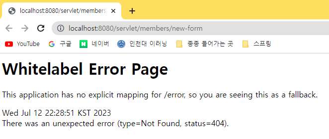
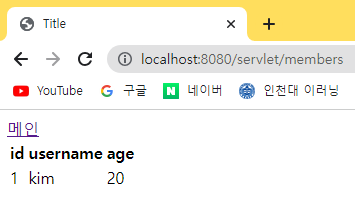

# 백엔드 웹 개발 핵심 기술

## ✔ 서블릿, JSP, MVC 패턴

### 회원 관리 웹 애플리케이션 요구사항

**회원 정보**
이름: `username`
나이: `age`

**기능 요구사항**

- 회원 저장
- 회원 목록 조회

**회원 도메인 모델**

```java
package hello.servlet.domain.member;

import lombok.Getter;
import lombok.Setter;

@Getter
@Setter
public class Member {
    private Long id;
    private String username;
    private int age;

    public Member() {
    }

    public Member(String username, int age) {
        this.username = username;
        this.age = age;
    }
}
```

- `id` 는 `Member` 를 회원 저장소에 저장하면 회원 저장소가 할당한다.

**회원 저장소**

```java
package hello.servlet.domain.member;

import java.util.ArrayList;
import java.util.HashMap;
import java.util.List;
import java.util.Map;

/**
 * 동시성 문제가 고려되어 있지 않음, 실무에서는 ConcurrentHashMap, AtomicLong 사용 고려
 */
public class MemberRepository {

    private static Map<Long, Member> store = new HashMap<>(); //static 사용
    private static long sequence = 0L; //static 사용

    private static final MemberRepository instance = new MemberRepository();

    public static MemberRepository getInstance() {
        return instance;
    }

    private MemberRepository() {
    }

    public Member save(Member member) {
        member.setId(++sequence);
        store.put(member.getId(), member);
        return member;
    }

    public Member findById(Long id) {
        return store.get(id);
    }

    public List<Member> findAll() {
        return new ArrayList<>(store.values());
    }

    public void clearStore() {
        store.clear();
    }
}
```

회원 저장소는 싱글톤 패턴을 적용했다.
스프링을 사용하면 스프링 빈으로 등록하면 되지만, 지금은 최대한 스프링 없이 순수 서블릿 만으로 구현하는 것이 목적이다.
싱글톤 패턴은 객체를 단 하나만 생생해서 공유해야 하므로 생성자를 `private` 접근자로 막아둔다.
(문자열 계산기할 때 코드리뷰로 받았던 내용.. 저번 강의에서도 정리해놓고 까먹지 말자.)

**회원 저장소 테스트 코드**

```java
package hello.servlet.domain.member;

import org.junit.jupiter.api.AfterEach;
import org.junit.jupiter.api.Test;

import java.util.List;

import static org.assertj.core.api.Assertions.*;

class MemberRepositoryTest {
    MemberRepository memberRepository = MemberRepository.getInstance();

    @AfterEach
    void afterEach() {
        memberRepository.clearStore();
    }

    @Test
    void 회원을_저장한다_save() {
        //given
        Member member = new Member("hello", 20);

        //when
        Member savedMember = memberRepository.save(member);

        //then
        Member findMember = memberRepository.findById(savedMember.getId());
        assertThat(findMember).isEqualTo(savedMember);
    }

    @Test
    void 회원_목록을_조회한다_findall() {
        //given
        Member member1 = new Member("member1", 20);
        Member member2 = new Member("member2", 30);

        memberRepository.save(member1);
        memberRepository.save(member2);

        //when
        List<Member> result = memberRepository.findAll();

        //then
        assertThat(result.size()).isEqualTo(2);
        assertThat(result).contains(member1, member2);
    }
}
```

회원을 저장하고, 목록을 조회하는 테스트를 작성했다.
각 테스트가 끝날 때, 다음 테스트에 영향을 주지 않도록 각 테스트의 저장소를 clearStore() 를 호출해서 초기화했다.
`@AfterEach` : 테스트 끝날 때 호출되는 것

---

### 서블릿으로 회원 관리 웹 애플리케이션 만들기

서블릿으로 회원 관리 웹 애플리케이션을 만들어본다.

가장 먼저 서블릿으로 회원 등록 HTML 폼을 제공해보자.

MemberFormServlet - 회원 등록 폼

```java
package hello.servlet.web.servlet;

import javax.servlet.ServletException;
import javax.servlet.annotation.WebServlet;
import javax.servlet.http.HttpServlet;
import javax.servlet.http.HttpServletRequest;
import javax.servlet.http.HttpServletResponse;
import java.io.IOException;
import java.io.PrintWriter;

@WebServlet(name = "memberFormServlet", urlPatterns = "/servlet/members/newform")
public class MemberFormServlet extends HttpServlet {
    @Override
    protected void service(HttpServletRequest request, HttpServletResponse response) throws ServletException, IOException {

        response.setContentType("text/html");
        response.setCharacterEncoding("utf-8");
        PrintWriter w = response.getWriter();
        w.write("<!DOCTYPE html>\n" +
                "<html>\n" +
                "<head>\n" +
                "   <meta charset=\"UTF-8\">\n" +
                "   <title>Title</title>\n" +
                "</head>\n" +
                "<body>\n" +
                "<form action=\"/servlet/members/save\" method=\"post\">\n" +
                "   username: <input type=\"text\" name=\"username\" />\n" +
                "   age:      <input type=\"text\" name=\"age\" />\n" +
                "   <button type=\"submit\">전송</button>\n" +
                "</form>\n" +
                "</body>\n" +
                "</html>\n");
    }
}
```

`MemberFormServlet` 은 단순하게 회원 정보를 입력할 수 있는 HTML Form을 만들어서 응답한다.
자바 코드로 HTML을 제공해야 하므로 쉽지 않은 작업이다.

실행

- http://localhost:8080/servlet/members/new-form

결과



- HTML Form 데이터를 POST로 전송해도, 전달 받는 서블릿을 아직 만들지 않았다. 그래서 오류가 발생하는 것이 정상이다.

이번에는 HTML Form에서 데이터를 입력하고 전송을 누르면 실제 회원 데이터가 저장되도록 해보자.
전송 방식은 POST HTML Form에서 학습한 내용과 같다.

**MemberSaveServlet - 회원 저장**

```java
package hello.servlet.web.servlet;

import hello.servlet.domain.member.Member;
import hello.servlet.domain.member.MemberRepository;

import javax.servlet.ServletException;
import javax.servlet.annotation.WebServlet;
import javax.servlet.http.HttpServlet;
import javax.servlet.http.HttpServletRequest;
import javax.servlet.http.HttpServletResponse;
import java.io.IOException;
import java.io.PrintWriter;

@WebServlet(name = "memberSaveServlet", urlPatterns = "/servlet/members/save")
public class MemberSaveServlet extends HttpServlet {
    private MemberRepository memberRepository = MemberRepository.getInstance();

    @Override
    protected void service(HttpServletRequest request, HttpServletResponse response) throws ServletException, IOException {

        System.out.println("MemberSaveServlet.service");
        String username = request.getParameter("username");
        int age = Integer.parseInt(request.getParameter("age"));

        Member member = new Member(username, age);
        System.out.println("member = " + member);
        memberRepository.save(member);

        response.setContentType("text/html");
        response.setCharacterEncoding("utf-8");

        PrintWriter w = response.getWriter();
        w.write("<html>\n" +
                "<head>\n" +
                "   <meta charset=\"UTF-8\">\n" +
                "</head>\n" +
                "<body>\n" +
                "성공\n" +
                "<ul>\n" +
                "   <li>id=" + member.getId() + "</li>\n" +
                "   <li>username=" + member.getUsername() + "</li>\n" +
                "   <li>age=" + member.getAge() + "</li>\n" +
                "</ul>\n" +
                "<a href=\"/index.html\">메인</a>\n" +
                "</body>\n" +
                "</html>");
    }
}
```

`MemberSaveServlet` 은 다음 순서로 동작한다.

1. 파라미터를 조회해서 Member 객체를 만든다.
2. Member 객체를 MemberRepository를 통해서 저장한다.
3. Member 객체를 사용해서 결과 화면용 HTML을 동적으로 만들어서 응답한다.

실행

- http://localhost:8080/servlet/members/new-form

결과


- 데이터가 전송되고, 저장 결과를 확인할 수 있다.

이번에는 저장된 모든 회원 목록을 조회하는 기능을 만들어보자.

**MemberListServlet - 회원 목록**

```java
package hello.servlet.web.servlet;

import hello.servlet.domain.member.Member;
import hello.servlet.domain.member.MemberRepository;

import javax.servlet.ServletException;
import javax.servlet.annotation.WebServlet;
import javax.servlet.http.HttpServlet;
import javax.servlet.http.HttpServletRequest;
import javax.servlet.http.HttpServletResponse;
import java.io.IOException;
import java.io.PrintWriter;
import java.util.List;

@WebServlet(name = "memberListServlet", urlPatterns = "/servlet/members")
public class MemberListServlet extends HttpServlet {

    private MemberRepository memberRepository = MemberRepository.getInstance();

    @Override
    protected void service(HttpServletRequest request, HttpServletResponse response) throws ServletException, IOException {

        response.setContentType("text/html");
        response.setCharacterEncoding("utf-8");

        List<Member> members = memberRepository.findAll();

        PrintWriter w = response.getWriter();
        w.write("<html>");
        w.write("<head>");
        w.write("   <meta charset=\"UTF-8\">");
        w.write("   <title>Title</title>");
        w.write("</head>");
        w.write("<body>");
        w.write("<a href=\"/index.html\">메인</a>");
        w.write("<table>");
        w.write("   <thead>");
        w.write("   <th>id</th>");
        w.write("   <th>username</th>");
        w.write("   <th>age</th>");
        w.write("   </thead>");
        w.write("   <tbody>");
/*
        w.write("   <tr>");
        w.write("       <td>1</td>");
        w.write("       <td>userA</td>");
        w.write("       <td>10</td>");
        w.write("   </tr>");
*/
        for (Member member : members) {
            w.write("   <tr>");
            w.write("       <td>" + member.getId() + "</td>");
            w.write("       <td>" + member.getUsername() + "</td>");
            w.write("       <td>" + member.getAge() + "</td>");
            w.write("   </tr>");
        }

        w.write("   </tbody>");
        w.write("</table>");
        w.write("</body>");
        w.write("</html>");
    }
}
```

MemberListServlet 은 다음 순서로 동작한다.

1. memberRepository.findAll() 을 통해 모든 회원을 조회한다.
2. 회원 목록 HTML을 for 루프를 통해서 회원 수 만큼 동적으로 생성하고 응답한다.

**실행**

- http://localhost:8080/servlet/members



저장된 회원 목록을 확인할 수 있다.

**템플릿 엔진으로**
지금까지 서블릿과 자바 코드만으로 HTML을 만들어보았다.
서블릿 덕분에 동적으로 원하는 HTML을 마음껏 만들 수 있다.
정적인 HTML 문서라면 화면이 계속 달라지는 회원의 저장 결과라던가, 회원 목록 같은 동적인 HTML을 만드는 일은 불가능 할 것이다.
그런데, 코드에서 보듯이 이것은 매우 복잡하고 비효율 적이다.
자바 코드로 HTML을 만들어 내는 것 보다 차라리 **HTML 문서에 동적으로 변경해야 하는 부분만 자바 코드를 넣을 수 있다면 더 편리할 것이다.**
이것이 바로 **템플릿 엔진이 나온 이유**이다. 템플릿 엔진을 사용하면 HTML 문서에서 필요한 곳만 코드를
적용해서 동적으로 변경할 수 있다.
템플릿 엔진에는 JSP, Thymeleaf, Freemarker, Velocity등이 있다.
다음 시간에는 JSP로 동일한 작업을 진행해보자.

> 참고
> JSP는 성능과 기능면에서 다른 템플릿 엔진과의 경쟁에서 밀리면서, 점점 사장되어 가는 추세이다. 템플릿
> 엔진들은 각각 장단점이 있는데, 강의에서는 JSP는 앞부분에서 잠깐 다루고, 스프링과 잘 통합되는
> Thymeleaf를 사용한다.

**Welcome 페이지 변경**

```html
<!DOCTYPE html>
<html>
<head>
    <meta charset="UTF-8">
    <title>Title</title>
</head>
<body>
<ul>
    <li><a href="basic.html">서블릿 basic</a></li>
    <li>서블릿
        <ul>
            <li><a href="/servlet/members/new-form">회원가입</a></li>
            <li><a href="/servlet/members">회원목록</a></li>
        </ul>
    </li>
    <li>JSP
        <ul>
            <li><a href="/jsp/members/new-form.jsp">회원가입</a></li>
            <li><a href="/jsp/members.jsp">회원목록</a></li>
        </ul>
    </li>
    <li>서블릿 MVC
        <ul>
            <li><a href="/servlet-mvc/members/new-form">회원가입</a></li>
            <li><a href="/servlet-mvc/members">회원목록</a></li>
        </ul>
    </li>
    <li>FrontController - v1
        <ul>
            <li><a href="/front-controller/v1/members/new-form">회원가입</a></li>
            <li><a href="/front-controller/v1/members">회원목록</a></li>
        </ul>
    </li>
    <li>FrontController - v2
        <ul>
            <li><a href="/front-controller/v2/members/new-form">회원가입</a></li>
            <li><a href="/front-controller/v2/members">회원목록</a></li>
        </ul>
    </li>
    <li>FrontController - v3
        <ul>
            <li><a href="/front-controller/v3/members/new-form">회원가입</a></li>
            <li><a href="/front-controller/v3/members">회원목록</a></li>
        </ul>
    </li>
    <li>FrontController - v4
        <ul>
            <li><a href="/front-controller/v4/members/new-form">회원가입</a></li>
            <li><a href="/front-controller/v4/members">회원목록</a></li>
        </ul>
    </li>
    <li>FrontController - v5 - v3
        <ul>
            <li><a href="/front-controller/v5/v3/members/new-form">회원가입</a></li>
            <li><a href="/front-controller/v5/v3/members">회원목록</a></li>
        </ul>
    </li>
    <li>FrontController - v5 - v4
        <ul>
            <li><a href="/front-controller/v5/v4/members/new-form">회원가입</a></li>
            <li><a href="/front-controller/v5/v4/members">회원목록</a></li>
        </ul>
    </li>
    <li>SpringMVC - v1
        <ul>
            <li><a href="/springmvc/v1/members/new-form">회원가입</a></li>
            <li><a href="/springmvc/v1/members">회원목록</a></li>
        </ul>
    </li>
    <li>SpringMVC - v2
        <ul>
            <li><a href="/springmvc/v2/members/new-form">회원가입</a></li>
            <li><a href="/springmvc/v2/members">회원목록</a></li>
        </ul>
    </li>
    <li>SpringMVC - v3
        <ul>
            <li><a href="/springmvc/v3/members/new-form">회원가입</a></li>
            <li><a href="/springmvc/v3/members">회원목록</a></li>
        </ul>
    </li>
</ul>
</body>
</html>
```