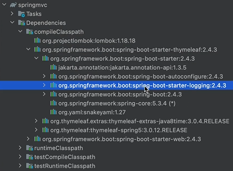
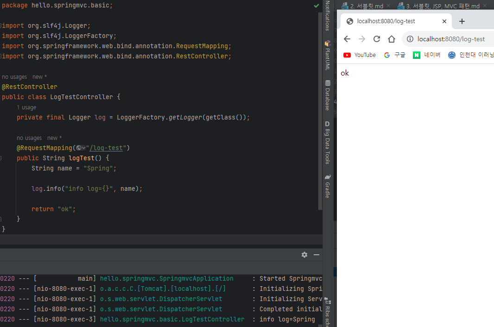
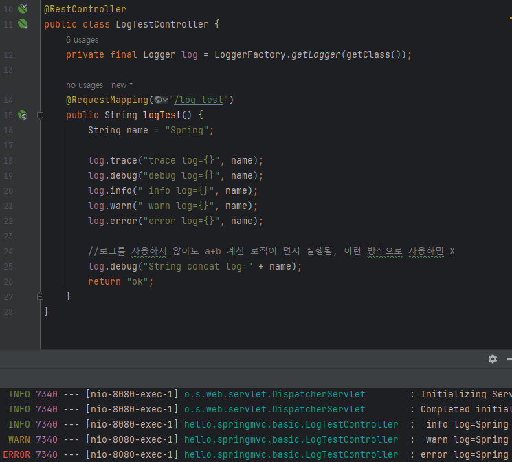
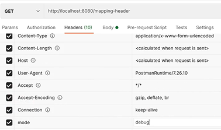
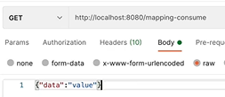
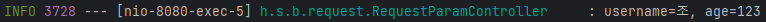
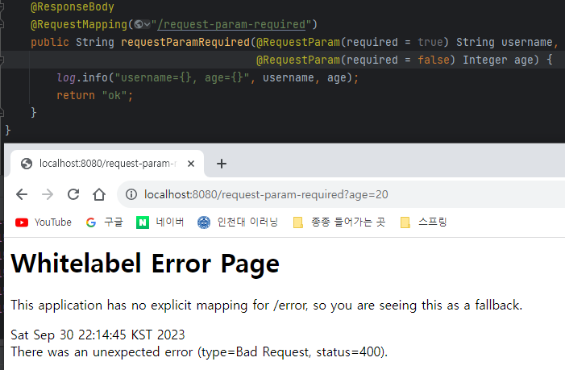
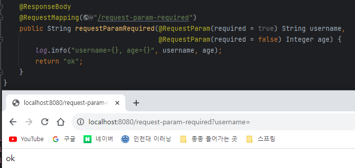
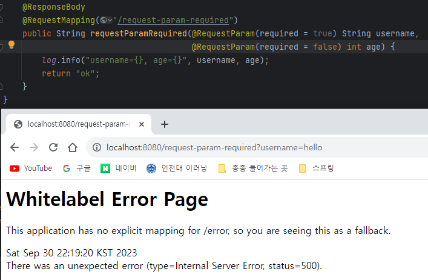
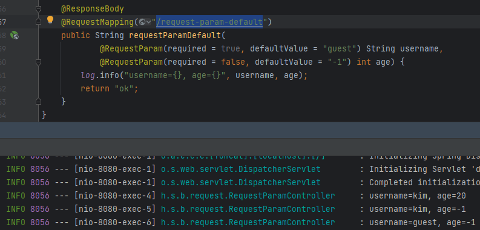

# 백엔드 웹 개발 핵심 기술

## ✔ 스프링 MVC - 기본 기능

### 프로젝트 생성

- 프로젝트 선택
    - Project: Gradle Project
    - Language: Java
    - Spring Boot: 2.4.x


- Project Metadata
  - Group: hello
  - Artifact: springmvc
  - Name: springmvc
  - Package name: hello.springmvc
  - Packaging: Jar (주의!)
  - Java: 11
   

- Dependencies: **Spring Web, Thymeleaf, Lombok**
   

- 동작 확인   
기본 메인 클래스 실행( SpringmvcApplication.main() )   
http://localhost:8080 호출해서 Whitelabel Error Page가 나오면 정상 동작

---
### Welcome 페이지 만들기

학습할 내용을 편리하게 참고하기 위해 Welcome 페이지를 만든다.

스프링 부트에 Jar 를 사용하면 `/resources/static/` 위치에 `index.html` 파일을 두면 Welcome
페이지로 처리해준다. (스프링 부트가 지원하는 정적 컨텐츠 위치에 `/index.html` 이 있으면 된다.

```html
<!DOCTYPE html>
<html>
<head>
  <meta charset="UTF-8">
  <title>Title</title>
</head>
<body>
<ul>
  <li>로그 출력
    <ul>
      <li><a href="/log-test">로그 테스트</a></li>
    </ul>
  </li>
  <!-- -->
  <li>요청 매핑
    <ul>
      <li><a href="/hello-basic">hello-basic</a></li>
      <li><a href="/mapping-get-v1">HTTP 메서드 매핑</a></li>
      <li><a href="/mapping-get-v2">HTTP 메서드 매핑 축약</a></li>
      <li><a href="/mapping/userA">경로 변수</a></li>
      <li><a href="/mapping/users/userA/orders/100">경로 변수 다중</a></li>
      <li><a href="/mapping-param?mode=debug">특정 파라미터 조건 매핑</a></li>
      <li><a href="/mapping-header">특정 헤더 조건 매핑(POST MAN 필요)</a></
      li>
      <li><a href="/mapping-consume">미디어 타입 조건 매핑 Content-Type(POST
        MAN 필요)</a></li>
      <li><a href="/mapping-produce">미디어 타입 조건 매핑 Accept(POST MAN
        필요)</a></li>
    </ul>
  </li>
  <li>요청 매핑 - API 예시
    <ul>
      <li>POST MAN 필요</li>
    </ul>
  </li>
  <li>HTTP 요청 기본
    <ul>
      <li><a href="/headers">기본, 헤더 조회</a></li>
    </ul>
  </li>
  <li>HTTP 요청 파라미터
    <ul>
      <li><a href="/request-param-v1?username=hello&age=20">요청 파라미터
        v1</a></li>
      <li><a href="/request-param-v2?username=hello&age=20">요청 파라미터
        v2</a></li>
      <li><a href="/request-param-v3?username=hello&age=20">요청 파라미터
        v3</a></li>
      <li><a href="/request-param-v4?username=hello&age=20">요청 파라미터
        v4</a></li>
      <li><a href="/request-param-required?username=hello&age=20">요청
        파라미터 필수</a></li>
      <li><a href="/request-param-default?username=hello&age=20">요청
        파라미터 기본 값</a></li>
      <li><a href="/request-param-map?username=hello&age=20">요청 파라미터
        MAP</a></li>
      <li><a href="/model-attribute-v1?username=hello&age=20">요청 파라미터
        @ModelAttribute v1</a></li>
      <li><a href="/model-attribute-v2?username=hello&age=20">요청 파라미터
        @ModelAttribute v2</a></li>
    </ul>
  </li>
  <li>HTTP 요청 메시지
    <ul>
      <li>POST MAN</li>
    </ul>
  </li>
  <li>HTTP 응답 - 정적 리소스, 뷰 템플릿
    <ul>
      <li><a href="/basic/hello-form.html">정적 리소스</a></li>
      <li><a href="/response-view-v1">뷰 템플릿 v1</a></li>
      <li><a href="/response-view-v2">뷰 템플릿 v2</a></li>
    </ul>
  </li>
  <li>HTTP 응답 - HTTP API, 메시지 바디에 직접 입력
    <ul>
      <li><a href="/response-body-string-v1">HTTP API String v1</a></li>
      <li><a href="/response-body-string-v2">HTTP API String v2</a></li>
      <li><a href="/response-body-string-v3">HTTP API String v3</a></li>
      <li><a href="/response-body-json-v1">HTTP API Json v1</a></li>
      <li><a href="/response-body-json-v2">HTTP API Json v2</a></li>
    </ul>
  </li>
</ul>
</body>
</html>
```

---
### 로깅 간단히 알아보기

앞으로 로그를 사용할 것이기 때문에, 이번시간에는 로그에 대해서 간단히 알아보자.

운영 시스템에서는 `System.out.println()` 같은 시스템 콘솔을 사용해서 필요한 정보를 출력하지 않고,
별도의 로깅 라이브러리를 사용해서 로그를 출력한다.   
참고로 로그 관련 라이브러리도 많고, 깊게 들어가면 끝이 없기 때문에, 여기서는 최소한의 사용 방법만
알아본다.   

**로깅 라이브러리**   
스프링 부트 라이브러리를 사용하면 스프링 부트 로깅 라이브러리( `spring-boot-starter-logging` )가
함께 포함된다.   
스프링 부트 로깅 라이브러리는 기본으로 다음 로깅 라이브러리를 사용한다.

- SLF4J - http://www.slf4j.org
- Logback - http://logback.qos.ch



로그 라이브러리는 Logback, Log4J, Log4J2 등등 수 많은 라이브러리가 있는데, 그것을 통합해서
인터페이스로 제공하는 것이 바로 SLF4J 라이브러리다.   
쉽게 이야기해서 SLF4J는 인터페이스이고, 그 구현체로 Logback 같은 로그 라이브러리를 선택하면 된다.   
**실무에서는 스프링 부트가 기본으로 제공하는 Logback을 대부분 사용한다.**

**로그 선언**   
- `private Logger log = LoggerFactory.getLogger(getClass());`
- `private static final Logger log = LoggerFactory.getLogger(Xxx.class)`
- `@Slf4j` : 롬복 사용 가능

**로그 호출**
- `log.info("hello")`   

시스템 콘솔로 직접 출력하는 것 보다 로그를 사용하면 다음과 같은 장점이 있다.    
실무에서는 항상 로그를 사용해야 한다.



LogTestController 가 잘 실행됐음을 알 수 있다.

**매핑 정보**   
- `@RestController`
  - `@Controller` 는 반환 값이 String 이면 **뷰 이름**으로 인식된다. 그래서 **뷰를 찾고 뷰가 랜더링 된다.**
  - `@RestController` 는 반환 값으로 뷰를 찾는 것이 아니라, **HTTP 메시지 바디에 바로 입력**한다.
따라서 실행 결과로 문자를 받을 수 있다. `@ResponseBody` 와 관련이 있는데, 뒤에서 더 자세히 설명한다.

Logger의 진가는 지금부터 드러난다.

```java
package hello.springmvc.basic;

import lombok.extern.slf4j.Slf4j;
import org.slf4j.Logger;
import org.slf4j.LoggerFactory;
import org.springframework.web.bind.annotation.RequestMapping;
import org.springframework.web.bind.annotation.RestController;
//@Slf4j

@RestController
public class LogTestController {
    private final Logger log = LoggerFactory.getLogger(getClass());

    @RequestMapping("/log-test")
    public String logTest() {
        String name = "Spring";

        log.trace("trace log={}", name);
        log.debug("debug log={}", name);
        log.info(" info log={}", name);
        log.warn(" warn log={}", name);
        log.error("error log={}", name);
        
        //로그를 사용하지 않아도 a+b 계산 로직이 먼저 실행됨, 이런 방식으로 사용하면 X
        log.debug("String concat log=" + name);
        return "ok";
    }
}
```

**위의 코드를 실행한 결과**



trace, debug는 나오지 않는데 모든 로그를 보고 싶다면  
application.properties 로 가서 
```
#hello.spring 패키지와 그 하위 로그 레벨 설정
logging.level.hello.springmvc=trace
```
입력하면 trace 부터 다 볼 수 있다. `logging.level.hello.springmvc=debug` 면 debug 부터 볼 수 있다.

**테스트**  
- 로그가 출력되는 포멧 확인
  - 시간, 로그 레벨, 프로세스 ID, 쓰레드 명, 클래스명, 로그 메시지
- 로그 레벨 설정을 변경해서 출력 결과를 보자.
  - LEVEL: `TRACE > DEBUG > INFO > WARN > ERROR`
  - 개발 서버는 debug 출력
  - 운영 서버는 info 출력
- `@Slf4j` 로 변경

**로그 레벨 설정**   
`application.properties`
```
#전체 로그 레벨 설정(기본 info)
logging.level.root=info

#hello.springmvc 패키지와 그 하위 로그 레벨 설정
logging.level.hello.springmvc=debug
```

**올바른 로그 사용법**  
- `log.debug("data="+data)` <- 안 좋은 예시
  - 로그 출력 레벨을 info로 설정해도 해당 코드에 있는 "data="+data가 실제 실행이 되어 버린다.
  결과적으로 문자 더하기 연산이 발생한다.
  - ex) String = "Spring" 이면 `log.debug("data=Spring")` 과 똑같다는 뜻이다.
  - 그냥 파라미터만 넘기는 것과 의미 없는 연산을 하는 것에는 차이가 있다.
- `log.debug("data={}", data)` **<- 좋은 예시**
  - 로그 출력 레벨을 info로 설정하면 아무일도 발생하지 않는다. 따라서 앞과 같은 의미없는 연산이
  발생하지 않는다.

**로그 사용시 장점 (중요)**
- 쓰레드 정보, 클래스 이름 같은 부가 정보를 함께 볼 수 있고, 출력 모양을 조정할 수 있다.
- 로그 레벨에 따라 **개발 서버에서는 모든 로그를 출력하고, 운영서버에서는 출력하지 않는 등 로그를 상황에
맞게 조절할 수 있다.**
- **시스템 아웃 콘솔에만 출력하는 것이 아니라, 파일이나 네트워크 등, 로그를 별도의 위치에 남길 수 있다.**
- 특히 파일로 남길 때는 일별, 특정 용량에 따라 로그를 분할하는 것도 가능하다.
- 성능도 일반 System.out보다 좋다. (내부 버퍼링, 멀티 쓰레드 등등) 그래서 실무에서는 꼭 로그를
사용해야 한다.

---
### 요청 매핑

MappingController
```java
package hello.springmvc.basic.requestmapping;

import org.slf4j.Logger;
import org.slf4j.LoggerFactory;
import org.springframework.web.bind.annotation.RequestMapping;
import org.springframework.web.bind.annotation.RestController;

@RestController
public class MappingController {

    private Logger log = LoggerFactory.getLogger(getClass());

    @RequestMapping("/hello-basic")
    public String helloBasic() {
        log.info("helloBasic");
        return "ok";
    }
}

```

**매핑 정보(한번 더)**
- `@RestController`
  - `@Controller` 는 반환 값이 String 이면 **뷰 이름으로 인식**된다. 그래서 뷰를 찾고 **뷰가 랜더링 된다.**
  - `@RestController` 는 반환 값으로 뷰를 찾는 것이 아니라, **HTTP 메시지 바디에 바로 입력**한다. 따라서 실행 결과로 ok 메세지를 받을 수 있다. `@ResponseBody` 와 관련이 있는데, 뒤에서 더 자세히 설명한다.
- `@RequestMapping("/hello-basic")`
  - `/hello-basic` URL 호출이 오면 이 메서드가 실행되도록 매핑한다.
  - 대부분의 속성을 `배열[]` 로 제공하므로 다중 설정이 가능하다. `{"/hello-basic", "/hello-go"}`

**둘다 허용 - 스프링 부트 3.0 이전**
다음 두가지 요청은 다른 URL이지만, 스프링은 다음 URL 요청들을 같은 요청으로 매핑한다.
- 매핑: `/hello-basic`
- URL 요청: `/hello-basic` , `/hello-basic/`

> **스프링 부트 3.0 이후**  
> 스프링 부트 3.0 부터는 `/hello-basic` , `/hello-basic/` 는 서로 다른 URL 요청을 사용해야 한다.  
> 기존에는 마지막에 있는 `/` (slash)를 제거했지만, 스프링 부트 3.0 부터는 마지막의 `/` (slash)를 유지한다.  
> 따라서 다음과 같이 다르게 매핑해서 사용해야 한다.  
> 매핑: `/hello-basic` URL 요청: `/hello-basic`  
> 매핑: `/hello-basic/` URL 요청: `/hello-basic/`  

위의 코드를 Postman으로 테스트해보면 GET, POST, DELETE, PUT 등 다 OK로 반환시켜준다.
이것을 다르게 하려면 HTTP 메서드 매핑이 필요하다.

**HTTP 메서드 매핑**  
`@RequestMapping` 에 `method` 속성으로 HTTP 메서드를 지정하지 않으면 HTTP 메서드와 무관하게
호출된다.  
모두 허용 GET, HEAD, POST, PUT, PATCH, DELETE

```java
package hello.springmvc.basic.requestmapping;

import org.slf4j.Logger;
import org.slf4j.LoggerFactory;
import org.springframework.web.bind.annotation.RequestMapping;
import org.springframework.web.bind.annotation.RequestMethod;
import org.springframework.web.bind.annotation.RestController;

@RestController
public class MappingController {

    private Logger log = LoggerFactory.getLogger(getClass());

    @RequestMapping(value = "/hello-basic", method = RequestMethod.GET)
    public String helloBasic() {
        log.info("helloBasic");
        return "ok";
    }
}

```

위 코드대로 HTTP 메서드를 추가해주면 GET 일 때만 OK 인 것을 알 수 있다.  
만약 여기에 POST 요청을 하면 스프링 MVC는 HTTP 405 상태코드(Method Not Allowed)를 반환한다.  

---
해당 메서드 매핑을 축약하는 방법도 있다.

**HTTP 메서드 매핑 축약**
* @GetMapping
* @PostMapping
* @PutMapping
* @DeleteMapping
* @PatchMapping

```java
    @GetMapping(value = "/mapping-get-v2")
    public String mappingGetV2() {
        log.info("mapping-get-v2");
        return "ok";
    }
```
HTTP 메서드를 축약한 애노테이션을 사용하는 것이 더 직관적이다. 코드를 보면 내부에서
`@RequestMapping` 과 `method` 를 지정해서 사용하는 것을 확인할 수 있다.

---
**PathVariable(경로 변수) 사용**
```java
    @GetMapping("/mapping/{userId}")
    public String mappingPath(@PathVariable("userId") String data) {
        log.info("mappingPath userId={}", data);
        return "ok";
    }
```
최근 HTTP API는 다음과 같이 리소스 경로에 식별자를 넣는 스타일을 선호한다.
- `/mapping/userA`
- `/users/1`


- `@RequestMapping` 은 URL 경로를 템플릿화 할 수 있는데, `@PathVariable` 을 사용하면 매칭 되는 부분을 편리하게 조회할 수 있다.
- `@PathVariable` 의 이름과 파라미터 이름이 같으면 생략할 수 있다.

**PathVariable 사용 - 다중**
```java
    @GetMapping("/mapping/users/{userId}/orders/{orderId}")
    public String mappingPath(@PathVariable String userId, @PathVariable Long orderId) {
        log.info("mappingPath userId={}, orderId={}", userId, orderId);
        return "ok";
    }
```

  
위의 코드를 Postman으로 요청을 보내면  
  
mapping의 users의 userId = A와 orders의 orderId = 100을 로그로 출력해준다.

---
**특정 파라미터 조건 매핑**
```java
    @GetMapping(value = "/mapping-param", params = "mode=debug")
    public String mappingParam() {
        log.info("mappingParam");
        return "ok";
    }
```

특정 파라미터가 있거나 없는 조건을 추가할 수 있다. 잘 사용하지는 않는다.

---
**특정 헤더 조건 매핑**
```java
/**
 * 특정 헤더로 추가 매핑
 * headers="mode",
 * headers="!mode"
 * headers="mode=debug"
 * headers="mode!=debug" (! = )
 */
    @GetMapping(value = "/mapping-header", headers = "mode=debug")
    public String mappingHeader() {
        log.info("mappingHeader");
        return "ok";
    }
```
파라미터 매핑과 비슷하지만, HTTP 헤더를 사용한다.  
  
요청을 보내면 ok가 반환되는 것을 알 수 있다.  

---
미디어 타입 조건 매핑 - HTTP 요청 Content-Type, **consume**
```java
/**
 * Content-Type 헤더 기반 추가 매핑 Media Type
 * consumes="application/json"
 * consumes="!application/json"
 * consumes="application/*"
 * consumes="*\/*"
 * MediaType.APPLICATION_JSON_VALUE
 */
    @PostMapping(value = "/mapping-consume", consumes = "application/json")
    public String mappingConsumes() {
        log.info("mappingConsumes");
        return "ok";
    }
```
  
(GET이 아닌 POST 여야 한다.)

HTTP 요청의 **Content-Type 헤더를 기반으로 미디어 타입으로 매핑**한다.  
만약 맞지 않으면 HTTP 415 상태코드(Unsupported Media Type)을 반환한다.

예시) consumes
```
consumes = "text/plain"
consumes = {"text/plain", "application/*"}
consumes = MediaType.TEXT_PLAIN_VALUE
```
---
미디어 타입 조건 매핑 - HTTP 요청 Accept, **produce**
```
/**
 * Accept 헤더 기반 Media Type
 * produces = "text/html"
 * produces = "!text/html"
 * produces = "text/*"
 * produces = "*\/*"
 */
  @PostMapping(value = "/mapping-produce", produces = "text/html")
    public String mappingProduces() {
        log.info("mappingProduces");
        return "ok";
    }
```

HTTP 요청의 Accept 헤더를 기반으로 미디어 타입으로 매핑한다.  
Accept 헤더에서 알맞은 값을 적은 뒤 요청을 보내면 ok를 반환하지만,  
만약 맞지 않으면 HTTP **406 상태코드**(Not Acceptable)을 반환한다.

예시)
```
produces = "text/plain"
produces = {"text/plain", "application/*"}
produces = MediaType.TEXT_PLAIN_VALUE
produces = "text/plain;charset=UTF-8"
```
---
### 요청 매핑 - API 예시

회원 관리를 HTTP API로 만든다 생각하고 매핑을 어떻게 하는지 알아보자.  
(실제 데이터가 넘어가는 부분은 생략하고 URL 매핑만)  

**회원 관리 API**
- 회원 목록 조회: GET `/users`
- 회원 등록: POST `/users`
- 회원 조회: GET `/users/{userId}`
- 회원 수정: PATCH `/users/{userId}`
- 회원 삭제: DELETE `/users/{userId}`

**MappingClassController**
```java
package hello.springmvc.basic.requestmapping;

import org.springframework.web.bind.annotation.*;

@RestController
@RequestMapping("/mapping/users")
public class MappingClassController {
  /**
   * GET /mapping/users
   */
    @GetMapping
    //@GetMapping("/mapping/users")
    public String users() {
        return "get users";
    }
  /**
   * POST /mapping/users
   */
    @PostMapping
    //@PostMapping("/mapping/users")
    public String addUser() {
        return "post user";
    }
  /**
   * GET /mapping/users/{userId}
   */
    @GetMapping("/{userId}")
    //@GetMapping("/mapping/users/{userId}")
    public String findUser(@PathVariable String userId) {
        return "get userId=" + userId;
    }
  /**
   * PATCH /mapping/users/{userId}
   */
    @PatchMapping("/{userId}")
    //@PatchMapping("/mapping/users/{userId}")
    public String updateUser(@PathVariable String userId) {
        return "update userId=" + userId;
    }
  /**
   * DELETE /mapping/users/{userId}
   */
    @DeleteMapping("/{userId}")
    //@DeleteMapping("/mapping/users/{userId}")
    public String deleteUser(@PathVariable String userId) {
        return "delete userId=" + userId;
    }
}
```
- `/mapping` :는 강의의 다른 예제들과 구분하기 위해 사용했다.
- `@RequestMapping("/mapping/users")`
  - 클래스 레벨에 매핑 정보를 두면 메서드 레벨에서 해당 정보를 조합해서 사용한다.

**Postman으로 테스트**
- 회원 목록 조회: GET `/mapping/users`
- 회원 등록: POST `/mapping/users`
- 회원 조회: GET `/mapping/users/id1`
- 회원 수정: PATCH `/mapping/users/id1`
- 회원 삭제: DELETE `/mapping/users/id1`

매핑 방법을 이해했으니, 이제부터 HTTP 요청이 보내는 데이터들을 스프링 MVC로 어떻게 조회하는지 알아보자.

---
### HTTP 요청 - 기본, 헤더 조회

애노테이션 기반의 스프링 컨트롤러는 다양한 파라미터를 지원한다.  
이번 시간에는 HTTP 헤더 정보를 조회하는 방법을 알아보자.  

**RequestHeaderController**
```java
package hello.springmvc.basic.request;

import lombok.extern.slf4j.Slf4j;
import org.springframework.http.HttpMethod;
import org.springframework.util.MultiValueMap;
import org.springframework.web.bind.annotation.*;

import javax.servlet.http.HttpServletRequest;
import javax.servlet.http.HttpServletResponse;
import java.util.Locale;

@Slf4j
@RestController
public class RequestHeaderController {
    @RequestMapping("/headers")
    public String headers(HttpServletRequest request,
                          HttpServletResponse response,
                          HttpMethod httpMethod,
                          Locale locale,
                          @RequestHeader MultiValueMap<String, String> headerMap,
                          @RequestHeader("host") String host,
                          @CookieValue(value = "myCookie", required = false)
                          String cookie
    ) {
        log.info("request={}", request);
        log.info("response={}", response);
        log.info("httpMethod={}", httpMethod);
        log.info("locale={}", locale);
        log.info("headerMap={}", headerMap);
        log.info("header host={}", host);
        log.info("myCookie={}", cookie);
        return "ok";
    }
}
```

- `HttpServletRequest`
- `HttpServletResponse`
- `HttpMethod` : HTTP 메서드를 조회한다. `org.springframework.http.HttpMethod`
- `Locale` : Locale 정보를 조회한다.
- `@RequestHeader MultiValueMap<String, String> headerMap`
  - 모든 HTTP 헤더를 MultiValueMap 형식으로 조회한다.
- `@RequestHeader("host") String host`
  - 특정 HTTP 헤더를 조회한다.
  - 속성
    - 필수 값 여부: `required`
    - 기본 값 속성: `defaultValue`
- `@CookieValue(value = "myCookie", required = false) String cookie`
  - 특정 쿠키를 조회한다.
  - 속성
    - 필수 값 여부: `required`
    - 기본 값: `defaultValue`

```
INFO 13116 --- [nio-8080-exec-1] h.s.b.request.RequestHeaderController    : request=org.apache.catalina.connector.RequestFacade@72aab535
INFO 13116 --- [nio-8080-exec-1] h.s.b.request.RequestHeaderController    : response=org.apache.catalina.connector.ResponseFacade@2d7b12cb
INFO 13116 --- [nio-8080-exec-1] h.s.b.request.RequestHeaderController    : httpMethod=GET
INFO 13116 --- [nio-8080-exec-1] h.s.b.request.RequestHeaderController    : locale=ko_KR
INFO 13116 --- [nio-8080-exec-1] h.s.b.request.RequestHeaderController    : headerMap={user-agent=[PostmanRuntime/7.32.3], accept=[*/*], postman-token=[87687833-1d6c-419e-87e5-6437d2e6ff04], 
                                                                            host=[localhost:8080], accept-encoding=[gzip, deflate, br], connection=[keep-alive]}
INFO 13116 --- [nio-8080-exec-1] h.s.b.request.RequestHeaderController    : header host=localhost:8080
INFO 13116 --- [nio-8080-exec-1] h.s.b.request.RequestHeaderController    : myCookie=null
```
(한 줄마다 나오지만 보기 편하게 했다)

`MultiValueMap`
- MAP과 유사한데, 하나의 키에 여러 값을 받을 수 있다.
- HTTP header, HTTP 쿼리 파라미터와 같이 하나의 키에 여러 값을 받을 때 사용한다.
  - **keyA=value1&keyA=value2**로 출력된다.
```java
MultiValueMap<String, String> map = new LinkedMultiValueMap();
map.add("keyA", "value1");
map.add("keyA", "value2");

//[value1,value2]
List<String> values = map.get("keyA");
```

**@Slf4j**  
다음 코드를 자동으로 생성해서 로그를 선언해준다. 개발자는 편리하게 `log` 라고 사용하면 된다.
```java
private static final org.slf4j.Logger log = org.slf4j.LoggerFactory.getLogger(RequestHeaderController.class);
```
---
### HTTP 요청 파라미터 - 쿼리 파라미터, HTML Form

#### HTTP 요청 데이터 조회 - 개요

서블릿에서 학습했던 HTTP 요청 데이터를 조회 하는 방법을 다시 떠올려보자. 그리고 서블릿으로 학습했던
내용을 스프링이 얼마나 깔끔하고 효율적으로 바꾸어주는지 알아보자.

HTTP 요청 메시지를 통해 클라이언트에서 서버로 데이터를 전달하는 방법을 알아보자.

**클라이언트에서 서버로 요청 데이터를 전달할 때는 주로 다음 3가지 방법을 사용**
- **GET - 쿼리 파라미터**
  - /url**?username=hello&age=20**
  - 메시지 바디 없이, URL의 쿼리 파라미터에 데이터를 포함해서 전달
  - 예) 검색, 필터, 페이징등에서 많이 사용하는 방식
- **POST - HTML Form**
  - content-type: application/x-www-form-urlencoded
  - 메시지 바디에 쿼리 파리미터 형식으로 전달 username=hello&age=20
  - 예) 회원 가입, 상품 주문, HTML Form 사용
- **HTTP message body**에 데이터를 직접 담아서 요청
  - HTTP API에서 주로 사용, JSON, XML, TEXT
  - 데이터 형식은 주로 JSON 사용
  - POST, PUT, PATCH

하나씩 알아보자.

#### 요청 파라미터 - 쿼리 파라미터, HTML Form

`HttpServletRequest` 의 `request.getParameter()` 를 사용하면 다음 두가지 요청 파라미터를 조회할 수 있다.

**GET, 쿼리 파라미터 전송**  
예시  
`http://localhost:8080/request-param?username=hello&age=20`  

**POST, HTML Form 전송**  
예시
```
POST /request-param ...
content-type: application/x-www-form-urlencoded

username=hello&age=20
```
GET 쿼리 파리미터 전송 방식이든, POST HTML Form 전송 방식이든 둘다 형식이 같으므로 구분없이 조회할 수 있다.  
이것을 간단히 **요청 파라미터(request parameter) 조회**라 한다.

스프링으로 요청 파라미터를 조회하는 방법을 단계적으로 알아보자.

**RequestParamController**
```java
package hello.springmvc.basic.request;

import lombok.extern.slf4j.Slf4j;
import org.springframework.stereotype.Controller;
import org.springframework.web.bind.annotation.RequestMapping;

import javax.servlet.http.HttpServletRequest;
import javax.servlet.http.HttpServletResponse;
import java.io.IOException;

@Slf4j
@Controller
public class RequestParamController {

    @RequestMapping("/request-param-v1")
    public void requestParamV1(HttpServletRequest request, HttpServletResponse response) throws IOException {
        String username = request.getParameter("username");
        int age = Integer.parseInt(request.getParameter("age"));
        log.info("username={}, age={}", username, age);

        response.getWriter().write("ok");
    }
}

```

**request.getParameter()**  
여기서는 단순히 HttpServletRequest가 제공하는 방식으로 요청 파라미터를 조회했다.

**GET 실행**  
http://localhost:8080/request-param-v1?username=hello&age=20

**Post Form 페이지 생성**  
먼저 테스트용 HTML Form을 만들어야 한다.  

리소스는 `/resources/static` 아래에 두면 스프링 부트가 자동으로 인식한다.

`main/resources/static/basic/hello-form.html`
```html
<!DOCTYPE html>
<html>
<head>
    <meta charset="UTF-8">
    <title>Title</title>
</head>
<body>
<form action="/request-param-v1" method="post">
    username: <input type="text" name="username" />
    age: <input type="text" name="age" />
    <button type="submit">전송</button>
</form>
</body>
</html>
```

**Post Form 실행**  
http://localhost:8080/basic/hello-form.html



> 참고
> Jar 를 사용하면 webapp 경로를 사용할 수 없다. 이제부터 정적 리소스도 클래스 경로에 함께 포함해야 한다.

---
### HTTP 요청 파라미터 - @RequestParam

스프링이 제공하는 `@RequestParam` 을 사용하면 요청 파라미터를 매우 편리하게 사용할 수 있다.

**requestParamV2**
```java
    @ResponseBody
    @RequestMapping("/request-param-v2")
    public String requestParamV2(@RequestParam("username") String memberName, @RequestParam("age") int memberAge) {
        log.info("username={}, age={}", memberName, memberAge);
        return "ok";
    }
```
- `@RequestParam` : 파라미터 이름으로 바인딩
- `@ResponseBody` : View 조회를 무시하고, HTTP message body에 직접 해당 내용 입력
  - "ok"를 바디에 직접 입력한다는 뜻

**@RequestParam**의 `name(value)` 속성이 파라미터 이름으로 사용  
- @RequestParam("**username**") String **memberName** == request.getParameter("**username**")  

**requestParamV3**
```java
    @ResponseBody
    @RequestMapping("/request-param-v3")
    public String requestParamV3(
            @RequestParam String username, @RequestParam int age) {
        log.info("username={}, age={}", username, age);
        return "ok";
    }
```
HTTP 파라미터 이름이 변수 이름과 같으면 `@RequestParam(name="xx")` 생략 가능

**requestParamV4**
```java
    @ResponseBody
    @RequestMapping("/request-param-v4")
    public String requestParamV4(String username, int age) {
        log.info("username={}, age={}", username, age);
        return "ok";
        }
```
`String` , `int` , `Integer` 등의 단순 타입이면 `@RequestParam` 도 생략 가능

> 주의  
> @RequestParam 애노테이션을 생략하면 스프링 MVC는 내부에서 required=false 를 적용한다.  
> required 옵션은 바로 다음에 설명한다.

**파라미터 필수 여부 - requestParamRequired**
```java
    @ResponseBody
    @RequestMapping("/request-param-required")
    public String requestParamRequired(@RequestParam(required = true) String username, @RequestParam(required = false) Integer age) {
        log.info("username={}, age={}", username, age);
        return "ok";
    }
```
---
- `@RequestParam.required`
  - 파라미터 필수 여부
  - 기본값이 파라미터 필수( `true` )이다.

예시 1.  
  
- `/request-param` 요청
- `username` true임에도 없으므로 400 예외가 발생한다.

예시 2.  
  
**주의! - 파라미터 이름만 사용**  
`/request-param?username=`  
파라미터 이름만 있고 값이 없는 경우 빈 문자로 통과  

예시 3.  
  
**주의! - 기본형(primitive)에 null 입력**  
- `/request-param` 요청
- `@RequestParam(required = false) int age`-> 이 상태에서 age에 아무 값을 넣지 않으면 500 에러가 발생한다.

---
**기본 값 적용 - requestParamDefault**
```java
    @ResponseBody
    @RequestMapping("/request-param-default")
    public String requestParamDefault(
            @RequestParam(required = true, defaultValue = "guest") String username,
            @RequestParam(required = false, defaultValue = "-1") int age) {
        log.info("username={}, age={}", username, age);
        return "ok";
    }
```

파라미터에 값이 없는 경우 `defaultValue` 를 사용하면 기본 값을 적용할 수 있다.  
이미 기본 값이 있기 때문에 `required` 는 의미가 없다.  

`defaultValue` 는 빈 문자의 경우에도 설정한 기본 값이 적용된다.  
`/request-param-default?username=`  

  
- username에 kim, age에 20을 넣었을 때
- username만 kim을 넣었을 때
- 둘다 안 쓰고 요청했을 때
---
**파라미터를 Map으로 조회하기 - requestParamMap**
```java
    @ResponseBody
    @RequestMapping("/request-param-map")
    public String requestParamMap(@RequestParam Map<String, Object> paramMap) {
        log.info("username={}, age={}", paramMap.get("username"), paramMap.get("age"));
        return "ok";
    }
```
파라미터를 Map, MultiValueMap으로 조회할 수 있다.  

- `@RequestParam Map ,`
  - `Map(key=value)`
- `@RequestParam MultiValueMap`
  - `MultiValueMap(key=[value1, value2, ...] ex) (key=userIds, value=[id1, id2])  `

파라미터의 값이 1개가 확실하다면 `Map` 을 사용해도 되지만, 그렇지 않다면 `MultiValueMap` 을 사용하자.  
거의 1개를 사용하고, 애매하게 2개를 쓰진 않는다.

---
### HTTP 요청 파라미터 - @ModelAttribute

실제 개발을 하면 요청 파라미터를 받아서 필요한 객체를 만들고 그 객체에 값을 넣어주어야 한다.   
보통 다음과 같이 코드를 작성할 것이다.
```java
@RequestParam String username;
@RequestParam int age;

HelloData data = new HelloData();
data.setUsername(username);
data.setAge(age);
```

스프링은 이 과정을 완전히 자동화해주는 `@ModelAttribute` 기능을 제공한다.  

먼저 요청 파라미터를 바인딩 받을 객체를 만들자.

**HelloData**
```java
package hello.springmvc.basic;

import lombok.Data;

@Data
public class HelloData {
    private String username;
    private int age;
}
```

- 롬복 `@Data`
- `@Getter` , `@Setter` , `@ToString` , `@EqualsAndHashCode` , `@RequiredArgsConstructor` 를 자동으로 적용해준다.

**@ModelAttribute 적용 - modelAttributeV1** (RequestParamController에 마저 진행)
기본에 만들었던 방식
```java
    @ResponseBody
    @RequestMapping("/model-attribute-v1")
    public String modelAttributeV1(@RequestParam String username, @RequestParam int age) {
        HelloData helloData = new HelloData();
        helloData.setUsername(username);
        helloData.setAge(age);
        
        log.info("username={}, age={}", helloData.getUsername(), helloData.getAge());
        
        return "ok";
    }
```

위의 코드대로 해도 가능은 하지만 롬복을 사용하면 아래처럼 해도 된다.

```java
    @ResponseBody
    @RequestMapping("/model-attribute-v1")
    public String modelAttributeV1(@ModelAttribute HelloData helloData) {
        log.info("username={}, age={}", helloData.getUsername(), helloData.getAge());
        return "ok";
    }
```
마치 마법처럼 `HelloData` 객체가 생성되고, 요청 파라미터의 값도 모두 들어가 있다.

스프링MVC는 `@ModelAttribute` 가 있으면 다음을 실행한다.
- `HelloData` 객체를 생성한다.
- 요청 파라미터의 이름으로 `HelloData` 객체의 프로퍼티를 찾는다. 그리고 해당 프로퍼티의 setter를 호출해서 파라미터의 값을 입력(바인딩) 한다.
- 예) 파라미터 이름이 `username` 이면 `setUsername()` 메서드를 찾아서 호출하면서 값을 입력한다.

**프로퍼티 Property**란?  
객체에 `getUsername()` , `setUsername()` 메서드가 있으면, 이 객체는 `username` 이라는 프로퍼티를 가지고 있다.  
`username` 프로퍼티의 값을 변경하면 `setUsername()` 이 호출되고, 조회하면 `getUsername()` 이 호출된다.
```
class HelloData {
  getUsername();
  setUsername();
}
```

**바인딩 오류**  
`age=abc` 처럼 숫자가 들어가야 할 곳에 문자를 넣으면 `BindException` 이 발생한다.  
> 이런 바인딩 오류를 처리하는 방법은 검증 부분에서 다룬다.
---
**@ModelAttribute 생략 - modelAttributeV2**
```java
    @ResponseBody
    @RequestMapping("/model-attribute-v2")
    public String modelAttributeV2(HelloData helloData) {
        log.info("username={}, age={}", helloData.getUsername(), helloData.getAge());
        return "ok";
    }
```

`@ModelAttribute` 는 생략할 수 있다.
그런데 `@RequestParam` 도 생략할 수 있으니 혼란이 발생할 수 있다.

스프링은 해당 생략시 다음과 같은 규칙을 적용한다.
- `String` , `int` , `Integer` 같은 단순 타입 = `@RequestParam`
- 나머지 = `@ModelAttribute` (argument resolver 로 지정해둔 타입은 ModelAttribute가 지정되지 않는다.)

> 참고
> argument resolver는 뒤에서 학습한다.

---
### HTTP 요청 메시지 - 단순 텍스트

