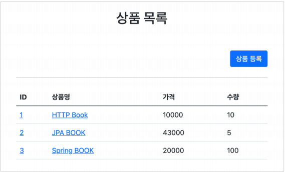
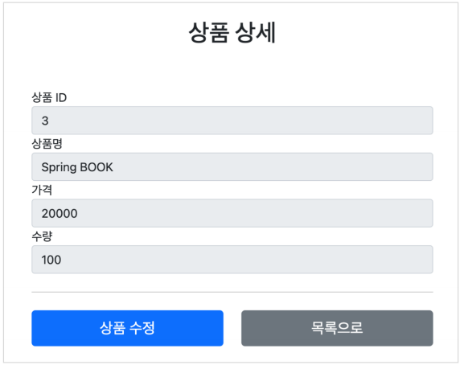
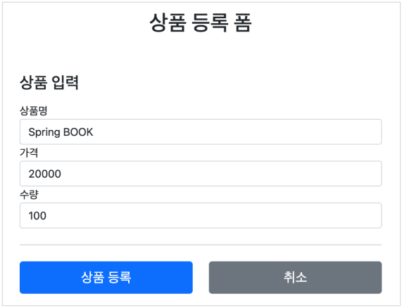
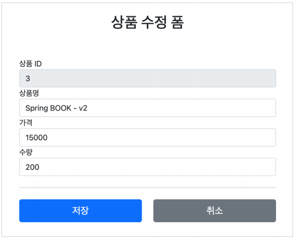
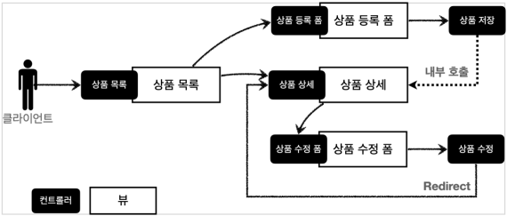

# 백엔드 웹 개발 핵심 기술

## ✔ 스프링 MVC - 웹 페이지 만들기

### 프로젝트 생성

스프링 부트 스타터 사이트로 이동해서 스프링 프로젝트 생성  
https://start.spring.io

- 프로젝트 선택
  - Project: Gradle Project
  - Language: Java
  - Spring Boot: 2.7.x
- Project Metadata
  - Group: hello
  - Artifact: item-service
  - Name: item-service
  - Package name: hello.itemservice
  - Packaging: Jar (주의!)
  - Java: 11

- Dependencies: Spring Web, Thymeleaf, Lombok
---
**build.gradle**
```build.gradle
plugins {
    id 'java'
    id 'org.springframework.boot' version '2.7.17'
    id 'io.spring.dependency-management' version '1.0.15.RELEASE'
}

group = 'hello'
version = '0.0.1-SNAPSHOT'

java {
    sourceCompatibility = '11'
}

configurations {
    compileOnly {
        extendsFrom annotationProcessor
    }
}

repositories {
    mavenCentral()
}

dependencies {
    implementation 'org.springframework.boot:spring-boot-starter-thymeleaf'
    implementation 'org.springframework.boot:spring-boot-starter-web'
    compileOnly 'org.projectlombok:lombok'
    annotationProcessor 'org.projectlombok:lombok'
    testImplementation 'org.springframework.boot:spring-boot-starter-test'
}

tasks.named('test') {
    useJUnitPlatform()
}

```

- 동작 확인
  - 기본 메인 클래스 실행( SpringmvcApplication.main() )
  - http://localhost:8080 호출해서 Whitelabel Error Page가 나오면 정상 동작
---
### Welcome 페이지 추가
편리하게 사용할 수 있도록 Welcome 페이지를 추가하자.  
`/resources/static/index.html`
```html
<!DOCTYPE html>
<html>
<head>
  <meta charset="UTF-8">
  <title>Title</title>
</head>
<body>
<ul>
  <li>상품 관리
    <ul>
      <li><a href="/basic/items">상품 관리 - 기본</a></li>
    </ul>
  </li>
</ul>
</body>
</html>
```
- 동작 확인
  - 기본 메인 클래스 실행( SpringmvcApplication.main() )
  - http://localhost:8080 호출해서 Welcome 페이지가 나오면 성공
---
### 요구사항 분석 
상품을 관리할 수 있는 서비스를 만들어보자.  
 
**상품 도메인 모델**  
- 상품 ID
- 상품명
- 가격수량

**상품 관리 기능**
- 상품 목록
- 상품 상세
- 상품 등록
- 상품 수정

**서비스 화면**  







---
**서비스 제공 흐름**  

요구사항이 정리되고 디자이너, 웹 퍼블리셔, 백엔드 개발자가 업무를 나누어 진행한다.
- **디자이너**: 요구사항에 맞도록 디자인하고, 디자인 결과물을 웹 퍼블리셔에게 넘겨준다.
- **웹 퍼블리셔**: 다자이너에서 받은 디자인을 기반으로 HTML, CSS를 만들어 개발자에게 제공한다.
- **백엔드 개발자**: 디자이너, 웹 퍼블리셔를 통해서 HTML 화면이 나오기 전까지 시스템을 설계하고, 핵심 비즈니스 모델을 개발한다. 이후 HTML이 나오면 이 HTML을 뷰 템플릿으로 변환해서 동적으로 화면을그리고, 또 웹 화면의 흐름을 제어한다.
---
### 상품 도메인 개발

**Item - 상품 객체**
```java
package hello.itemservice.domain.item;

import lombok.Data;

@Data
public class Item {
    
    private Long id;
    private String itemName;
    private Integer price;
    private Integer quantity;
    
    public Item() {
    }
    
    public Item(String itemName, Integer price, Integer quantity) {
        this.itemName = itemName;
        this.price = price;
        this.quantity = quantity;
    }
}
```

**ItemRepository - 상품 저장소**
```java
package hello.itemservice.domain.item;

import org.springframework.stereotype.Repository;

import java.util.ArrayList;
import java.util.HashMap;
import java.util.List;
import java.util.Map;

@Repository
public class ItemRepository {

    private static final Map<Long, Item> store = new HashMap<>(); //static 사용한다.
    private static long sequence = 0L; // static 사용한다.

    public Item save(Item item) {
        item.setId(++sequence);
        store.put(item.getId(), item);
        return item;
    }

    public Item findById(Long id) {
        return store.get(id);
    }

    public List<Item> findAll() {
        return new ArrayList<>(store.values());
    }

    public void update(Long itemId, Item updateParam) {
        Item findItem = findById(itemId);
        findItem.setItemName(updateParam.getItemName());
        findItem.setPrice(updateParam.getPrice());
        findItem.setQuantity(updateParam.getQuantity());
    }

    public void clearStore() {
        store.clear();
    }
}
```

**ItemRepositoryTest - 상품 저장소 테스트**
```java
package hello.itemservice.domain.item;

import org.junit.jupiter.api.AfterEach;
import org.junit.jupiter.api.Test;

import java.util.List;

import static org.assertj.core.api.Assertions.assertThat;

class ItemRepositoryTest {

    ItemRepository itemRepository = new ItemRepository();

    @AfterEach
    void afterEach() {
        itemRepository.clearStore();
    }

    @Test
    void save() {
        //given
        Item item = new Item("itemA", 10000, 10);

        //when
        Item savedItem = itemRepository.save(item);

        //then
        Item findItem = itemRepository.findById(item.getId());
        assertThat(findItem).isEqualTo(savedItem);
    }

    @Test
    void findAll() {
        //given
        Item item1 = new Item("item1", 10000, 10);
        Item item2 = new Item("item2", 20000, 20);
        itemRepository.save(item1);
        itemRepository.save(item2);

        //when
        List<Item> result = itemRepository.findAll();

        //then
        assertThat(result.size()).isEqualTo(2);
        assertThat(result).contains(item1, item2);
    }

    @Test
    void updateItem() {
        //given
        Item item = new Item("item1", 10000, 10);
        Item savedItem = itemRepository.save(item);
        Long itemId = savedItem.getId();

        //when
        Item updateParam = new Item("item2", 20000, 30);
        itemRepository.update(itemId, updateParam);
        Item findItem = itemRepository.findById(itemId);

        //then
        assertThat(findItem.getItemName()).isEqualTo(updateParam.getItemName());
        assertThat(findItem.getPrice()).isEqualTo(updateParam.getPrice());
        assertThat(findItem.getQuantity()).isEqualTo(updateParam.getQuantity());
    }
}
```
---
### 상품 서비스 HTML
핵심 비즈니스 로직을 개발하는 동안, 웹 퍼블리셔는 HTML 마크업을 완료했다.  
다음 파일들을 경로에 넣고 잘 동작하는지 확인해보자.  

**부트스트랩**  
참고로 HTML을 편리하게 개발하기 위해 부트스트랩 사용했다.  
먼저 필요한 부트스트랩 파일을 설치하자  

부트스트랩을 다운로드 받고 압축을 풀자.
- 이동: https://getbootstrap.com/docs/5.0/getting-started/download/
- Compiled CSS and JS 항목을 다운로드하자.
- 압축을 출고 `bootstrap.min.css` 를 복사해서 다음 폴더에 추가하자
- `resources/static/css/bootstrap.min.css`

**HTML, css 파일**
- `/resources/static/css/bootstrap.min.css` -> 부트스트랩 다운로드
밑의 4가지는 아래 코드 참조
- `/resources/static/html/items.html `
- `/resources/static/html/item.html`
- `/resources/static/html/addForm.html`
- `/resources/static/html/editForm.html`

참고로 `/resources/static` 에 넣어두었기 때문에 스프링 부트가 정적 리소스를 제공한다.

**실행**  
http://localhost:8080/html/items.html

**상품 목록 HTML**
```html
<!DOCTYPE HTML>
<html>
<head>
    <meta charset="utf-8">
    <link href="../css/bootstrap.min.css" rel="stylesheet">
</head>
<body>
<div class="container" style="max-width: 600px">
    <div class="py-5 text-center">
        <h2>상품 목록</h2>
    </div>
    <div class="row">
        <div class="col">
            <button class="btn btn-primary float-end"
                    onclick="location.href='addForm.html'" type="button">상품
                등록</button>
        </div>
    </div>
    <hr class="my-4">
    <div>
        <table class="table">
            <thead>
            <tr>
                <th>ID</th>
                <th>상품명</th>
                <th>가격</th>
                <th>수량</th> </tr>
            </thead>
            <tbody>
            <tr>
                <td><a href="item.html">1</a></td>
                <td><a href="item.html">테스트 상품1</a></td>
                <td>10000</td>
                <td>10</td>
            </tr>
            <tr>
                <td><a href="item.html">2</a></td>
                <td><a href="item.html">테스트 상품2</a></td>
                <td>20000</td>
                <td>20</td>
            </tr>
            </tbody>
        </table>
    </div>
</div> <!-- /container -->
</body>
</html>
```

**상품 상세 HTML**
```html
<!DOCTYPE HTML>
<html>
<head>
  <meta charset="utf-8">
  <link href="../css/bootstrap.min.css" rel="stylesheet">
  <style>
    .container {
      max-width: 560px;
    }
  </style></head>
<body>
<div class="container">
  <div class="py-5 text-center">
    <h2>상품 상세</h2>
  </div>
  <div>
    <label for="itemId">상품 ID</label>
    <input type="text" id="itemId" name="itemId" class="form-control"
           value="1" readonly>
  </div>
  <div>
    <label for="itemName">상품명</label>
    <input type="text" id="itemName" name="itemName" class="form-control"
           value="상품A" readonly>
  </div>
  <div>
    <label for="price">가격</label>
    <input type="text" id="price" name="price" class="form-control"
           value="10000" readonly>
  </div>
  <div>
    <label for="quantity">수량</label>
    <input type="text" id="quantity" name="quantity" class="form-control"
           value="10" readonly>
  </div>
  <hr class="my-4">
  <div class="row">
    <div class="col">
      <button class="w-100 btn btn-primary btn-lg"
              onclick="location.href='editForm.html'" type="button">상품 수정</button>
    </div>
    <div class="col">
      <button class="w-100 btn btn-secondary btn-lg"onclick="location.href='items.html'" type="button">목록으로</button>
    </div>
  </div>
</div> <!-- /container -->
</body>
</html>
```

**상품 등록 폼 HTML**
```html
<!DOCTYPE HTML>
<html>
<head>
  <meta charset="utf-8">
  <link href="../css/bootstrap.min.css" rel="stylesheet">
  <style>
    .container {
      max-width: 560px;
    }
  </style>
</head>
<body>
<div class="container">
  <div class="py-5 text-center">
    <h2>상품 등록 폼</h2>
  </div>
  <h4 class="mb-3">상품 입력</h4>
  <form action="item.html" method="post">
    <div>
      <label for="itemName">상품명</label>
      <input type="text" id="itemName" name="itemName" class="formcontrol"
             placeholder="이름을 입력하세요">
    </div> <div>
    <label for="price">가격</label>
    <input type="text" id="price" name="price" class="form-control"
           placeholder="가격을 입력하세요">
  </div>
    <div>
      <label for="quantity">수량</label>
      <input type="text" id="quantity" name="quantity" class="formcontrol"
             placeholder="수량을 입력하세요">
    </div>
    <hr class="my-4">
    <div class="row">
      <div class="col">
        <button class="w-100 btn btn-primary btn-lg" type="submit">상품
          등록</button>
      </div>
      <div class="col">
        <button class="w-100 btn btn-secondary btn-lg"
                onclick="location.href='items.html'" type="button">취소</button>
      </div>
    </div>
  </form>
</div> <!-- /container -->
</body>
</html>
```

**상품 수정 폼 HTML**
```html
<!DOCTYPE HTML>
<html>
<head>
  <meta charset="utf-8">
  <link href="../css/bootstrap.min.css" rel="stylesheet"> <style>
  .container {
    max-width: 560px;
  }
</style>
</head>
<body>
<div class="container">
  <div class="py-5 text-center">
    <h2>상품 수정 폼</h2>
  </div>
  <form action="item.html" method="post">
    <div>
      <label for="id">상품 ID</label>
      <input type="text" id="id" name="id" class="form-control" value="1"
             readonly>
    </div>
    <div>
      <label for="itemName">상품명</label>
      <input type="text" id="itemName" name="itemName" class="formcontrol"
             value="상품A">
    </div>
    <div>
      <label for="price">가격</label>
      <input type="text" id="price" name="price" class="form-control"
             value="10000">
    </div>
    <div>
      <label for="quantity">수량</label>
      <input type="text" id="quantity" name="quantity" class="formcontrol"
             value="10">
    </div>
    <hr class="my-4">
    <div class="row"> <div class="col">
      <button class="w-100 btn btn-primary btn-lg" type="submit">저장
      </button>
    </div>
      <div class="col">
        <button class="w-100 btn btn-secondary btn-lg"
                onclick="location.href='item.html'" type="button">취소</button>
      </div>
    </div>
  </form>
</div> <!-- /container -->
</body>
</html>
```
---

### 상품 목록 - 타임리프
본격적으로 컨트롤러와 뷰 템플릿을 개발해보자.

**BasicItemController**
```java
package hello.itemservice.domain.item.basic;

import hello.itemservice.domain.item.Item;
import hello.itemservice.domain.item.ItemRepository;
import lombok.RequiredArgsConstructor;
import org.springframework.stereotype.Controller;
import org.springframework.ui.Model;
import org.springframework.web.bind.annotation.GetMapping;
import org.springframework.web.bind.annotation.RequestMapping;

import javax.annotation.PostConstruct;
import java.util.List;

@Controller
@RequestMapping("/basic/items")
@RequiredArgsConstructor
public class BasicItemController {
    
    private final ItemRepository itemRepository;
    
    @GetMapping
    public String items(Model model) {
        List<Item> items = itemRepository.findAll();
        model.addAttribute("items", items);
        return "basic/items";
    }
    
    @PostConstruct
    public void init() {
        itemRepository.save(new Item("testA", 10000, 10));
        itemRepository.save(new Item("testB", 20000, 20));
    }
}
```

컨트롤러 로직은 itemRepository에서 모든 상품을 조회한 다음에 모델에 담는다. 그리고 뷰 템플릿을
호출한다.

- `@RequiredArgsConstructor`
  - `final`이 붙은 멤버 변수만 사용해서 생성자를 자동으로 만들어준다.
```java
public BasicItemController(ItemRepository itemRepository) {
    this.itemRepository = itemRepository;
}
```
- 이렇게 생성자가 딱 1개만 있으면 스프링이 해당 생성자에 `@Autowired` 로 의존관계를 주입해준다.
- 따라서 **final 키워드를 빼면 안된다!**, 그러면 `ItemRepository` 의존관계 주입이 안된다.
- 스프링 핵심원리 - 기본편 강의 참고

**테스트용 데이터 추가**
- 테스트용 데이터가 없으면 회원 목록 기능이 정상 동작하는지 확인하기 어렵다.
- `@PostConstruct` : 해당 빈의 의존관계가 모두 주입되고 나면 초기화 용도로 호출된다.
- 여기서는 간단히 테스트용 테이터를 넣기 위해서 사용했다.

**items.html 정적 HTML을 뷰 템플릿(templates) 영역으로 복사하고 다음과 같이 수정하자**  
`/resources/static/items.html` -> 복사 -> `/resources/templates/basic/items.html`

`/resources/templates/basic/items.html`
```html
<!DOCTYPE HTML>
<html xmlns:th="http://www.thymeleaf.org">
<head>
    <meta charset="utf-8">
    <link href="../css/bootstrap.min.css"
          th:href="@{/css/bootstrap.min.css}" rel="stylesheet">
</head>
<body>
<div class="container" style="max-width: 600px">
    <div class="py-5 text-center">
        <h2>상품 목록</h2>
    </div>
    <div class="row">
        <div class="col">
            <button class="btn btn-primary float-end"
                    onclick="location.href='addForm.html'"
                    th:onclick="|location.href='@{/basic/items/add}'|"
                    type="button">상품 등록</button>
        </div>
    </div>
    <hr class="my-4">
    <div>
        <table class="table">
            <thead>
            <tr>
                <th>ID</th>
                <th>상품명</th> <th>가격</th>
                <th>수량</th>
            </tr>
            </thead>
            <tbody>
            <tr th:each="item : ${items}">
                <td><a href="item.html" th:href="@{/basic/items/{itemId}
(itemId=${item.id})}" th:text="${item.id}">회원id</a></td>
                <td><a href="item.html" th:href="@{|/basic/items/${item.id}|}"
                       th:text="${item.itemName}">상품명</a></td>
                <td th:text="${item.price}">10000</td>
                <td th:text="${item.quantity}">10</td>
            </tr>
            </tbody>
        </table>
    </div>
</div> <!-- /container -->
</body>
</html>
```
---
### 타임리프 간단히 알아보기
타임리프 사용 선언  
`<html xmlns:th="http://www.thymeleaf.org">`

**속성 변경 - th:href**
`th:href="@{/css/bootstrap.min.css}"`
- `href="value1"` 을 `th:href="value2"` 의 값으로 변경한다.
- 타임리프 뷰 템플릿을 거치게 되면 원래 값을 `th:xxx` 값으로 변경한다. 만약 값이 없다면 새로 생성한다.
- HTML을 그대로 볼 때는 `href` 속성이 사용되고, 뷰 템플릿을 거치면 `th:href` 의 값이 `href` 로 대체되면서 동적으로 변경할 수 있다.
- 대부분의 HTML 속성을 `th:xxx` 로 변경할 수 있다.

**타임리프 핵심**
- 핵심은 `th:xxx` 가 붙은 부분은 서버사이드에서 렌더링 되고, 기존 것을 대체한다. `th:xxx` 이 없으면 기존html의 `xxx` 속성이 그대로 사용된다.
- HTML을 파일로 직접 열었을 때, `th:xxx` 가 있어도 웹 브라우저는 `th:` 속성을 알지 못하므로 무시한다.
- 따라서 HTML을 파일 보기를 유지하면서 템플릿 기능도 할 수 있다.

**URL 링크 표현식 - @{...},**
`th:href="@{/css/bootstrap.min.css}"`
- `@{...}` : 타임리프는 URL 링크를 사용하는 경우 `@{...}` 를 사용한다. 이것을 URL 링크 표현식이라 한다.
- URL 링크 표현식을 사용하면 서블릿 컨텍스트를 자동으로 포함한다.

**상품 등록 폼으로 이동**  
**속성 변경 - th:onclick**  
- `onclick="location.href='addForm.html'"`
- `th:onclick="|location.href='@{/basic/items/add}'|"`
여기에는 다음에 설명하는 리터럴 대체 문법이 사용되었다. 자세히 알아보자.

**리터럴 대체 - |...|**
**|...|** :이렇게 사용한다.
- 타임리프에서 문자와 표현식 등은 분리되어 있기 때문에 더해서 사용해야 한다.
  - `<span th:text="'Welcome to our application, ' + ${user.name} + '!'">`
- 다음과 같이 리터럴 대체 문법을 사용하면, 더하기 없이 편리하게 사용할 수 있다.
  - `<span th:text="|Welcome to our application, ${user.name}!|">`

- 결과를 다음과 같이 만들어야 하는데
  - `location.href='/basic/items/add'`
- 그냥 사용하면 문자와 표현식을 각각 따로 더해서 사용해야 하므로 다음과 같이 복잡해진다.
  - `th:onclick="'location.href=' + '\'' + @{/basic/items/add} + '\''"`
- 리터럴 대체 문법을 사용하면 다음과 같이 편리하게 사용할 수 있다.
  - `th:onclick="|location.href='@{/basic/items/add}'|"`

**반복 출력 - th:each**
- `<tr th:each="item : ${items}">`
- 반복은 `th:each` 를 사용한다. 이렇게 하면 모델에 포함된 `items` 컬렉션 데이터가 `item` 변수에 하나씩 포함되고, 반복문 안에서 item 변수를 사용할 수 있다.
- 컬렉션의 수 만큼 `<tr>..</tr>` 이 하위 테그를 포함해서 생성된다.

**변수 표현식 - ${...}**
- `<td th:text="${item.price}">10000</td>`
- 모델에 포함된 값이나, 타임리프 변수로 선언한 값을 조회할 수 있다.
- 프로퍼티 접근법을 사용한다. ( `item.getPrice()` )

**내용 변경 - th:text**
- `<td th:text="${item.price}">10000</td>`
- 내용의 값을 `th:text` 의 값으로 변경한다.
- 여기서는 10000을 `${item.price}` 의 값으로 변경한다.

**URL 링크 표현식2 - @{...}**,
- `th:href="@{/basic/items/{itemId}(itemId=${item.id})}"`
- 상품 ID를 선택하는 링크를 확인해보자.
- URL 링크 표현식을 사용하면 경로를 템플릿처럼 편리하게 사용할 수 있다.
- 경로 변수( `{itemId}` ) 뿐만 아니라 쿼리 파라미터도 생성한다.
- 예) `th:href="@{/basic/items/{itemId}(itemId=${item.id}, query='test')}"`
  - 생성 링크: http://localhost:8080/basic/items/1?query=test

**URL 링크 간단히**
- `th:href="@{|/basic/items/${item.id}|}"`
- 상품 이름을 선택하는 링크를 확인해보자.
- 리터럴 대체 문법을 활용해서 간단히 사용할 수도 있다.
---
### 상품 상세
상품 상세 컨트롤러와 뷰를 개발하자.

**BasicItemController에 추가**
```java
    @GetMapping("/{itemId}")
    public String item(@PathVariable Long itemId, Model model) {
        Item item = itemRepository.findById(itemId);
        model.addAttribute("item", item);
        return "basic/item";
    }
```
`PathVariable` 로 넘어온 상품ID로 상품을 조회하고, 모델에 담아둔다. 그리고 뷰 템플릿을 호출한다.

**상품 상세 뷰**  
정적 HTML을 뷰 템플릿(templates) 영역으로 복사하고 다음과 같이 수정하자.  
`/resources/static/item.html` -> 복사 -> `/resources/templates/basic/item.html`

`/resources/templates/basic/item.html`
```html
<!DOCTYPE HTML>
<html xmlns:th="http://www.thymeleaf.org">
<head>
  <meta charset="utf-8">
  <link href="../css/bootstrap.min.css"
        th:href="@{/css/bootstrap.min.css}" rel="stylesheet">
  <style>
    .container {
      max-width: 560px;
    }
  </style>
</head>
<body>
<div class="container">
  <div class="py-5 text-center">
    <h2>상품 상세</h2>
  </div>
  <div>
    <label for="itemId">상품 ID</label>
    <input type="text" id="itemId" name="itemId" class="form-control"
           value="1" th:value="${item.id}" readonly>
  </div>
  <div> <label for="itemName">상품명</label>
    <input type="text" id="itemName" name="itemName" class="form-control"
           value="상품A" th:value="${item.itemName}" readonly>
  </div>
  <div>
    <label for="price">가격</label>
    <input type="text" id="price" name="price" class="form-control"
           value="10000" th:value="${item.price}" readonly>
  </div>
  <div>
    <label for="quantity">수량</label>
    <input type="text" id="quantity" name="quantity" class="form-control"
           value="10" th:value="${item.quantity}" readonly>
  </div>
  <hr class="my-4">
  <div class="row">
    <div class="col">
      <button class="w-100 btn btn-primary btn-lg"
              onclick="location.href='editForm.html'"
              th:onclick="|location.href='@{/basic/items/{itemId}/
edit(itemId=${item.id})}'|" type="button">상품 수정</button>
    </div>
    <div class="col">
      <button class="w-100 btn btn-secondary btn-lg"
              onclick="location.href='items.html'"
              th:onclick="|location.href='@{/basic/items}'|"
              type="button">목록으로</button>
    </div>
  </div>
</div> <!-- /container -->
</body>
</html>
```

**속성 변경 - th:value**  
`th:value="${item.id}`  
- 모델에 있는 item 정보를 획득하고 프로퍼티 접근법으로 출력한다. ( item.getId() )
- `value` 속성을 `th:value` 속성으로 변경한다.

**상품수정 링크**
- `th:onclick="|location.href='@{/basic/items/{itemId}/edit(itemId=${item.id})}'|"`

**목록으로 링크**
- `th:onclick="|location.href='@{/basic/items}'|"`
---
### 상품 등록 폼

**상품 등록 폼**  
**BasicItemController에 추가**
```java
    @GetMapping("/add")
    public String addForm() {
        return "basic/addForm";
    }
```

상품 등록 폼은 단순히 뷰 템플릿만 호출한다.  

**상품 등록 폼 뷰**  
정적 HTML을 뷰 템플릿(templates) 영역으로 복사하고 다음과 같이 수정하자.  
`/resources/static/addForm.html` -> 복사 -> `/resources/templates/basic/addForm.html`

`/resources/templates/basic/addForm.html`
```html
<!DOCTYPE HTML>
<html>
<head>
  <meta charset="utf-8">
  <link href="../css/bootstrap.min.css" rel="stylesheet">
  <style>
    .container {
      max-width: 560px;
    }
  </style>
</head>
<body>
<div class="container">
  <div class="py-5 text-center">
    <h2>상품 등록 폼</h2>
  </div>
  <h4 class="mb-3">상품 입력</h4>
  <form action="item.html" method="post">
    <div>
      <label for="itemName">상품명</label>
      <input type="text" id="itemName" name="itemName" class="formcontrol"
             placeholder="이름을 입력하세요">
    </div> <div>
    <label for="price">가격</label>
    <input type="text" id="price" name="price" class="form-control"
           placeholder="가격을 입력하세요">
  </div>
    <div>
      <label for="quantity">수량</label>
      <input type="text" id="quantity" name="quantity" class="formcontrol"
             placeholder="수량을 입력하세요">
    </div>
    <hr class="my-4">
    <div class="row">
      <div class="col">
        <button class="w-100 btn btn-primary btn-lg" type="submit">상품
          등록</button>
      </div>
      <div class="col">
        <button class="w-100 btn btn-secondary btn-lg"
                onclick="location.href='items.html'" type="button">취소</button>
      </div>
    </div>
  </form>
</div> <!-- /container -->
</body>
</html>
```

**속성 변경 - th:action**
- `th:action`
- HTML form에서 `action` 에 값이 없으면 현재 URL에 데이터를 전송한다.
- 상품 등록 폼의 URL과 실제 상품 등록을 처리하는 URL을 똑같이 맞추고 HTTP 메서드로 두 기능을 구분한다.
- 상품 등록 폼: GET `/basic/items/add`
- 상품 등록 처리: POST `/basic/items/add`
- 이렇게 하면 하나의 URL로 등록 폼과, 등록 처리를 깔끔하게 처리할 수 있다.

**취소**
- 취소시 상품 목록으로 이동한다.
- `th:onclick="|location.href='@{/basic/items}'|"`
---
### 상품 등록 처리 - @ModelAttribute
이제 상품 등록 폼에서 전달된 데이터로 실제 상품을 등록 처리해보자.  
상품 등록 폼은 다음 방식으로 서버에 데이터를 전달한다.  

- **POST - HTML Form**
  - `content-type: application/x-www-form-urlencoded `
  - 메시지 바디에 쿼리 파리미터 형식으로 전달 `itemName=itemA&price=10000&quantity=10` 
  - 예) 회원 가입, 상품 주문, HTML Form 사용

요청 파라미터 형식을 처리해야 하므로 `@RequestParam` 을 사용하자

### 상품 등록 처리 - @RequestParam

addItemV1 - BasicItemController에 추가
```java
    @PostMapping("/add")
    public String addItemV1(@RequestParam String itemName,
                            @RequestParam int price,
                            @RequestParam Integer quantity,
                            Model model) {

        Item item = new Item();
        
        item.setItemName(itemName);
        item.setPrice(price);
        item.setQuantity(quantity);
        
        itemRepository.save(item);
        
        model.addAttribute("item", item);
        
        return "basic/item";
    }
```
- 먼저 `@RequestParam String itemName` : itemName 요청 파라미터 데이터를 해당 변수에 받는다.
- Item 객체를 생성하고 `itemRepository` 를 통해서 저장한다.
- 저장된 `item` 을 모델에 담아서 뷰에 전달한다.

**중요** : 여기서는 상품 상세에서 사용한 `item.html` 뷰 템플릿을 그대로 재활용한다.  
실행해서 상품이 잘 저장되는지 확인하자.  

### 상품 등록 처리 - @ModelAttribute
`@RequestParam` 으로 변수를 하나하나 받아서 Item 을 생성하는 과정은 불편했다.  
이번에는 `@ModelAttribute` 를 사용해서 한번에 처리해보자.  

**addItemV2 - 상품 등록 처리 - ModelAttribute**
```java
    @PostMapping("/add")
    public String addItemV2(@ModelAttribute("item") Item item, Model model) {
        itemRepository.save(item);
        //model.addAttribute("item", item); //자동 추가, 생략 가능
        return "basic/item";
    }
```

**@ModelAttribute - 요청 파라미터 처리**  
`@ModelAttribute` 는 `Item` 객체를 생성하고, 요청 파라미터의 값을 프로퍼티 접근법(setXxx)으로 입력해준다.

**@ModelAttribute - Model 추가**  
`@ModelAttribute` 는 중요한 한가지 기능이 더 있는데, 바로 **모델(Model)에** `@ModelAttribute` **로 지정한 객체를 자동으로 넣어준다.**  
지금 코드를 보면 `model.addAttribute("item", item)` 가 주석 처리 되어 있어도 잘 동작하는 것을 확인할 수 있다.

모델에 데이터를 담을 때는 이름이 필요하다. 이름은 `@ModelAttribute` 에 지정한 `name(value)` 속성을
사용한다. 만약 다음과 같이 `@ModelAttribute` 의 이름을 다르게 지정하면 다른 이름으로 모델에
포함된다.

`@ModelAttribute("hello") Item item` -> 이름을 `hello` 로 지정
`model.addAttribute("hello", item);` -> 모델에 `hello` 이름으로 저장

**주의**  
실행전에 이전 버전인 `addItemV1` 에 `@PostMapping("/add")` 를 꼭 주석처리 해주어야 한다. 그렇지
않으면 **중복 매핑으로 오류가 발생한다.**

### addItemV3 - 상품 등록 처리 - ModelAttribute 이름 생략
```java
@PostMapping("/add")
public String addItemV3(@ModelAttribute Item item) {
 itemRepository.save(item);
 return "basic/item";
}
```

addItemV2 에서는 name을 받아왔지만, **`@ModelAttribute`은 생략할 수 있다.**

**주의**  
`@ModelAttribute` 의 이름을 생략하면 모델에 저장될 때 클래스명을 사용한다. **이 때 클래스의 첫글자만 소문자로 변경해서 등록한다.**
- 예) `@ModelAttribute` 클래스명 모델에 자동 추가되는 이름
  - `Item` -> `item`
  - `HelloWorld` -> `helloWorld`

### addItemV4 - 상품 등록 처리 - ModelAttribute 전체 생략
```java
    @PostMapping("/add") //@ModelAttribute 자체도 생략 가능하다.
    public String addItemV4(Item item) {
        itemRepository.save(item);
        return "basic/item";
    }
```
---
### 상품 수정
**상품 수정 폼 컨트롤러**  
**BasicItemController에 추가**
```java
    @GetMapping("/{itemId}/edit")
    public String editForm(@PathVariable Long itemId, Model model) {
        Item item = itemRepository.findById(itemId);
        model.addAttribute("item", item);
        return "basic/editForm";
    }
```
수정에 필요한 정보를 조회하고, 수정용 폼 뷰를 호출한다.

**상품 수정 폼 뷰**  
정적 HTML을 뷰 템플릿(templates) 영역으로 복사하고 다음과 같이 수정하자.  
`/resources/static/editForm.html` -> 복사 -> `/resources/templates/basic/editForm.html`

`/resources/templates/basic/editForm.html`
```html
<!DOCTYPE HTML>
<html xmlns:th="http://www.thymeleaf.org">
<head>
  <meta charset="utf-8">
  <link href="../css/bootstrap.min.css"
        th:href="@{/css/bootstrap.min.css}" rel="stylesheet">
  <style>
    .container {
      max-width: 560px;
    }
  </style>
</head><body>
<div class="container">
  <div class="py-5 text-center">
    <h2>상품 수정 폼</h2>
  </div>
  <form action="item.html" th:action method="post">
    <div>
      <label for="id">상품 ID</label>
      <input type="text" id="id" name="id" class="form-control" value="1"
             th:value="${item.id}" readonly>
    </div>
    <div>
      <label for="itemName">상품명</label>
      <input type="text" id="itemName" name="itemName" class="formcontrol"
             value="상품A" th:value="${item.itemName}">
    </div>
    <div>
      <label for="price">가격</label>
      <input type="text" id="price" name="price" class="form-control"
             th:value="${item.price}">
    </div>
    <div>
      <label for="quantity">수량</label>
      <input type="text" id="quantity" name="quantity" class="formcontrol"
             th:value="${item.quantity}">
    </div>
    <hr class="my-4">
    <div class="row">
      <div class="col">
        <button class="w-100 btn btn-primary btn-lg" type="submit">저장
        </button>
      </div>
      <div class="col">
        <button class="w-100 btn btn-secondary btn-lg"onclick="location.href='item.html'"
                th:onclick="|location.href='@{/basic/items/{itemId}(itemId=${item.id})}'|"
                type="button">취소</button>
      </div>
    </div>
  </form>
</div> <!-- /container -->
</body>
</html>
```
상품 수정 폼은 상품 등록과 유사하고, 특별한 내용이 없다.

### 상품 수정 개발
**BasicItemController 에 추가**
```java
    @PostMapping("/{itemId}/edit")
    public String edit(@PathVariable Long itemId, @ModelAttribute Item item) {
        itemRepository.update(itemId, item);
        return "redirect:/basic/items/{itemId}";
    }
```
상품 수정은 상품 등록과 전체 프로세스가 유사하다.
- GET `/items/{itemId}/edit` : 상품 수정 폼
- POST `/items/{itemId}/edit` : 상품 수정 처리

**리다이렉트**  
상품 수정은 마지막에 뷰 템플릿을 호출하는 **대신에** 상품 상세 화면으로 이동하도록 **리다이렉트를 호출**한다.
- 스프링은 `redirect:/...` 으로 편리하게 리다이렉트를 지원한다.
- `redirect:/basic/items/{itemId}`
  - 컨트롤러에 매핑된 `@PathVariable` 의 값은 `redirect` 에도 사용 할 수 있다.
  - `redirect:/basic/items/{itemId}` -> `{itemId}` 는 `@PathVariable Long itemId` 의 값을 그대로 사용한다.

> **참고**  
> HTML Form 전송은 PUT, PATCH를 지원하지 않는다. GET, POST만 사용할 수 있다.  
> PUT, PATCH는 HTTP API 전송시에 사용  
> 스프링에서 HTTP POST로 Form 요청할 때 히든 필드를 통해서 PUT, PATCH 매핑을 사용하는 방법이 있지만, HTTP 요청상 POST 요청이다.
---
### PRG Post/Redirect/Get 
**사실 지금까지 진행한 상품 등록 처리 컨트롤러는 심각한 문제가 있다. (addItemV1 ~ addItemV4)**  
상품 등록을 완료하고 웹 브라우저의 **새로고침 버튼을 클릭**해보자.  
상품이 계속해서 **중복 등록되는 것을 확인할 수 있다.**  

