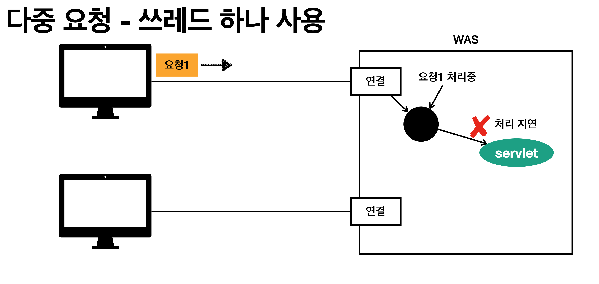

# 스프링 웹 MVC
<HR>

## 웹 서버, 웹 애플리케이션 서버

\

> 웹은 HTTP 프로토콜 기반으로 모든 통신이 일어난다.

### 모든 것이 HTTP 
HTTP 메시지에 모든 것을 전송

* HTML, TEXT
* IMAGE, 음성, 영상, 파일
* JSON, XML (API)
* 거의 모든 형태의 데이터 전송 가능
* 서버간에 데이터를 주고 받을 때도 대부분 HTTP 사용 지금은 HTTP 시대!


> 정적 파일 전송을 위한 서버로 js,html,css 같은 파일 전송을 하는 서버 대표적인 서버로 `nignx`, `apache` 가 있다.


> WAS는 앞선 웹서버의 상위호환격의 서버로 웹서버의 기능을 모두 포함하고 프로그램 코드를 실행해서 동적으로 동작이 가능하다.<br>
> ex) 사용자의 이름을 가져오거나 사용자별로 다른 화면을 보여줌

<HR>

### 웹 서버, 웹 애플리케이션 서버(WAS) 차이

* 웹 서버는 정적 리소스(파일), WAS는 애플리케이션 로직 + 웹 서버의 기능 포함
* 사실은 둘의 용어도 경계도 모호함
  * 웹 서버도 프로그램을 실행하는 기능을 포함하기도 함
  * 웹 애플리케이션 서버도 웹 서버의 기능을 제공함
* 자바는 서블릿 컨테이너 기능을 제공하면 WAS
  * 서블릿 없이 자바코드를 실행하는 서버 프레임워크도 있음
* WAS는 애플리케이션 코드를 실행하는데 더 특화

<HR>

### 웹 시스템 구성 - WAS, DB


> 제일 간단한 구성 => WAS, 디비 조합으로 서버를 구성


> 하지만, WAS가 모든 일을 담당하기 때문에 안정성이 떨어지는 단점이 존재한다.<br>
> WAS가 장애나면 웹서버에 접근조차 안됨 => 오류화면 조차 볼 수가 없음.

<HR>

### 웹 시스템 구성 - WEB(서버), WAS, DB


> 위의 문제를 해결하기 위해 보편적으로 구축하는 인프라 형태<br>
> 정적 리소스 형태는 웹서버에게 위임하고 동적인 요청만 WAS가 받는 구조


> 이런 형태로 인프라를 구축하면 효율적인 리소스 관리가 가능해짐<br>
> 가령, 정적인 리소스가 많이 필요하면 웹서버를 늘리고/동적인 리소스가 많이 필요하면 WAS를 늘리면 된다.


<HR>

## 서블릿


> 왼쪽 html 양식에 username, age를 입력하고 전송을 누르면 웹 브라우저가 오른쪽과 같이 HTTP 메시지를 생성하고 서버로 전송한다.


> 웹 브라우저가 보낸 메시지를 가지고 서버가 처리해야 하는 리스트는 왼쪽과 같다.<br>
> 서버 TCP/IP 연결대기, 소켓 연결... HTTP 요청 메시지를 파싱해서 읽기...<br>
> 이 많은 일중 정작 중요한 비즈니스 로직은 "데이터베이스에 저장 요청" 한가지 이다.<br>
> 만약 서버를 직접 구현 해야 한다면 다른 일을 하느라 정작 중요한 비즈니스 로직에 집중하지 못하는 상황이 발생한다.  


> 이를 해결하기 위해 Servelt이 나온다. <br>
> 즉, 왼쪽의 리스트에서 비즈니스 로직을 제외한 모든 일을 대신 처리해주게 된다.


> HTTP에 대한 정보를 유용하게 사용하기 위한 서블릿 객체가 존재하며 <br>
> 이곳의 HttpServletRequest, HttpServletResponse를 사용해서 http 요청과 응답에 대한 정보를 사용할 수 있게 된다.


> 웹 브라우저가 요청을 보내면 WAS 에서 Servlet이 해주는 일<br>
>1. 브라우저가 보낸 HTTP 요청 메시지를 기반으로 request, response 객체를 만들어줌.<br>
>2. 개발자가 만든 서블릿 객체를 실행.<br>
>3. 1번에서 생성한 response 객체의 정보를 기반으로 HTTP 응답 메시지를 생성.<br>
>4. 웹 브라우저에 생성한 응답 메시지 전달.

#### 서블릿 -HTTP 요청, 응답 흐름

* HTTP 요청시
  * WAS는 Request, Response 객체를 새로 만들어서 서블릿 객체 호출 
  * 개발자는 Request 객체에서 HTTP 요청 정보를 편리하게 꺼내서 사용 
  * 개발자는 Response 객체에 HTTP 응답 정보를 편리하게 입력 
  * WAS는 Response 객체에 담겨있는 내용으로 HTTP 응답 정보를 생성

### 서블릿 컨테이너


> WAS 내부에는 서블릿 컨테이너가 존재하여 개발자가 작성한 서블릿 관련 코드를 읽어서 서블릿 객체를 생성하고 관리해줌.

#### 서블릿, 서블릿 컨테이너

* 톰캣처럼 서블릿을 지원하는 WAS를 서블릿 컨테이너라고 함 
* 서블릿 컨테이너는 서블릿 객체를 생성, 초기화, 호출, 종료하는 생명주기 관리 
* 서블릿 객체는 **싱글톤**으로 관리
  * 고객의 요청이 올 때 마다 계속 객체를 생성하는 것은 비효율
  * 최초 로딩 시점에 서블릿 객체를 미리 만들어두고 재활용 
  * 모든 고객 요청은 동일한 서블릿 객체 인스턴스에 접근 
  * **공유 변수 사용 주의** 
  * 서블릿 컨테이너 종료시 함께 종료
* JSP도 서블릿으로 변환 되어서 사용
* 동시 요청을 위한 멀티 쓰레드 처리 지원

> 위의 Request, Response 객체는 요청시 마다 정보가 다를것이므로 각 요청마다 새로 생성해서 사용한다.(싱글톤 X) <br>
> 서블릿 객체만 재활용 <br> 
> 싱글톤 객체이기 때문에 서블릿 내부에 맴버 변수를 설정하지말고 사용하자!

가령, 위의 서블릿 코드에서

```java
@WebServlet(name = "helloServlet", urlPatterns = "/hello")
public class HelloServlet extends HttpServlet {
    
    private String userName = ""; 
    
    @Override
    protected void service(HttpServletRequest request, HttpServletResponse response){
        // 애플리케이션 로직
        // 요청 내부의 유저 닉네임 유저에 저장
        userName = request.getUserName();
        // userName에 저장된 정보를 response에 담아서 브라우저로 돌려줌
        response.add(userName);
    }
}
```

이런 코드의 경우 무슨일이 벌어질까?

가령 service() 메서드를 호출하지 않았는데 service2 메서드가 호출된다면 
현재, userName에 A라는 사람의 닉네임이 저장되어있다면, 그 정보를 꺼내서 B라는 사람에게 A의 닉네임을 보여줄수도 있다.

<HR>


#### Q : 위의 상황을 해결하려면?? 

> A : 특정 변수는 맴버로 선언하지말고 함수 내부의 지역변수로 선언해야 한다.

```java
@WebServlet(name = "helloServlet", urlPatterns = "/hello")
public class HelloServlet extends HttpServlet {
    
    @Override
    protected void service(HttpServletRequest request, HttpServletResponse response){
        // 애플리케이션 로직
        // 요청 내부의 유저 닉네임 유저에 저장
        String userName = "";
        userName = request.getUserName();
        
        // userName에 저장된 정보를 response에 담아서 브라우저로 돌려줌
        response.add(userName);
    }
}
```

즉, 특정 변수의 생명주기가 메서드의 생명주기와 일치해야한다.
문제의 상황에서는 메서드가 끝나고 사라져도 메서드 내부의 정보가 객체 내부에서 살아있는 형태를 띄게되어서 위험하다.

<HR>

## 동시 요청 - 멀티 쓰레드


> 웹 브라우저에서 서버에 요청을 보냄


> TCP/IP 커넥션 연결이 됨
> 그 이후 서블릿 호출


> 서블릿 호출은 쓰레드가 하게 됨

### 쓰레드

* 애플리케이션 코드를 하나하나 순차적으로 실행하는 것은 쓰레드
* 자바 메인 메서드를 처음 실행하면 main이라는 이름의 쓰레드가 실행
* 쓰레드가 없다면 자바 애플리케이션 실행이 불가능
* 쓰레드는 한번에 하나의 코드 라인만 수행
* 동시 처리가 필요하면 쓰레드를 추가로 생성

<HR>

### 단일 요청 - 쓰레드 하나 사용


> 초기에 쓰레드 하나가 존재한다고 가정


> 클라이언트로 부터 요청이 오면 쓰레드를 하나 할당하고 <br>
> 할당된 쓰레드가 코드를 읽어나가면서 서블릿을 호출함


> 할당된 서블릿이 요청을 응답


> 요청이 끝나면 쓰레드 휴식

<HR>

### 다중 요청 - 쓰레드 하나 사용



> 1번 클라이언트가 요청을 보냄 <br>
> 요청을 처리중에 모종의 이유로 처리가 지연됨 (복잡한 로직, 디비 연결 지연 등등)


> 2번 클라이언트가 요청을 보냄 <br>
> 쓰레드가 아직 사용중이기 때문에 2번 요청은 기다려야함


> 지연이 길어진 끝에 1,2번 요청 모두 timeout이 생겨서 요청에 대한 응답 실패함

### 이런 문제를 해결하려면?

<HR>

### 해결책 1 : 요청 마다 쓰레드 생성


> 요청마다 쓰레드를 생성해서 위의 문제를 해결 

### 요청 마다 쓰레드 생성 장단점

* 동시 요청을 처리할 수 있다.

* 장점

  * 리소스(CPU, 메모리)가 허용할 때 까지 처리가능
  * 하나의 쓰레드가 지연 되어도, 나머지 쓰레드는 정상 동작한다. 

* 단점

  * 쓰레드는 생성 비용은 매우 비싸다.
  * 고객의 요청이 올 때 마다 쓰레드를 생성하면, 응답 속도가 늦어진다. 
  * 쓰레드는 컨텍스트 스위칭 비용이 발생한다. 
  * 쓰레드 생성에 제한이 없다. 
  * 고객 요청이 너무 많이 오면, CPU, 메모리 임계점을 넘어서 서버가 죽을 수 있다.

<HR>

### 해결책 2 : 쓰레드 풀


> 1. 쓰레드 풀을 미리 생성해 놓고 그 안에 쓰레드를 여러개 생성해서 관리한다. <br>
> 2. 요청이 오면 쓰레드를 생성하는 것이 아니라, 쓰레드 풀에서 쓰레드를 달라고 요청 <br>
> 3. 쓰레드 사용이 끝나면 쓰레드를 없애는 것이 아니라 <br>
> 4. 다시 쓰레드 풀로 반납후 다음에 요청에 재사용


> 쓰레드의 요청보다 많은 요청이 오면 <br>
> 쓰레드 대기를 하거나 거절하게 됨

<HR>

### 쓰레드 풀 - 요청 마다 쓰레드 생성의 단점 보완

* 특징
  * 필요한 쓰레드를 쓰레드 풀에 보관하고 관리한다. 
  * 쓰레드 풀에 생성 가능한 쓰레드의 최대치를 관리한다. 톰캣은 최대 200개 기본 설정 (변경 가능) 

* 사용 
  * 쓰레드가 필요하면, 이미 생성되어 있는 쓰레드를 쓰레드 풀에서 꺼내서 사용한다. 
  * 사용을 종료하면 쓰레드 풀에 해당 쓰레드를 반납한다. 
  * 최대 쓰레드가 모두 사용중이어서 쓰레드 풀에 쓰레드가 없으면? 
    * 기다리는 요청은 거절하거나 특정 숫자만큼만 대기하도록 설정할 수 있다.
  
* 장점
  * 쓰레드가 미리 생성되어 있으므로, 쓰레드를 생성하고 종료하는 비용(CPU)이 절약되고, 응답 시간이 빠르다. 
  * 생성 가능한 쓰레드의 최대치가 있으므로 너무 많은 요청이 들어와도 기존 요청은 안전하게 처리할 수 있다.

<HR>

### 쓰레드 풀 - 실무 팁

* WAS의 주요 튜닝 포인트는 최대 쓰레드(max thread) 수이다.


> * 이 값을 너무 낮게 설정하면?
>   * 동시 요청이 많으면, 서버 리소스는 여유롭지만, 클라이언트는 금방 응답 지연


> * 이 값을 너무 높게 설정하면?
>    * 동시 요청이 많으면, CPU, 메모리 리소스 임계점 초과로 서버 다운

  
>* 장애 발생시?
>  * 클라우드면 일단 서버부터 늘리고, 이후에 튜닝
>  * 클라우드가 아니면 열심히 튜닝

<HR>

### 쓰레드 풀 -  쓰레드 풀의 적정 숫자


* Q :적정 숫자는 어떻게 찾나요?

* 애플리케이션 로직의 복잡도, CPU, 메모리, IO 리소스 상황에 따라 모두 다름 

* 성능 테스트
  * 최대한 실제 서비스와 유사하게 성능 테스트 시도 
  * 툴: 아파치 ab, 제이미터, nGrinder

<HR>

### WAS의 멀티 쓰레드 지원 -  핵심

* 멀티 쓰레드에 대한 부분은 WAS가 처리
* **개발자가 멀티 쓰레드 관련 코드를 신경쓰지 않아도 됨**
* 개발자는 마치 싱글 쓰레드 프로그래밍을 하듯이 편리하게 소스 코드를 개발 
* 멀티 쓰레드 환경이므로 싱글톤 객체(서블릿, 스프링 빈)는 주의해서 사용

<HR>

## HTML, HTTP API, CSR, SSR

### 서버에서 제공하는 리소스의 종류


> 클라이언트가 정적 파일을 요청하면 서버 폴더에서 찾아서 보내줌


> 동적인 html이 필요한 경우(ex.JSP) <br>
> 디비에서 데이터 꺼내서 찾아온 뒤 찾은 정보 html에 심어서 보내줌


> html을 전달하는 것이 아닌 데이터를 전달
> 디비에서 찾은 데이터를 가공해서 클라이언트에게 데이터 형태(JSON)으로 반환 


> http API를 사용하는 곳은 크게 세가지로 나뉜다. <br>
> 1. 웹 브라우저(자바스크립트) <br>
> 2. 앱 클라이언트(안드로이드, 아이폰, 등등) <br>
> 3. HTTP API 서버

<HR>

### HTTP API - 다양한 시스템 연동

* 주로 JSON 형태로 데이터 통신

* UI 클라이언트 접점
  * 앱 클라이언트(아이폰, 안드로이드, PC 앱)
  * 웹 브라우저에서 자바스크립트를 통한 HTTP API 호출 
  * React, Vue.js 같은 웹 클라이언트

* 서버 to 서버
  * 주문 서버 -> 결제 서버
  * 기업간 데이터 통신

###  서버사이드 렌더링, 클라이언트 사이드 렌더링


>* SSR - 서버 사이드 렌더링
>  * HTML 최종 결과를 서버에서 만들어서 웹 브라우저에 전달 
>  * 주로 정적인 화면에 사용
>  * 관련기술: JSP, 타임리프 -> 벡엔드 개발자
>  * 관련기술 : NEXT.JS -> 최신 프론트엔드 기술


>* CSR - 클라이언트 사이드 렌더링
>  * HTML 결과를 자바스크립트를 사용해 웹 브라우저에서 동적으로 생성해서 적용 
>  * 주로 동적인 화면에 사용, 웹 환경을 마치 앱 처럼 필요한 부분부분 변경할 수 있음
>  * 예) 구글 지도, Gmail, 구글 캘린더 
>  * 관련기술: React, Vue.js -> 웹 프론트엔드 개발자
  
* 참고
  * React, Vue.js를 CSR + SSR 동시에 지원하는 웹 프레임워크도 있음 
  * SSR을 사용하더라도, 자바스크립트를 사용해서 화면 일부를 동적으로 변경 가능

<HR>

### 어디까지 알아야 하나요? 백엔드 개발자 입장에서 UI 기술

* 백엔드 - 서버 사이드 렌더링 기술
  * JSP, 타임리프
  * 화면이 정적이고, 복잡하지 않을 때 사용
  * 백엔드 개발자는 서버 사이드 렌더링 기술 학습 필수

* 웹 프론트엔드 - 클라이언트 사이드 렌더링 기술
  * React, Vue.js
  * 복잡하고 동적인 UI 사용
  * 웹 프론트엔드 개발자의 전문 분야
  
* 선택과 집중
  * 백엔드 개발자의 웹 프론트엔드 기술 학습은 옵션
  * 백엔드 개발자는 서버, DB, 인프라 등등 수 많은 백엔드 기술을 공부해야 한다. 
  * 웹 프론트엔드도 깊이있게 잘 하려면 숙련에 오랜 시간이 필요하다.

<HR>

## 자바 백엔드 웹 기술 역사

### 과거 기술

* 서블릿 - 1997
  * HTML 생성이 어려움

* JSP - 1999
* HTML 생성은 편리하지만, 비즈니스 로직까지 너무 많은 역할 담당

* 서블릿, JSP 조합 MVC 패턴 사용
  * 모델, 뷰 컨트롤러로 역할을 나누어 개발
  
* MVC 프레임워크 춘추 전국 시대 - 2000년 초 ~ 2010년 초
  * MVC 패턴 자동화, 복잡한 웹 기술을 편리하게 사용할 수 있는 다양한 기능 지원
  * 스트럿츠, 웹워크, 스프링 MVC(과거 버전)


### 현재 사용 기술

* 애노테이션 기반의 스프링 MVC 등장
  * @Controller
  * MVC 프레임워크의 춘추 전국 시대 마무리
  
* 스프링 부트의 등장
  * 스프링 부트는 서버를 내장
  * 과거에는 서버에 WAS를 직접 설치하고, 소스는 War 파일을 만들어서 설치한 WAS에 배포
  * 스프링 부트는 빌드 결과(Jar)에 WAS 서버 포함 -> 빌드 배포 단순화

<HR>

## 최신 기술 - 스프링 웹 기술의 분화

* Web Servlet - Spring MVC
* Web Reactive - Spring WebFlux

<HR>

### 최신 기술 - 스프링 웹 플럭스(WebFlux)

* 특징
  * 비동기 넌 블러킹 처리
  * 최소 쓰레드로 최대 성능 - 쓰레드 컨텍스트 스위칭 비용 효율화 
  * 함수형 스타일로 개발 - 동시처리 코드 효율화
  * 서블릿 기술 사용X

* 그런데
  * 웹 플럭스는 기술적 난이도 매우 높음
  * 아직은 RDB 지원 부족
  * 일반 MVC의 쓰레드 모델도 충분히 빠르다. 
  * 실무에서 아직 많이 사용하지는 않음 (전체 1% 이하)

<HR>

### HTML을 편리하게 생성하는 뷰 기능

* JSP
  * 속도 느림, 기능 부족

* 프리마커(Freemarker), Velocity(벨로시티)
  * 속도 문제 해결, 다양한 기능
  
* 타임리프(Thymeleaf)
  * 내추럴 템플릿: HTML의 모양을 유지하면서 뷰 템플릿 적용 가능
  * 스프링 MVC와 강력한 기능 통합
  * 최선의 선택, 단 성능은 프리마커, 벨로시티가 더 빠름