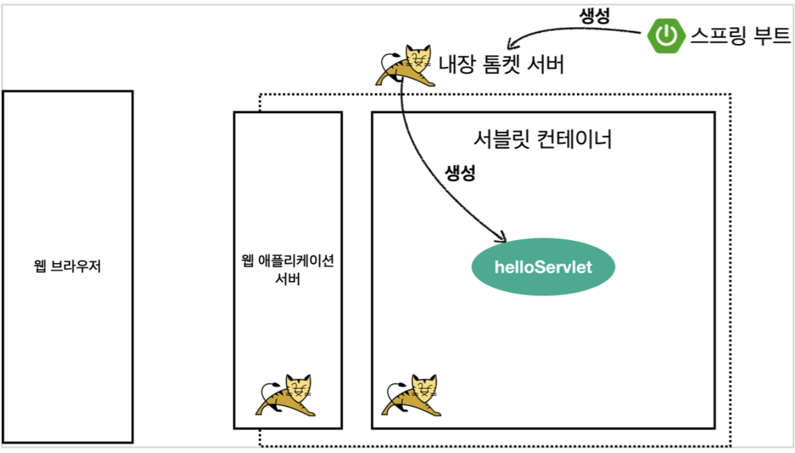
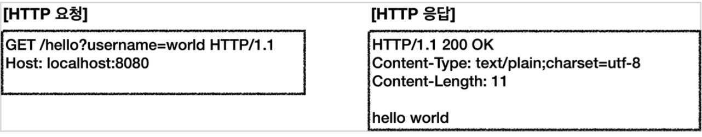
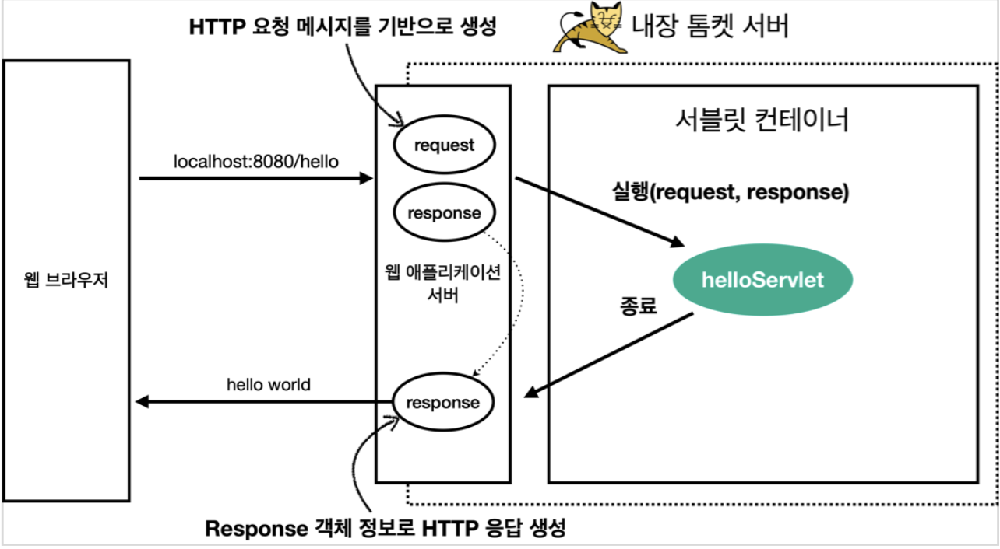

# Hello 서블릿

스프링 부트 환경에서 서블릿 등록하고 사용해보자.

> 참고
> 서블릿은 톰캣 같은 웹 애플리케이션 서버를 직접 설치하고,그 위에 서블릿 코드를 클래스 파일로 빌드해서
올린 다음, 톰캣 서버를 실행하면 된다. 하지만 이 과정은 매우 번거롭다.
> 스프링 부트는 톰캣 서버를 내장하고 있으므로, 톰캣 서버 설치 없이 편리하게 서블릿 코드를 실행할 수
있다.

# 스프링 부트 서블릿 환경 구성

## @ServletComponentScan
스프링 부트는 서블릿을 직접 등록해서 사용할 수 있도록 `@ServletComponentScan` 을 지원한다. 다음과
같이 추가하자.

## hello.servlet.ServletApplication
```java
package hello.servlet;

import org.springframework.boot.SpringApplication;
import org.springframework.boot.autoconfigure.SpringBootApplication;
import org.springframework.boot.web.servlet.ServletComponentScan;

@ServletComponentScan //서블릿 자동 등록 @SpringBootApplication
public class ServletApplication {
    public static void main(String[] args) {
        SpringApplication.run(ServletApplication.class, args);
    }
}   
```

## 서블릿 등록하기

처음으로 실제 동작하는 서블릿 코드를 등록해보자.

```java
@WebServlet(name = "helloServlet", urlPatterns = "/hello")
  public class HelloServlet extends HttpServlet {
    
    @Override
    protected void service(HttpServletRequest request, HttpServletResponse
            response) throws ServletException, IOException {
        
        System.out.println("HelloServlet.service");
        System.out.println("request = " + request);
        System.out.println("response = " + response);
        
        String username = request.getParameter("username");
        System.out.println("username = " + username);
        
        response.setContentType("text/plain");
        response.setCharacterEncoding("utf-8");
        response.getWriter().write("hello " + username);
    }
}
```

* @WebServlet 서블릿 애노테이션
  * name: 서블릿 이름 
  * urlPatterns: URL 매핑
  
HTTP 요청을 통해 매핑된 URL이 호출되면 서블릿 컨테이너는 다음 메서드를 실행한다.
```java
protected void service(HttpServletRequest request, HttpServletResponse response)
```
  
* 웹 브라우저 실행
  * http://localhost:8080/hello?username=world
  * 결과: hello world 
  
* 콘솔 실행결과
```
HelloServlet.service
request = org.apache.catalina.connector.RequestFacade@5e4e72
response = org.apache.catalina.connector.ResponseFacade@37d112b6
username = world
```

# 서블릿 컨테이너 동작 방식 설명

## 내장 톰캣 서버 생성



1. 스프링 부트를 실행하면 스프링 부트가 내장 톰캣 서버를 실행해줌
2. 톰캣 서버 내부의 서블릿 컨테이너에 서블릿들을 생성



3. 브라우저가 요청을 보내면 위의 그림처럼 HTTP 메시지를 만들고 서버로 요청을 보냄



4. 요청이 오면 request, response 객체를 만들고 기존에 만들었던 싱글톤의 서블릿을 호출하고 만든 객체를 넘겨줌.
5. 서블릿에서 개발자가 만든 로직을 수행하고 다 완료되면 response 객체를 위 그림의 HTTP 응답 메시지로 바꿔서 브라우저로 응답을 보냄.

> 참고
> HTTP 응답에서 Content-Length는 웹 애플리케이션 서버가 자동으로 생성해준다.

# HttpServletRequest - 개요

## HttpServletRequest 역할
HTTP 요청 메시지를 개발자가 직접 파싱해서 사용해도 되지만, 매우 불편할 것이다. 
서블릿은 개발자가 HTTP 요청 메시지를 편리하게 사용할 수 있도록 개발자 대신에 HTTP 요청 메시지를 파싱한다. 
그리고 그 결과를 `HttpServletRequest` 객체에 담아서 제공한다.

HttpServletRequest를 사용하면 다음과 같은 HTTP 요청 메시지를 편리하게 조회할 수 있다.

* HTTP 요청 메시지
```
POST /save HTTP/1.1
Host: localhost:8080
Content-Type: application/x-www-form-urlencoded
  
username=kim&age=20
```

위 메시지에서 마지막 줄 부분이 바디 부분 나머지는 헤더 및 START LINE

* START LINE 
  * HTTP 메소드 
  * URL 
  * 쿼리 스트링 
  * 스키마, 프로토콜 헤더
* 헤더 
  * 조회 
* 바디
  * form 파라미터 형식 조회 
  * message body 데이터 직접 조회 


### 임시 저장소 기능 : HttpServletRequest 객체는 추가로 여러가지 부가기능도 함께 제공한다.
해당 HTTP 요청이 시작부터 끝날 때 까지 유지되는 임시 저장소 기능 저장: request.setAttribute(name, value)
조회: request.getAttribute(name)

### 세션 관리 기능
* request.getSession(create: true)

> 중요
> HttpServletRequest, HttpServletResponse를 사용할 때 가장 중요한 점은 이 객체들이 HTTP 요청 메시지, HTTP 응답 메시지를 편리하게 사용하도록 도와주는 객체라는 점이다.
> 따라서 이 기능에 대해서 깊이있는 이해를 하려면 HTTP 스펙이 제공하는 요청, 응답 메시지 자체를 이해해야 한다.