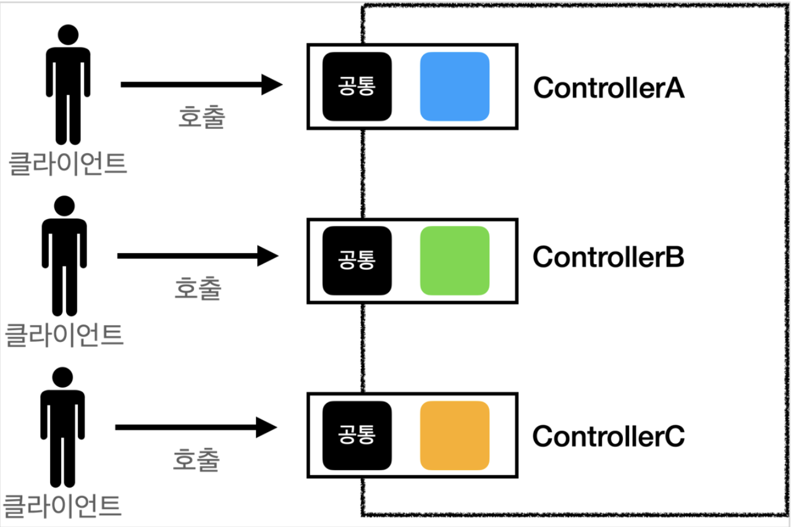
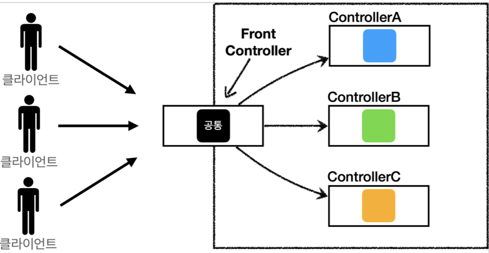
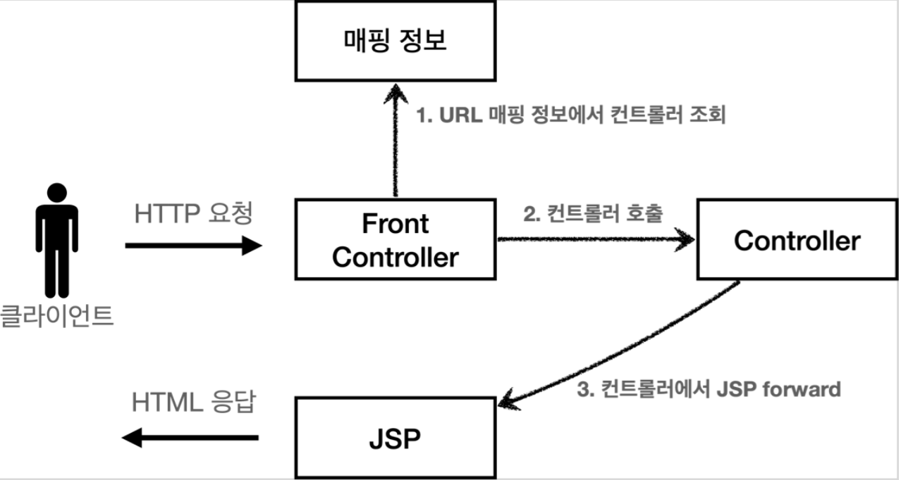

# 프론트 컨트롤러 패턴 소개

* 프론트 컨트롤러 도입 전

* 프론트 컨트롤러 도입 후

## FrontController 패턴 특징
* 프론트 컨트롤러 서블릿 하나로 클라이언트의 요청을 받음 
* 프론트 컨트롤러가 요청에 맞는 컨트롤러를 찾아서 호출 
* 입구를 하나로!
* 공통 처리 가능 
* 프론트 컨트롤러를 제외한 나머지 컨트롤러는 서블릿을 사용하지 않아도 됨

스프링 웹 MVC와 프론트 컨트롤러
* 스프링 웹 MVC의 핵심도 바로 FrontController
* 스프링 웹 MVC의 DispatcherServlet이 FrontController 패턴으로 구현되어 있음

# 프론트 컨트롤러 도입 - v1
프론트 컨트롤러를 단계적으로 도입해보자.
이번 목표는 기존 코드를 최대한 유지하면서, 프론트 컨트롤러를 도입하는 것이다.
먼저 구조를 맞추어두고 점진적으로 리펙터링 해보자.

* V1 구조
