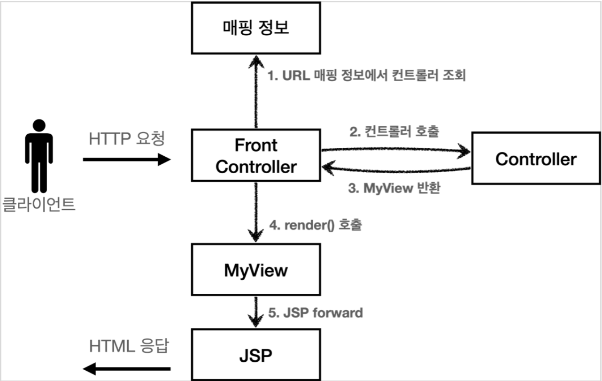

# 프론트 컨트롤러 패턴 소개

* 프론트 컨트롤러 도입 전


* 프론트 컨트롤러 도입 후


## FrontController 패턴 특징
* 프론트 컨트롤러 서블릿 하나로 클라이언트의 요청을 받음 
* 프론트 컨트롤러가 요청에 맞는 컨트롤러를 찾아서 호출 
* 입구를 하나로!
* 공통 처리 가능 
* 프론트 컨트롤러를 제외한 나머지 컨트롤러는 서블릿을 사용하지 않아도 됨

스프링 웹 MVC와 프론트 컨트롤러
* 스프링 웹 MVC의 핵심도 바로 FrontController
* 스프링 웹 MVC의 DispatcherServlet이 FrontController 패턴으로 구현되어 있음

# 프론트 컨트롤러 도입 - v1
프론트 컨트롤러를 단계적으로 도입해보자.
이번 목표는 기존 코드를 최대한 유지하면서, 프론트 컨트롤러를 도입하는 것이다.
먼저 구조를 맞추어두고 점진적으로 리펙터링 해보자.

* V1 구조


* ControllerV1

```java
public interface ControllerV1 {
      void process(HttpServletRequest request, HttpServletResponse response) throws ServletException, IOException;
  }
```

서블릿과 비슷한 모양의 컨트롤러 인터페이스를 도입한다. 
각 컨트롤러들은 이 인터페이스를 구현하면 된다. 
프론트 컨트롤러는 이 인터페이스를 호출해서 구현과 관계없이 로직의 일관성을 가져갈 수 있다.

이제 이 인터페이스를 구현한 컨트롤러를 만들어보자. 지금 단계에서는 기존 로직을 최대한 유지하는게 핵심이다.

* MemberFormControllerV1 - 회원 등록 컨트롤러

```java
public class MemberFormControllerV1 implements ControllerV1 {

    @Override
      public void process(HttpServletRequest request, HttpServletResponse response) throws ServletException, IOException {
          String viewPath = "/WEB-INF/views/new-form.jsp";
          RequestDispatcher dispatcher = request.getRequestDispatcher(viewPath);
          dispatcher.forward(request, response);
    } 
}
```

* MemberSaveControllerV1 - 회원 저장 컨트롤러

```java
public class MemberSaveControllerV1 implements ControllerV1 {
    private MemberRepository memberRepository = MemberRepository.getInstance();
    @Override
    public void process(HttpServletRequest request, HttpServletResponse
            response) throws ServletException, IOException {
        
        String username = request.getParameter("username");
        int age = Integer.parseInt(request.getParameter("age"));
        
        Member member = new Member(username, age);
        memberRepository.save(member);
        
        request.setAttribute("member", member);
        
        String viewPath = "/WEB-INF/views/save-result.jsp";
        RequestDispatcher dispatcher = request.getRequestDispatcher(viewPath);
        dispatcher.forward(request, response);
    } 
}
```

* MemberListControllerV1 - 회원 목록 컨트롤러

```java
public class MemberListControllerV1 implements ControllerV1 {
    private MemberRepository memberRepository = MemberRepository.getInstance();
    @Override
    public void process(HttpServletRequest request, HttpServletResponse
            response) throws ServletException, IOException {
        List<Member> members = memberRepository.findAll();
        request.setAttribute("members", members);
        String viewPath = "/WEB-INF/views/members.jsp";
        RequestDispatcher dispatcher = request.getRequestDispatcher(viewPath);
        dispatcher.forward(request, response);
    } 
}
```

내부 로직은 기존 서블릿과 거의 같다.
이제 프론트 컨트롤러를 만들어보자.

* FrontControllerServletV1 - 프론트 컨트롤러

```java
@WebServlet(name = "frontControllerServletV1", urlPatterns = "/front-controller/v1/*")
public class FrontControllerServletV1 extends HttpServlet {
  private Map<String, ControllerV1> controllerMap = new HashMap<>();
  
  public FrontControllerServletV1() {
          
      controllerMap.put("/front-controller/v1/members/new-form", new MemberFormControllerV1());
      controllerMap.put("/front-controller/v1/members/save", new MemberSaveControllerV1());
      controllerMap.put("/front-controller/v1/members", new MemberListControllerV1());
  }
  
    @Override
    protected void service(HttpServletRequest request, HttpServletResponse response) throws ServletException, IOException {
          System.out.println("FrontControllerServletV1.service");
          String requestURI = request.getRequestURI();
          ControllerV1 controller = controllerMap.get(requestURI);
          
          if (controller == null) {
              response.setStatus(HttpServletResponse.SC_NOT_FOUND);
              return; 
          }
          
          controller.process(request, response);
      }
}
```

## 프론트 컨트롤러 분석

urlPatterns

* urlPatterns = "/front-controller/v1/*" : /front-controller/v1 를 포함한 하위 모든 요청은 이 서블릿에서 받아들인다. 
* 예) /front-controller/v1 , /front-controller/v1/a , /front-controller/v1/a/b

controllerMap

* key: 매핑 URL 
* value: 호출될 컨트롤러

service()

먼저 requestURI 를 조회해서 실제 호출할 컨트롤러를 controllerMap 에서 찾는다.
만약 없다면 404(SC_NOT_FOUND) 상태 코드를 반환한다.
컨트롤러를 찾고 controller.process(request, response); 을 호출해서 해당 컨트롤러를 실행한다.

JSP

JSP는 이전 MVC에서 사용했던 것을 그대로 사용한다.

실행

* 등록: http://localhost:8080/front-controller/v1/members/new-form 
* 목록: http://localhost:8080/front-controller/v1/members

기존 서블릿, JSP로 만든 MVC와 동일하게 실행 되는 것을 확인할 수 있다.

# View 분리 - v2

모든 컨트롤러에서 뷰로 이동하는 부분에 중복이 있고, 깔끔하지 않다.

```
String viewPath = "/WEB-INF/views/new-form.jsp";
RequestDispatcher dispatcher = request.getRequestDispatcher(viewPath);
dispatcher.forward(request, response);
```

이 부분을 깔끔하게 분리하기 위해 별도로 뷰를 처리하는 객체를 만들자.

* V2 구조


```java
 public class MyView {
    
      private String viewPath;
      
      public MyView(String viewPath) {
          this.viewPath = viewPath;
      }
      
      public void render(HttpServletRequest request, HttpServletResponse response) throws ServletException, IOException {
          RequestDispatcher dispatcher = request.getRequestDispatcher(viewPath);
          dispatcher.forward(request, response);
      }
}
```

이 코드만 봐서는 어떻게 활용하는지 아직 감이 안올 것이다. 다음 버전의 컨트롤러 인터페이스를 만들어보자.
컨트롤러가 뷰를 반환하는 특징이 있다.

ControllerV2

```java
public interface ControllerV2 {
    MyView process(HttpServletRequest request, HttpServletResponse response) throws ServletException, IOException;
}
```

MemberFormControllerV2 - 회원 등록 폼

```java
public class MemberFormControllerV2 implements ControllerV2 {
    
    @Override
    public MyView process(HttpServletRequest request, HttpServletResponse response) throws ServletException, IOException {
        return new MyView("/WEB-INF/views/new-form.jsp");
    }
}
```

이제 각 컨트롤러는 복잡한 dispatcher.forward() 를 직접 생성해서 호출하지 않아도 된다. 단순히 MyView 객체를 생성하고 거기에 뷰 이름만 넣고 반환하면 된다.

ControllerV1 을 구현한 클래스와 ControllerV2 를 구현한 클래스를 비교해보면, 이 부분의 중복이 확실하게 제거된 것을 확인할 수 있다.

MemberSaveControllerV2 - 회원 저장

```java
 public class MemberSaveControllerV2 implements ControllerV2 {
    
      private MemberRepository memberRepository = MemberRepository.getInstance();
    
      @Override
      public MyView process(HttpServletRequest request, HttpServletResponse response) throws ServletException, IOException {
        
          String username = request.getParameter("username");
          int age = Integer.parseInt(request.getParameter("age"));
          
          Member member = new Member(username, age);
          memberRepository.save(member);
          
          request.setAttribute("member", member);
          
          return new MyView("/WEB-INF/views/save-result.jsp");
    } 
}
```

MemberListControllerV2 - 회원 목록

```java
public class MemberListControllerV2 implements ControllerV2 {
    private MemberRepository memberRepository = MemberRepository.getInstance();
    
    @Override
    public MyView process(HttpServletRequest request, HttpServletResponse response) throws ServletException, IOException {
        List<Member> members = memberRepository.findAll();
        request.setAttribute("members", members);
        return new MyView("/WEB-INF/views/members.jsp");
    }
}
```

프론트 컨트롤러 V2

```java
@WebServlet(name = "frontControllerServletV2", urlPatterns = "/front-controller/v2/*")
public class FrontControllerServletV2 extends HttpServlet {
    private Map<String, ControllerV2> controllerMap = new HashMap<>();
    public FrontControllerServletV2() {
          
        controllerMap.put("/front-controller/v2/members/new-form", new MemberFormControllerV2());
        controllerMap.put("/front-controller/v2/members/save", new MemberSaveControllerV2());
        controllerMap.put("/front-controller/v2/members", new MemberListControllerV2());
    }
    
    @Override
    protected void service(HttpServletRequest request, HttpServletResponse response) throws ServletException, IOException {
        String requestURI = request.getRequestURI();
        ControllerV2 controller = controllerMap.get(requestURI);
        if (controller == null) {
            response.setStatus(HttpServletResponse.SC_NOT_FOUND);
            return; }
        MyView view = controller.process(request, response);
        view.render(request, response);
    }
}
```

ControllerV2의 반환 타입이 MyView 이므로 프론트 컨트롤러는 컨트롤러의 호출 결과로 MyView 를 반환 받는다. 
그리고 view.render() 를 호출하면 forward 로직을 수행해서 JSP가 실행된다.

MyView.render()
```java
public void render(HttpServletRequest request, HttpServletResponse response) throws ServletException, IOException {
      RequestDispatcher dispatcher = request.getRequestDispatcher(viewPath);
      dispatcher.forward(request, response);
}
```
프론트 컨트롤러의 도입으로 MyView 객체의 render() 를 호출하는 부분을 모두 일관되게 처리할 수 있다. 
각각의 컨트롤러는 MyView 객체를 생성만 해서 반환하면 된다.

실행
* 등록: http://localhost:8080/front-controller/v2/members/new-form 
* 목록: http://localhost:8080/front-controller/v2/members