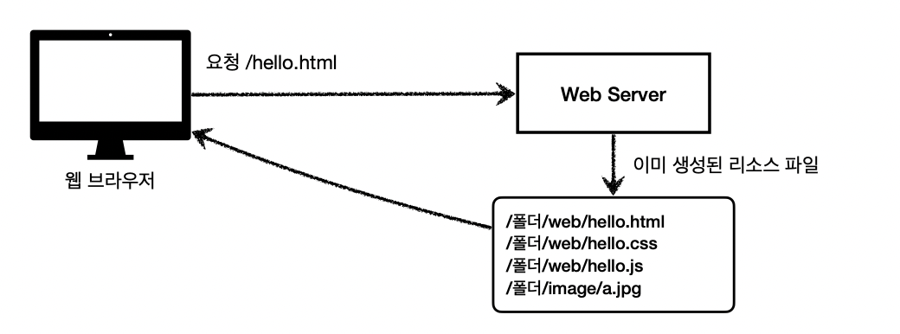

# Section1. 웹 애플리케이션 이해


## 웹 서버, 웹 어플리케이션 서버

### 웹 서버
+ HTTP 기반으로 동작
+ <정적 리소스> 제공
+ 정적(파일) HTML, CSS, JS, 이미지, 영상
+ 예) NGINX, APACHE


### 웹 애플리케이션 서버(WAS) 
+ HTTP 기반으로 동작
+ 웹 서버 기능 포함 + (정적 리소스 제공 가능)
+ 프로그램 코드를 실행해서 애플리케이션 로직 수행(요청이 오면 사용자에 따라서)
  + 동적 HTML, HTTP API
  + 서블릿, JSP, 스프링 MVC  (WAS에서 동작)
+ 예) 톰캣(Tomcat), Jetty, Undertow


## 웹 서버, 웹 애플케이션 서버(WAS) 차이'

+ 웹 서버는 정적 리소스 , WAS 는 애플리케이션 로직 
+ 웹 서버도 프로그램을 실행하는 기능을 포함하기도 한다.
+ WAS 도 웹 서버의 기능을 제공


그럼 어떻게 구분하지?

+ 자바는 서블릿 컨테이너 기능을 제공하면 WAS (구분)
+ WAS는 애플리케이션 코드를 실행하는데 더 특화되어있다.


## 웹 시스템 구성

가장 간단한 방법으로는 WAS, DB 로만 구성가능 하다.


하지만, 이렇게 구성하게 되면 WAS 가 너무 많은 역할을 담당하기 때문에, 서버 과부하가 일어난다.

HTML, CSS, JS 같은 서빙만 해줘도 되는 간단한 정적 리소스 때문에 정작, 리소스가 많이 필요한 애플리케이션 로직을
수행하기 어려워 진다.

그래서 일반적으로 다음과 같이 웹 시스템을 구성한다 (WEB, WAS, DB)


+ 정적 리소스는 웹서버가 처리
+ 동적인 처리가 필요하면 WAS에 요청을 위임
+ WAS 는 중요한 애플리케이션 로직 처리 전담


또 다른 장점으로는 다음 그림과 같이 리소스에 따라 서버를 증설하여 효율적인 리소스 관리가 가능하다.


## 서블릿


+ 웹 애플리케이션 서버를 직접 구현하면, 다음과 같은 일들을 전부 구현 해야 함.
+ 서블릿을 지원하는 웹 애플리케이션 서버(WAS)를 사용하면, 비즈니스 로직 실행을 제외한 나머지를 구현 해준다.

 
+ HTTP 스펙 제공
```java
@WebServelet(name = "helloServlet" , urlPatterns = "/hello")
public class HelloServlet extends HttpServlet {
    @Override
    protected void service(HttpServletRequest request, HttpServletResponse response){
        //
    }
}
```

HTTP 요청 및 응답 흐름에 대해 알아보자


+ HTTP 요청시 
  + WAS는 Request, Response객체를 만들어서 서블릿 객체를 호출 한다.
  + 개발자는 Request 객체에서 HTTP 요청 정보를 편리하게 꺼내서 사용하면 된다
  + 개발자는  Response 객체에 HTTP 응답 정보를 편리하게 입력한다.
  + WAS는 Response 객체에 담겨있는 내용으로 HTTP 응답 정보를 생성해준다


### 서블릿 컨테이너

+ 톰캣과 같이 서블릿을 지원하는 WAS를 서블릿 컨테이너라고 한다.
+ 서블릿 컨테이너는 서블릿 객체를 생성, 초기화, 호출, 종료하는 생명주기를 관리해준다.
+ 서블릿 객체는 싱글톤으로 관리한다 (객체를 하나만 생성하고 공유해서 사용)
+ JSP도 서블릿으로 변환 되어서 사용한다 
+ 동시 요청을 멀티 쓰레디 처리를 지원한다.


## 동시 요청 - 멀티 쓰레드

요청 ->  서블릿 객체를 누가 호출 하지? -> 쓰레드

### 쓰레드란?
+ 애플리케이션 코드를 하나하나 순차적으로 실행한는것은 쓰레드이다.
+ 자바 메인 메서드를 처음 실행하면 main 이라는 이름의 쓰레드가 실행된다.
+ 쓰레드가 없다면 자바 애플리케이션 실행이 불가능하다
+ 쓰레드는 한번에 하나의 코드 라인만 수행한다.
+ 동시처리가 필요하면 쓰레드를 추가로 생성한다.


### 단일 요청 

동시처리가 필요한 상황 이전에 쓰레드가 하나가 있다고 가정하면  
요청이 오면 쓰레드를 할당하고 서블릿 코드를 실행해준다.


### 다중 요청 - 쓰레드 하나 사용 


+ 요청 1번이 들어와서 쓰레드를 사용해서 서블릿 요청
+ 처리가 지연되는 상태에서 요청 2번이 들어옴
+ 사용할 수 있는 쓰레드가 1개뿐이라 쓰레드 대기 > 둘다 죽음

결과적으로 요청 1번도 처리가 안되고, 요청 2번도 처리가 되지 않음

> 이 문제를 해결하려면?


### 요청 마다 쓰레드 생성


+ 요청이 올때마다 쓰레드를 생성하고 요청이 끝나면 쓰레드를 날림


장점

+ 동시 요청을 처리할 수 있음
+ 리소스(CPU, 메모리)가 허용할 때 까지 처리가능
+ 하나의 쓰레드가 지연 되어도, 나머지 쓰레드는 정상 동작

단점

+ 쓰레드는 생성 비용은 매우 비쌈
  + 고객의 요청이 올 때 마다 쓰레드를 생성하면, 응답 속도가 늦어짐
+ 쓰레드는 컨텍스트 스위칭 비용이 발생 > 코어가 쓰레드를 전환할 때
+ 쓰레드 생성에 제한이 없음
  + 고객 요청이 너무 많이 오면, CPU, 메모리 임계점을 넘어서 서버가 죽을 수 있음 -> 쓰레드 풀 사용


### 쓰레드 풀


+ 특징
  + 필요한 쓰레드를 쓰레드 풀에 미리 보관하고 관리한다
  + 쓰레드 풀에 생성 가능한 쓰레드의 최대치를 관리한다. 톰캣은 최대 200개 기본 설정 (변경 가능)  

+ 사용
  + 쓰레드가 필요하면, 이미 생성되어 있는 쓰레드를 쓰레드 풀에서 꺼내서 사용(쓰레드 풀에서 놀고있는 쓰레드를 요청)
  + 사용을 종료하면 쓰레드 풀에 해당 쓰레드를 반납한다
  + 최대 쓰레드가 모두 사용중이어서 쓰레드 풀에 쓰레드가 없으면? ->  기다리는 요청은 거절하거나 특정 숫자만큼만 대기하도록 설정할 수 있다


장점

+ 쓰레드가 미리 생성되어 있으므로, 쓰레드를 생성하고 종료하는 비용(CPU)이 절약되고, 응답 시간이 빠름
+ 생성 가능한 쓰레드의 최대치가 있으므로 너무 많은 요청이 들어와도 기존 요청은 안전하게 처리 가능

> WAS 의 주요 튜닝 포인트는 최대 스레드 수 이다.  
> 너무 낮게 설정하면 -> 서버 리소스는 여유 , 클라이언트 응답 지연  
> 너무 높게 설정하면 -> CPU, 메모리 리소스 임계점 초과로 서버 다운


그렇다면 적정 숫자는 어떻게 찾지?

쓰레드 풀의 적정 숫자
+ 애플리케이션의 로직도 복잡도, CPU, 메모리, IO 리소스 상황 등을 고려하여 적정 숫자를 찾아 지정해야한다.
+ 최대한 실제 서비스와 유사하게 성능 테스트를 시도하면서 적정 숫자를 적한다


### WAS의 멀티 쓰레드 지원
+ 멀티 쓰레드에 대한 부분은 WAS가 처리
+ 개발자가 멀티 쓰레드 관련 코드를 신경쓰지 않아도 됨
+ 개발자는 마치 싱글 쓰레드 프로그래밍을 하듯이 편리하게 소스 코드를 개발


## HTML, HTTP API, SSR, CSR

### 정적 리소스


+ 고정된 html파일, css, js, 이미지, 영상 등을 제공
+ 주로 웹 브라우저


### HTML 페이지

HTML 페이지


동적으로 필요한 HTML 파일을 생성해서 전달한다 (뷰 템플릿 : Thymeleaf, JSP)  
웹 브라우저: 전달받은 HTML 파일을 해석하여 화면에 띄운다.


### HTTP API


+ HTML이 아니라 데이터를 전달
+ 주로 JSON 형식 사용
+ 다양한 시스템에서 호출 
  + 데이터만 DB 에서 내려줘서 주고 받는다 , UI 화면이 필요하면 클라이언트가 별도 처리
  + 앱, 웹 클라이언트, 서버 to 서버 (주문 서버랑 결제 서버 통신 시 json 으로 데이터 주고받음)


### SSR - 서버 사이드 렌더링 


+ 서버에서 최종 HTML을 생성해서 클라이언트에 전달하는 방식을 뜻한다.
+ 주로 정적인 화면에 사용
+ 사용 기술: JSP, 타임리프 -> 백엔드 개발자


### CSR - 클라이언트 사이드 렌더링


+ HTML 결과를 자바스크립트를 사용해 웹 브라우저에서 동적으로 생성해서 적용한다.
+ 주로 동적인 화면에 사용하고, 웹 환경을 마치 앱 처럼 필요한 부분부분씩 변경할 수 있다.
+ ex) 구글지도, Gmail, 구글 캘린더
+ 관련 기술: React, Vue.js -> 웹 프론트엔드 개발자


## 자바 백엔드 웹 기술 역사

> 과거 기술  
서블릿(1997) -> JSP(1999) -> 서블릿, JSP 조합 MVC 패턴 사용 -> MVC 프레임워크 춘추 전국 시대(2000초 ~ 2010년 초)


### 현재 사용 기술

+ 어노테이션 기반의 스프링 MVC 등장
  + 예) @Controller
  + MVC 프레임워크의 춘추 전국 시대 마무리
+ 스프링 부트의 등장 
  + 스프링 부트는 서버를 내장한다.
  + 과거에는 서버에 WAS를 직접 설치하고, 소스는 War 파일을 만들어서 설치한 WAS에 배포 했다.
  + 스프링 부트는 빌드 결과(Jar)에 WAS 서버를 포함하므로써 빌드 배포를 단순화 시킨다.

### 최신 기술
Web Servelt - Spring MVC (서블릿 기반)
Web Reactive - Spring WebFlux

### 최신 기술 - 스프링 웹 플럭스(WebFlux)

* 특징
  * 비동기 넌 블러킹 처리
  * 최소 쓰레드로 최대 성능 - 쓰레드 컨텍스트 스위칭 비용 효율화
  * 함수형 스타일로 개발 - 동시처리 코드 효율화
  * 서블릿 기술 사용X

* 그런데
  * 웹 플럭스는 기술적 난이도 매우 높음
  * 아직은 RDB 지원 부족
  * 일반 MVC의 쓰레드 모델도 충분히 빠르다.
  * 실무에서 아직 많이 사용하지는 않음 (전체 1% 이하)


### 자바 뷰 템플릿 - HTML을 편리하게 생성하는 뷰 기능

타임리프(Thymeleaf)
+ HTML의 모양을 유지하면서 뷰 템플릿 적용 가능하다 (내추럴 템플릿)
+ 스프링 MVC와 강력한 기능 통합

JSP - 속도 느림, 기능 부족

