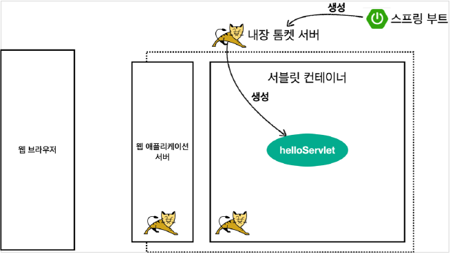
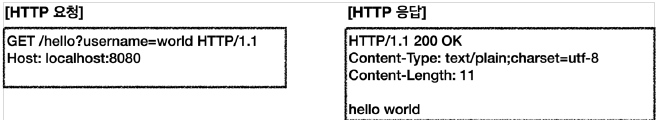
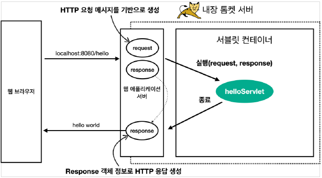
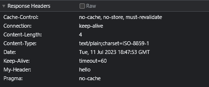
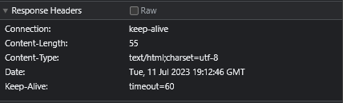
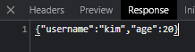

# 서블릿

## 프로젝트 생성

> Jar vs War  
> Jar와 War 모두 자바 클래스 패키징 확장자로 프로젝트를 배포할 때 사용
> Jar는 JAVA 어플리케이션이 동작할 수 있도록 자바 프로젝트를 압축한 파일, JRE(JAVA Runtime Environment)만 있어도 실행 가능함
> War는 Servlet / Jsp 컨테이너에 배치할 수 있는 웹 애플리케이션(Web Application) 압축 파일, 실행하기 위해 별도의 웹서버(WEB) or 웹 컨테이너(WAS) 필요

## Hello 서블릿

`@ServletComponentScan` : 스프링 부트는 서블릿을 직접 등록해서 사용할 수 있음

```
package hello.servlet;

import org.springframework.boot.SpringApplication;
import org.springframework.boot.autoconfigure.SpringBootApplication;
import org.springframework.boot.web.servlet.ServletComponentScan;

@ServletComponentScan //서블릿 자동 등록
@SpringBootApplication
public class ServletApplication {

	public static void main(String[] args) {
		SpringApplication.run(ServletApplication.class, args);
	}

}
```

### 서블릿 등록

```java
package hello.servlet.basic;

/*
@WebServlet 서블릿 애노테이션
  name: 서블릿 이름
  urlPatterns: URL 매핑
*/
@WebServlet(name = "helloServlet", urlPatterns = "/hello")
public class HelloServlet extends HttpServlet {

    // 서블릿이 호출되면 service 메소드가 실행됨
    @Override
    protected void service(HttpServletRequest request, HttpServletResponse response) throws ServletException, IOException {
        System.out.println("HelloServlet.service");
        System.out.println("request = " + request);
        System.out.println("response = " + response);

        String username = request.getParameter("username");
        System.out.println("username = " + username);

        response.setContentType("text/plain");
        response.setCharacterEncoding("utf-8");
        response.getWriter().write("hello " + username);

    }
}
```

HTTP 요청을 통해 매핑 URL이 호출되면, 서블릿 컨테이너는 아래 메서드 실행.  
`protected void service(HttpServletRequest request, HttpServletResponse response)`

### 서블릿 컨테이너 동작 방식



+ 스프링 부트는 내장 톰캣 서버를 실행한다.
+ 내장 톰캣 서버는 서블릿 컨테이너에서 helloServlet을 생성한다.

#### HTTP 요청, HTTP 응답 메시지



웹 브라우저는 다음과 같은 요청 메시지를 웹 애플리케이션 서버에 전송한다.

#### 웹 애플리케이션 서버의 요청 응답 구조



+ HTTP 요청이 오면 WAS가 request, response 객체를 만들고 helloServlet에 있는 service 메소드를 호출한다.
+ helloServlet 에서 필요한 작업을 진행(Content-type, 메시지)
+ WAS는 response 객체 정보를 가지고 HTTP 응답을 생성하여 웹 브라우저에 전송한다.

## HttpServletRequest

### HttpServletRequest - 개요

HTTP 요청 메시지를 개발자가 직접 파싱해서 사용해도 되지만, 매우 불편할 것이다.  
서블릿은 개발자가 HTTP 요청 메시지를 편리하게 사용할 수 있도록 개발자 대신에 HTTP 요청 메시지를 파싱한다.  
그리고 그 결과를 HttpServletRequest 객체에 담아서 제공한다.

+ HTTP 요청 메시지

```
POST /save HTTP/1.1
Host: localhost:8080
Content-Type: application/x-www-form-urlencoded

username=minyeob&age=26
```

+ START LINE
    + HTTP 메소드
    + URL
    + 쿼리 스트링
    + 스키마, 프로토콜
+ 헤더
    + 헤더 조회
+ 바디
    + form 파라미터 형식 조회
    + message body 데이터 직접 조회

임시 저장소 기능
해당 HTTP 요청이 시작부터 끝날 때까지 유지되는 임시 저장소 기능

+ 저장 : request.setAttribute(name, value)
+ 조회 : request.getAttribute(name)

세션 관리 기능  
`request.getSession(create: true)`

중요
> HttpServletRequest, HttpServletResponse를 사용할 때 가장 중요한 점은 이 객체들이 HTTP 요청
> 메시지, HTTP 응답 메시지를 편리하게 사용하도록 도와주는 객체라는 점이다.  
> 따라서 이 기능에 대해서 깊이있는 이해를 하려면 HTTP 스펙이 제공하는 요청, 응답 메시지 자체를 이해해야 한다.

### HttpServletRequest - 기본 사용법

```java

@WebServlet(name = "requestHeaderServlet", urlPatterns = "/request-header")
public class RequestHeaderServlet extends HttpServlet {

    @Override
    protected void service(HttpServletRequest request, HttpServletResponse
            response)
            throws ServletException, IOException {

        printStartLine(request);
        printHeaders(request);
        printHeaderUtils(request);
        printEtc(request);

        response.getWriter().write("ok");
    }
}
```

### start-line 정보

```java
private void printStartLine(HttpServletRequest request){
        System.out.println("--- REQUEST-LINE - start ---");

        System.out.println("request.getMethod() = "+request.getMethod()); //GET
        System.out.println("request.getProtocal() = "+request.getProtocol()); //HTTP/1.1
        System.out.println("request.getScheme() = "+request.getScheme()); //http
        // http://localhost:8080/request-header
        System.out.println("request.getRequestURL() = "+request.getRequestURL());
        // /request-test
        System.out.println("request.getRequestURI() = "+request.getRequestURI());
        //username=hi
        System.out.println("request.getQueryString() = "+request.getQueryString());
        System.out.println("request.isSecure() = "+request.isSecure()); //https 사용 유무
        System.out.println("--- REQUEST-LINE - end ---");
        System.out.println();
        }
```

결과

```java
---REQUEST-LINE-start---
        request.getMethod()=GET
        request.getProtocol()=HTTP/1.1
        request.getScheme()=http
        request.getRequestURL()=http://localhost:8080/request-header
        request.getRequestURI()=/request-header
        request.getQueryString()=username=hello
        request.isSecure()=false
        ---REQUEST-LINE-end---
```

### 헤더 정보

```java
//Header 모든 정보
private void printHeaders(HttpServletRequest request){
        System.out.println("--- Headers - start ---");
    
/*  예전방식
    Enumeration<String> headerNames = request.getHeaderNames();
    while (headerNames.hasMoreElements()) {
    String headerName = headerNames.nextElement();
    System.out.println(headerName + ": " + request.getHeader(headerName));
    }
*/

        request.getHeaderNames().asIterator().forEachRemaining(headerName->System.out.println(headerName+":"+request.getHeader(headerName)));
        System.out.println("--- Headers - end ---");
        System.out.println();
        }
```

결과

```java
---Headers-start---
        host:localhost:8080
        connection:keep-alive
        cache-control:max-age=0
        sec-ch-ua:"Chromium";v="88","Google Chrome";v="88",";Not A Brand";v="99"
        sec-ch-ua-mobile:?0
        upgrade-insecure-requests:1
        user-agent:Mozilla/5.0(Macintosh;Intel Mac OS X 11_2_0)AppleWebKit/537.36
        (KHTML,like Gecko)Chrome/88.0.4324.150Safari/537.36
        accept:text/html,application/xhtml+xml,application/xml;q=0.9,image/avif,image/
        webp,image/apng,*/*;q=0.8,application/signed-exchange;v=b3;q=0.9
sec-fetch-site: none
sec-fetch-mode: navigate
sec-fetch-user: ?1
sec-fetch-dest: document
accept-encoding: gzip, deflate, br
accept-language: ko,en-US;q=0.9,en;q=0.8,ko-KR;q=0.7
--- Headers - end ---
```

### Header 편리한 조회

```java
//Header 편리한 조회
private void printHeaderUtils(HttpServletRequest request){
        System.out.println("--- Header 편의 조회 start ---");
        System.out.println("[Host 편의 조회]");
        System.out.println("request.getServerName() = "+request.getServerName()); //Host 헤더
        System.out.println("request.getServerPort() = "+request.getServerPort()); //Host 헤더
        System.out.println();

        System.out.println("[Accept-Language 편의 조회]");
        request.getLocales().asIterator()
        .forEachRemaining(locale->System.out.println("locale = "+locale));
        System.out.println("request.getLocale() = "+request.getLocale());
        System.out.println();

        System.out.println("[cookie 편의 조회]");
        if(request.getCookies()!=null){
        for(Cookie cookie:request.getCookies()){
        System.out.println(cookie.getName()+": "+cookie.getValue());
        }
        }
        System.out.println();
        System.out.println("[Content 편의 조회]");
        System.out.println("request.getContentType() = "+request.getContentType());
        System.out.println("request.getContentLength() = "+request.getContentLength());
        System.out.println("request.getCharacterEncoding() = "+request.getCharacterEncoding());
        System.out.println("--- Header 편의 조회 end ---");
        System.out.println();
        }
```

결과

```java
---Header 편의 조회 start---
        [Host 편의 조회]
        request.getServerName()=localhost
        request.getServerPort()=8080
        [Accept-Language 편의 조회]
        locale=ko
        locale=en_US
        locale=en
        locale=ko_KR
        request.getLocale()=ko
        [cookie 편의 조회]
        [Content 편의 조회]
        request.getContentType()=null
        request.getContentLength()=-1
        request.getCharacterEncoding()=UTF-8
        ---Header 편의 조회 end---
```

### 기타 정보

```java
//기타 정보
private void printEtc(HttpServletRequest request){
        System.out.println("--- 기타 조회 start ---");
        System.out.println("[Remote 정보]");
        System.out.println("request.getRemoteHost() = "+request.getRemoteHost());
        System.out.println("request.getRemoteAddr() = "+request.getRemoteAddr());
        System.out.println("request.getRemotePort() = "+request.getRemotePort());
        System.out.println();

        System.out.println("[Local 정보]");
        System.out.println("request.getLocalName() = "+request.getLocalName());
        System.out.println("request.getLocalAddr() = "+request.getLocalAddr());
        System.out.println("request.getLocalPort() = "+request.getLocalPort());

        System.out.println("--- 기타 조회 end ---");
        System.out.println();
        }
```

결과

```
--- 기타 조회 start ---
[Remote 정보]
request.getRemoteHost() = 0:0:0:0:0:0:0:1
request.getRemoteAddr() = 0:0:0:0:0:0:0:1
request.getRemotePort() = 59212

[Local 정보]
request.getLocalName() = 0:0:0:0:0:0:0:1
request.getLocalAddr() = 0:0:0:0:0:0:0:1
request.getLocalPort() = 8080
--- 기타 조회 end ---
```

## HTTP 요청 데이터 - 개요

> HTTP 요청 메시지를 통하여 클라이언트에서 서버로 데이터를 전달하는 방법

주로 다음 3가지 방법을 사용

+ GET - 쿼리 파라미터 : /url?username=hello&age=20
    + 메시지 바디 없이 URL의 쿼리 파라미터에 데이터를 포함해서 전달
    + 검색, 필터, 페이징 등에서 많이 사용하는 방식
+ POST - HTML Form : content-type:application/x-www-form-urlencoded
    + 메시지 바디에 쿼리 파라미터 형식으로 전달
    + 회원 가입, 상품 주문, HTML Form 사용
+ HTTP message body에 데이터를 직접 담아서 요청
    + HTTP API에서 주로 사용, JSON, XML, TEXT
    + 데이터 형식은 주로 JSON 사용
    + POST, PUT, PATCH

## HTTP 요청 데이터 - GET 쿼리 파라미터

서버에서는 HttpServletRequest 가 제공하는 다음 메서드를 통해 쿼리 파라미터를 편리하게 조회할 수 있다.

```java
String username=request.getParameter("username"); //단일 파라미터 조회 
        Enumeration<String> parameterNames=request.getParameterNames(); //파라미터 이름들 모두 조회
        Map<String, String[]>parameterMap=request.getParameterMap(); //파라미터를 Map 으로 조회
        String[]usernames=request.getParameterValues("username"); //복수 파라미터 조회
```

```java
/*
 * 1. 파라미터 전송 기능
 * http://localhost:8080/request-param?username=hello&age=20
 * 2. 동일한 파라미터 전송 가능
 * http://localhost:8080/request-param?username=hello&username=hello2&age=20
 */

@WebServlet(name = "requestParamServlet", urlPatterns = "/request-param")
public class RequestParamServlet extends HttpServlet {

    @Override
    protected void service(HttpServletRequest request, HttpServletResponse response) throws ServletException, IOException {

        System.out.println("[전체 파라미터 조회] - start");
        request.getParameterNames().asIterator()
                .forEachRemaining(paramName -> System.out.println(paramName + "=" + request.getParameter(paramName)));
        System.out.println("[전체 파라미터 조회] - end");


        System.out.println("[단일 파라미터 조회]");
        String username = request.getParameter("username");
        String age = request.getParameter("age");
        System.out.println("username = " + username);
        System.out.println("age = " + age);

        System.out.println("[이름이 같은 복수 파라미터 조회]");
        String[] usernames = request.getParameterValues("username");
        for (String name : usernames) {
            System.out.println("username = " + name);
        }

        response.getWriter().write("ok");

    }
}
```

동일 파라미터 url : http://localhost:8080/request-param?username=hello&username=hello2&age=20 결과

```java
[전체 파라미터 조회]-start
        username=hello
        age=20
        [전체 파라미터 조회]-end

        [단일 파라미터 조회]
        request.getParameter(username)=hello
        request.getParameter(age)=20

        [이름이 같은 복수 파라미터 조회]
        request.getParameterValues(username)
        username=hello
        username=hello2
```

### 복수 파라미터에서 단일 파라미터 조회

username=hello&username=kim 과 같이 파라미터 이름은 하나인데, 값이 중복이면 어떻게 될까?  
request.getParameter() 는 하나의 파라미터 이름에 대해서 단 하나의 값만 있을 때 사용해야 한다.  
지금처럼 중복일 때는 request.getParameterValues() 를 사용해야 한다.  
참고로 이렇게 중복일 때 request.getParameter() 를 사용하면 request.getParameterValues() 의 첫 번째 값을 반환한다

## HTTP 요청 데이터 - POST HTML Form

특징

+ content-type: `application/x-www-form-urlencoded`
+ 메시지 바디에 쿼리 파리미터 형식으로 데이터를 전달한다. username=hello&age=20

> 요청 URL: http://localhost:8080/request-param  
> content-type: application/x-www-form-urlencoded  
> message body: username=김민엽&age=26


application/x-www-form-urlencoded 형식은 앞서 GET에서 살펴본 쿼리 파라미터 형식과 같다.  
따라서 쿼리 파라미터 조회 메서드를 그대로 사용하면 된다.  
클라이언트(웹 브라우저) 입장에서는 두 방식에 차이가 있지만, 서버 입장에서는 둘의 형식이 동일하므로,  
request.getParameter() 로 편리하게 구분없이 조회할 수 있다.

> 정리하면 request.getParameter() 는 GET URL 쿼리 파라미터 형식도 지원하고, POST HTML Form
> 형식도 둘 다 지원한다.


> 참고  
> content-type은 HTTP 메시지 바디의 데이터 형식을 지정한다.  
> GET URL 쿼리 파라미터 형식으로 클라이언트에서 서버로 데이터를 전달할 때는 HTTP 메시지 바디를 사용하지 않기 때문에 content-type이 없다.  
> POST HTML Form 형식으로 데이터를 전달하면 HTTP 메시지 바디에 해당 데이터를 포함해서 보내기 때문에 바디에 포함된 데이터가 어떤 형식인지 content-type을 꼭 지정해야 한다.  
> 이렇게 폼으로 데이터를 전송하는 형식을 `application/x-www-form-urlencoded` 라 한다.

## HTTP 요청 데이터 - API 메시지 바디 - 단순 텍스트

HTTP message body에 데이터를 직접 담아서 요청

+ HTTP API에서 주로 사용, JSON, XML, TEXT
+ 데이터 형식은 주로 JSON 사용
+ POST, PUT, PATCH

먼저 가장 단순한 텍스트 메시지를 HTTP 메시지 바디에 담아서 전송하고, 읽어보자.
HTTP 메시지 바디의 데이터를 InputStream을 사용해서 직접 읽을 수 있다.

```java

@WebServlet(name = "requestBodyStringServlet", urlPatterns = "/request-body-string")
public class RequestBodyStringServlet extends HttpServlet {

    @Override
    protected void service(HttpServletRequest request, HttpServletResponse response) throws ServletException, IOException {
        ServletInputStream inputStream = request.getInputStream(); // body 의 내용을 바이트 코드로 얻을 수 있음
        String messageBody = StreamUtils.copyToString(inputStream, StandardCharsets.UTF_8);// 바이트 코드 -> String 변환

        System.out.println("messageBody = " + messageBody);

        response.getWriter().write("ok");
    }
}
```

문자 전송
> POST http://localhost:8080/request-body-string  
> content-type: text/plain  
> message body: hello  
> 결과: messageBody = hello

## HTTP 요청 데이터 - API 메시지 바디 - JSON

JSON 형식 전송
> POST http://localhost:8080/request-body-json  
> content-type: application/json  
> message body: {"username": "hello", "age": 20}  
> 결과: messageBody = {"username": "hello", "age": 20}


HelloData.class

```java

@Getter
@Setter
public class HelloData {
    private String username;
    private int age;
}
```

RequestBodyJsonServlet

```java
/**
 * http://localhost:8080/request-body-json
 *
 * JSON 형식 전송
 * content-type: application/json
 * message body: {"username": "hello", "age": 20}
 *
 */
@WebServlet(name = "requestBodyJsonServlet", urlPatterns = "/request-body-json")
public class RequestBodyJsonServlet extends HttpServlet {
    private ObjectMapper objectMapper = new ObjectMapper(); // JSON 결과를 파싱해서 사용할 수 있는 자바 객체로 변환해주는 역할 (Jackson 같은 JSON 라이브러리)

    @Override
    protected void service(HttpServletRequest request, HttpServletResponse response) throws ServletException, IOException {
        ServletInputStream inputStream = request.getInputStream();
        String messageBody = StreamUtils.copyToString(inputStream, StandardCharsets.UTF_8);
        System.out.println("messageBody = " + messageBody);

        HelloData helloData = objectMapper.readValue(messageBody, HelloData.class);
        System.out.println("helloData.username = " + helloData.getUsername());
        System.out.println("helloData.age = " + helloData.getAge());

        response.getWriter().write("ok");
    }
}
```

결과
> messageBody={"username": "hello", "age": 20}  
> data.username=hello  
> data.age=20


> 참고:   
> JSON 결과를 파싱해서 사용할 수 있는 자바 객체로 변환하려면 Jackson, Gson 같은 JSON 변환
> 라이브러리를 추가해서 사용해야 한다. 스프링 부트로 Spring MVC를 선택하면 기본으로 Jackson
> 라이브러리( ObjectMapper )를 함께 제공한다.

## HttpServletResponse - 기본 사용법

HttpServletResponse 역할

+ HTTP 응답 메시지 생성
+ HTTP 응답코드 지정
+ 헤더 생성
+ 바디 생성

편의 기능 제공 : Content-Type, 쿠키, Redirect

```java
/**
 * http://localhost:8080/response-header
 *
 */
@WebServlet(name = "responseHeaderServlet", urlPatterns = "/response-header")
public class ResponseHeaderServlet extends HttpServlet {
    @Override
    protected void service(HttpServletRequest request, HttpServletResponse response) throws ServletException, IOException {
        //[status-line]
        response.setStatus(HttpServletResponse.SC_OK); //200
        //[response-headers]
        response.setHeader("Content-Type", "text/plain;charset=utf-8");
        response.setHeader("Cache-Control", "no-cache, no-store, mustrevalidate");
        response.setHeader("Pragma", "no-cache");
        response.setHeader("my-header", "hello");
        //[Header 편의 메서드]
        content(response);
        cookie(response);
        redirect(response);
        //[message body]
        PrintWriter writer = response.getWriter();
        writer.println("ok");
    }
}
```

+ Request Header 확인
  

Content 편의 메서드

```java
private void content(HttpServletResponse response){
        //Content-Type: text/plain;charset=utf-8
        //Content-Length: 2
        //response.setHeader("Content-Type", "text/plain;charset=utf-8");
        response.setContentType("text/plain");
        response.setCharacterEncoding("utf-8");
        //response.setContentLength(2); //(생략시 자동 생성)
        }
```

쿠키 편의 메서드

```java
private void cookie(HttpServletResponse response){
        //Set-Cookie: myCookie=good; Max-Age=600;
        //response.setHeader("Set-Cookie", "myCookie=good; Max-Age=600");

        Cookie cookie=new Cookie("myCookie","good");
        cookie.setMaxAge(600); //600초
        response.addCookie(cookie);
        }
```

redirect 편의 메서드

```java
private void redirect(HttpServletResponse response)throws IOException{
        //Status Code 302
        //Location: /basic/hello-form.html

        //response.setStatus(HttpServletResponse.SC_FOUND); //302
        //response.setHeader("Location", "/basic/hello-form.html");
        response.sendRedirect("/basic/hello-form.html");
        }
```

## HTTP 응답 데이터

+ 단순 텍스트 응답
    + `writer.println("ok");`
+ HTML 응답
+ HTTP API - MessageBody JSON 응답

### HTML 응답

```java

@WebServlet(name = "responseHtmlServlet", urlPatterns = "/response-html")
public class ResponseHtmlServlet extends HttpServlet {
    @Override
    protected void service(HttpServletRequest request, HttpServletResponse
            response)
            throws ServletException, IOException {
        //Content-Type: text/html;charset=utf-8
        response.setContentType("text/html");
        response.setCharacterEncoding("utf-8");
        PrintWriter writer = response.getWriter();
        writer.println("<html>");
        writer.println("<body>");
        writer.println(" <div>안녕?</div>");
        writer.println("</body>");
        writer.println("</html>");
    }
}
```

> HTTP 응답으로 HTML을 반환할 때는 content-type을 text/html 로 지정해야 한다.



### HTTP API - MessageBody JSON 응답 

```java
@WebServlet(name = "responseJsonServlet", urlPatterns = "/response-json")
public class ResponseJsonServlet extends HttpServlet {

    private ObjectMapper objectMapper = new ObjectMapper();

    @Override
    protected void service(HttpServletRequest request, HttpServletResponse response) throws ServletException, IOException {

        response.setContentType("application/json");
        response.setCharacterEncoding("utf-8");

        HelloData helloData = new HelloData();
        helloData.setUsername("kim");
        helloData.setAge(20);

        //{"username:"kim", "age":20}
        String result = objectMapper.writeValueAsString(helloData);

        response.getWriter().write(result);


    }
}
```



> HTTP 응답으로 JSON을 반환할 때는 content-type을 application/json 로 지정해야 한다.
> Jackson 라이브러리가 제공하는 objectMapper.writeValueAsString() 를 사용하면 객체를 JSON
> 문자로 변경할 수 있다