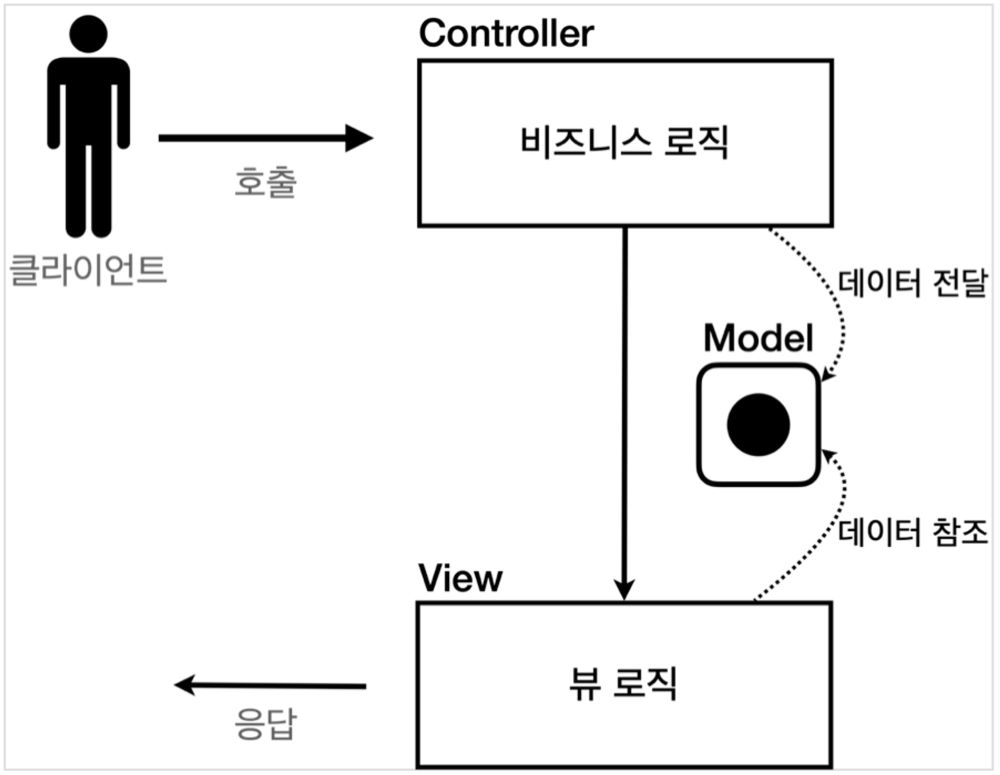
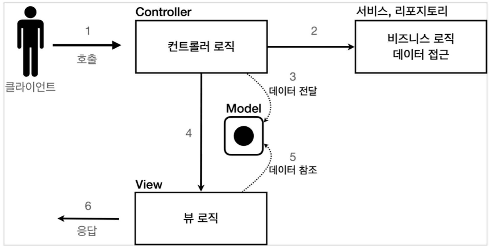

# 서블릿,JSP,MVC패턴

## 요구사항

회원 정보

+ 이름: username
+ 나이: age

기능 요구사항

+ 회원 저장
+ 회원 목록 조회

### Member - 회원 도메인 모델

```java
package hello.servlet.domain.member;

import lombok.Getter;
import lombok.Setter;

@Getter
@Setter
public class Member {
    private Long id;
    private String username;
    private int age;

    public Member() {
    }

    public Member(String username, int age) {
        this.username = username;
        this.age = age;
    }
}
```

### MemberRepository - 회원 도메인 저장소

```java
package hello.servlet.domain.member;

import java.util.ArrayList;
import java.util.HashMap;
import java.util.List;
import java.util.Map;

/**
 * 동시성 문제가 고려되지 않고 있으며, 실무에서는 ConcurrentHashMap, AtomicLong 사용을 고려하자.
 */
public class MemberRepository {
    private Map<Long, Member> store = new HashMap<>();
    private static long sequence = 0L;

    private static final MemberRepository instance = new MemberRepository();

    public static MemberRepository getInstance() {
        return instance;
    }

    //싱글톤 패턴은 객체를 단 하나만 생생해서 공유해야 하므로 생성자를 private 접근자로 막아둔다.
    private MemberRepository() {
    }

    public Member save(Member member) {
        member.setId(++sequence);
        store.put(member.getId(), member);

        return member;
    }

    public Member findById(Long id) {
        return store.get(id);
    }

    public List<Member> findAll() {
        return new ArrayList<>(store.values());
    }

    public void clearStore() {
        store.clear();
    }
}
```

+ 싱글톤 패턴을 적용해여 서블릿 컨테이너에서 하나의 저장소만 동작한다.
+ 싱글톤은 기본생성자의 접근제어자를 private로 하여 추가 생성을 막아준다.

### MemberRepositoryTest

```java
package hello.servlet.domain.member;

import org.junit.jupiter.api.AfterEach;
import org.junit.jupiter.api.Test;

import java.util.List;

import static org.assertj.core.api.Assertions.*;

class MemberRepositoryTest {
    MemberRepository memberRepository = MemberRepository.getInstance();

    @AfterEach
    void afterEach() {
        memberRepository.clearStore();
    }

    @Test
    void save() {
        //given
        Member member = new Member("hello", 20);
        //when
        Member savedMember = memberRepository.save(member);
        //then
        Member findMember = memberRepository.findById(savedMember.getId());
        assertThat(findMember).isEqualTo(savedMember);
    }

    @Test
    void findAll() {
        //given
        Member member1 = new Member("member1", 20);
        Member member2 = new Member("member2", 30);
        memberRepository.save(member1);
        memberRepository.save(member2);
        //when
        List<Member> result = memberRepository.findAll();
        //then
        assertThat(result.size()).isEqualTo(2);
        assertThat(result).contains(member1, member2);
    }
}
```

+ 회원을 저장하고 목록을 조회하는 테스트를 작성
+ 각 테스트가 끝날 때, 다음 테스트에 영향을 주지 않도록 각 테스트의 저장소를 `@AfterEach` 를 통해 clearStore() 를 호출

## 서블릿으로 회원 관리 웹 애플리케이션 만들기

### MemberFormServlet - 회원 가입

```java
package hello.servlet.web.servlet;

import hello.servlet.domain.member.MemberRepository;

import javax.servlet.ServletException;
import javax.servlet.annotation.WebServlet;
import javax.servlet.http.HttpServlet;
import javax.servlet.http.HttpServletRequest;
import javax.servlet.http.HttpServletResponse;
import java.io.IOException;
import java.io.PrintWriter;

@WebServlet(name = "memberFormServlet", urlPatterns = "/servlet/members/new-form")
public class MemberFormServlet extends HttpServlet {

    private MemberRepository memberRepository = MemberRepository.getInstance();

    @Override
    protected void service(HttpServletRequest request, HttpServletResponse response) throws ServletException, IOException {

        response.setContentType("text/html");
        response.setCharacterEncoding("utf-8");

        PrintWriter w = response.getWriter();
        w.write("<!DOCTYPE html>\n" +
                "<html>\n" +
                "<head>\n" +
                "    <meta charset=\"UTF-8\">\n" +
                "    <title>Title</title>\n" +
                "</head>\n" +
                "<body>\n" +
                "<form action=\"/servlet/members/save\" method=\"post\">\n" +
                "    username: <input type=\"text\" name=\"username\" />\n" +
                "    age:      <input type=\"text\" name=\"age\" />\n" +
                "    <button type=\"submit\">전송</button>\n" +
                "</form>\n" +
                "</body>\n" +
                "</html>\n");
    }
}
```

+ 회원 가입을 위한 폼을 동적으로 생성하여 반환하는 서블릿
+ 폼 양식을 살펴보면 /servlet/members/save 경로로 POST HTML Form 방식으로 전달한다.
+ MemberFormServlet 은 단순하게 회원 정보를 입력할 수 있는 HTML Form을 만들어서 응답한다. 자바 코드로 HTML을 제공해야 하므로 쉽지 않은 작업

### MemberSaveServlet - 회원 저장

```java
package hello.servlet.web.servlet;

import hello.servlet.domain.member.Member;
import hello.servlet.domain.member.MemberRepository;

import javax.servlet.ServletException;
import javax.servlet.annotation.WebServlet;
import javax.servlet.http.HttpServlet;
import javax.servlet.http.HttpServletRequest;
import javax.servlet.http.HttpServletResponse;
import java.io.IOException;
import java.io.PrintWriter;

@WebServlet(name = "memberSaveServlet", urlPatterns = "/servlet/members/save")
public class MemberSaveServlet extends HttpServlet {
    private MemberRepository memberRepository = MemberRepository.getInstance();

    @Override
    protected void service(HttpServletRequest request, HttpServletResponse response) throws ServletException, IOException {
        String username = request.getParameter("username");
        int age = Integer.parseInt(request.getParameter("age"));

        Member member = new Member(username, age);
        Member savedMember = memberRepository.save(member);

        response.setContentType("text/html");
        response.setCharacterEncoding("utf-8");

        PrintWriter w = response.getWriter();
        w.write("<html>\n" +
                "<head>\n" +
                " <meta charset=\"UTF-8\">\n" + "</head>\n" +
                "<body>\n" +
                "성공\n" +
                "<ul>\n" +
                "    <li>id=" + member.getId() + "</li>\n" +
                "    <li>username=" + member.getUsername() + "</li>\n" +
                " <li>age=" + member.getAge() + "</li>\n" + "</ul>\n" +
                "<a href=\"/index.html\">메인</a>\n" + "</body>\n" +
                "</html>");
    }
}
```

MemberSaveServlet 은 다음 순서로 동작한다.

1. 파라미터를 조회(getParameter)해서 Member 객체를 만든다.
2. Member 객체를 MemberRepository를 통해서 저장한다.
3. Member 객체를 사용해서 결과 화면용 HTML을 동적으로 만들어서 응답한다.

### MemberListServlet - 회원 목록

```java
package hello.servlet.web.servlet;

import hello.servlet.domain.member.Member;
import hello.servlet.domain.member.MemberRepository;

import javax.servlet.ServletException;
import javax.servlet.annotation.WebServlet;
import javax.servlet.http.HttpServlet;
import javax.servlet.http.HttpServletRequest;
import javax.servlet.http.HttpServletResponse;
import java.io.IOException;
import java.io.PrintWriter;
import java.util.List;

@WebServlet(name = "memberListServlet", urlPatterns = "/servlet/members")
public class MemberListServlet extends HttpServlet {
    private MemberRepository memberRepository = MemberRepository.getInstance();

    @Override
    protected void service(HttpServletRequest request, HttpServletResponse response) throws ServletException, IOException {
        List<Member> members = memberRepository.findAll();

        response.setContentType("text/html");
        response.setCharacterEncoding("utf-8");

        PrintWriter w = response.getWriter();
        w.write("<!DOCTYPE html>");
        w.write("<html lang=\"en\">");
        w.write("<head>");
        w.write("    <meta charset=\"UTF-8\">");
        w.write("    <title>Title</title>");
        w.write("</head>");
        w.write("<body>");
        w.write("<a href=\"/index.html\">메인</a>");
        w.write("<ul>");
        w.write("    <table>");
        w.write("        <thead>");
        w.write("        <th>id</th>");
        w.write("        <th>username</th>");
        w.write("        <th>age</th>");
        w.write("        </thead>");
        w.write("        <tbody>");
        w.write("        ");
        for (Member member : members) {
            w.write("<tr>");
            w.write("<td>" + member.getId() + "</td>");
            w.write("<td>" + member.getUsername() + "</td>");
            w.write("<td>" + member.getAge() + "</td>");
            w.write("</tr>");
        }
        w.write("        </tbody>");
        w.write("    </table>");
        w.write("</ul>");
        w.write("</body>");
        w.write("</html>");
    }
}
```

MemberListServlet 은 다음 순서로 동작한다.

1. `memberRepository.findAll()` 을 통해 모든 회원을 조회한다.
2. 회원 목록 HTML을 for 루프를 통해서 회원 수 만큼 동적으로 생성하고 응답한다.

### 템플릿 엔진으로

> 코드에서 보듯이 서블릿과 자바 코드만으로 HTML을 만드는것은 매우 복잡하고 비효율 적이다. 자바 코드로 HTML을 만들어 내는 것 보다
> 차라리 HTML 문서에 동적으로 변경해야 하는 부분만 자바 코드를 넣을 수 있다면 더 편리할 것이다.
> 이것이 바로 `템플릿 엔진`이 나온 이유이다. 템플릿 엔진을 사용하면 HTML 문서에서 필요한 곳만 코드를
> 적용해서 동적으로 변경할 수 있다. 템플릿 엔진에는 JSP, Thymeleaf, Freemarker, Velocity등이 있다

### 서블릿과 JSP의 한계

> 서블릿으로 개발할 때는 뷰(View)화면을 위한 HTML을 만드는 작업이 자바 코드에 섞여서 지저분하고
> 복잡했다.

> JSP는 뷰를 생성하는 HTML 작업을 깔끔하게 가져가고, 중간중간 동적으로 변경이 필요한
> 부분에만 자바 코드를 적용했다.

그런데 이렇게 해도 해결되지 않는 몇가지 고민이 남는다.

코드를 잘 보면, JAVA 코드, 데이터를 조회하는 리포지토리 등등 다양한 코드가 모두 JSP에 노출되어 있다.
JSP가 너무 많은 역할을 한다고 볼 수 있다.

## MVC 패턴 - 개요

+ 하나의 서블릿이나 JSP 만으로 비즈니스 로직과 뷰 렌더링까지 모두 처리하게 되면, `너무 많은 역할`을 하게되고, 결과적으로 유지보수가 어려워 진다.

+ 가장 큰 문제는 둘 사이에 변경의 라이프 사이클이 다르다는 점이다. UI를 수정하는 일과 비즈니스 로직을 수정하는 일은
  각각 다르게 발생할 가능성이 높고 서로에게 영향을 주지 않는다.

> 이렇게 변경의 라이프 사이클이 다른 부분을 하나의 코드로 관리하는 것은 유지보수하기 좋지 않다.

+ 기능 특화

> JSP 같은 뷰 템플릿은 화면을 렌더링 하는데 최적화 되어 있기 때문에 이 부분의 업무만 담당하는 것이 가장 효과적이다.

### Model View Controller

MVC 패턴은 지금까지 학습한 것 처럼 하나의 서블릿이나, JSP로 처리하던 것을 컨트롤러(Controller)와
뷰(View)라는 영역으로 서로 역할을 나눈 것을 말한다. 웹 애플리케이션은 보통 이 MVC 패턴을 사용한다.

+ `컨트롤러`: HTTP 요청을 받아서 파라미터를 검증하고, 비즈니스 로직을 실행한다. 그리고 뷰에 전달할 결과
  데이터를 조회해서 모델에 담는다.
+ `모델`: 뷰에 출력할 데이터를 담아둔다. 뷰가 필요한 데이터를 모두 모델에 담아서 전달해주는 덕분에 뷰는
  비즈니스 로직이나 데이터 접근을 몰라도 되고, 화면을 렌더링 하는 일에 집중할 수 있다.
+ `뷰`: 모델에 담겨있는 데이터를 사용해서 화면을 그리는 일에 집중한다. 여기서는 HTML을 생성하는 부분을
  말한다.

### MVC 패턴 1



고객이 요청하면 컨트롤러에서 비즈니스 로직을 수행하고 모델에 데이터를 담아서 뷰 로직으로 넘겨주면 뷰 로직(JSP)이 모델의 데이터를 참조해서 뷰를 그리는 것이다.

### MVC 패턴 2



MVC 패턴 1 처럼 하게되면 컨트롤러에서 너무 많은 책임이 부가된다. 그렇기에 일반적으로 비즈니스 로직은 서비스 계층(Service Layer)을 따로 만들어 처리한다.

## MVC패턴 - 적용

### MvcMemberFormServlet - 회원 등록 서블릿

```java
package hello.servlet.web.servletmvc;

import javax.servlet.RequestDispatcher;
import javax.servlet.ServletException;
import javax.servlet.annotation.WebServlet;
import javax.servlet.http.HttpServlet;
import javax.servlet.http.HttpServletRequest;
import javax.servlet.http.HttpServletResponse;
import java.io.IOException;

@WebServlet(name = "mvcMemberFormServlet", urlPatterns = "/servlet-mvc/members/new-form")
public class MvcMemberFormServlet extends HttpServlet {

    @Override
    protected void service(HttpServletRequest request, HttpServletResponse response) throws ServletException, IOException {
        String viewPath = "/WEB-INF/views/new-form.jsp";

        RequestDispatcher dispatcher = request.getRequestDispatcher(viewPath);
        dispatcher.forward(request, response);
    }
}
```

+ `dispatcher.forward()` : 다른 서블릿이나 JSP로 이동할 수 있는 기능이다. 서버 내부에서 다시 호출이
  발생한다.

참고 : `/WEB-INF`
> 이 경로안에 JSP가 있으면 외부에서 직접 JSP를 호출할 수 없다. 우리가 기대하는 것은 항상 컨트롤러를 통해서 JSP를 호출하는 것

참고: redirect vs forward
> 리다이렉트는 실제 클라이언트(웹)에 응답이 나갔다가, 클라이언트가 redirect경로로 다시 요청한다. 그렇기에 클라이언트가 인지 할 수 있고, URL경로도 실제로 변경된다. 반면 포워드의 경우 서버 내부에서
> 일어나는 호출이기 때문에 클라이언트가 인지할 수 없다. 


### new-form.jsp - 회원 등록 뷰 
회원 등록 JSP 페이지 구현  
생성 경로 main/webapp/WEB-INF/views/new-form.jsp  
```html
<%@ page contentType="text/html;charset=UTF-8" language="java" %>
<html>
<head>
    <title>Title</title>
</head>
<body>
<form action="save" method="post">
    username: <input type="text" name="username"/>
    age: <input type="text" name="age"/>
    <button type="submit">전송</button>
</form>
</body>
</html>
```
form의 action을 보면 절대 경로( / 로 시작)가 아니라 상대경로( / 로 시작X)인 것을 확인할 수
있다. 이렇게 상대경로를 사용하면 폼 전송시 현재 URL이 속한 계층 경로 + save가 호출된다.  
현재 계층 경로: `/servlet-mvc/members/`  
결과: `/servlet-mvc/members/save` 


### MvcMemberSaveServlet - 회원 저장 서블릿 
```java
package hello.servlet.web.servletmvc;

import hello.servlet.domain.member.Member;
import hello.servlet.domain.member.MemberRepository;

import javax.servlet.RequestDispatcher;
import javax.servlet.ServletException;
import javax.servlet.annotation.WebServlet;
import javax.servlet.http.HttpServlet;
import javax.servlet.http.HttpServletRequest;
import javax.servlet.http.HttpServletResponse;
import java.io.IOException;

@WebServlet(name = "mvcMemberSaveServlet", urlPatterns = "/servlet-mvc/members/save")
public class MvcMemberSaveServlet extends HttpServlet {

    private MemberRepository memberRepository = MemberRepository.getInstance();

    @Override
    protected void service(HttpServletRequest request, HttpServletResponse response) throws ServletException, IOException {
        String username = request.getParameter("username");
        int age = Integer.parseInt(request.getParameter("age"));

        Member member = new Member(username, age);
        Member savedMember = memberRepository.save(member);

        //Model에 데이터 보관
        request.setAttribute("member", member);

        String viewPath = "/WEB-INF/views/save-result.jsp";
        RequestDispatcher dispatcher = request.getRequestDispatcher(viewPath);
        dispatcher.forward(request, response);
    }
}
```
+ HttpServletRequest를 Model로 사용한다.
+ request가 제공하는 setAttribute() 를 사용하면 request 객체에 데이터를 보관해서 뷰에 전달할 수 있다.
+ 뷰는 request.getAttribute() 를 사용해서 데이터를 꺼내면 된다.


### MvcMemberListServlet - 회원 목록 조회
```java
package hello.servlet.web.servletmvc;

import hello.servlet.domain.member.Member;
import hello.servlet.domain.member.MemberRepository;

import javax.servlet.RequestDispatcher;
import javax.servlet.ServletException;
import javax.servlet.annotation.WebServlet;
import javax.servlet.http.HttpServlet;
import javax.servlet.http.HttpServletRequest;
import javax.servlet.http.HttpServletResponse;
import java.io.IOException;
import java.util.List;

@WebServlet(name = "mvcMemberListServlet", urlPatterns = "/servlet-mvc/members")
public class MvcMemberListServlet extends HttpServlet {
    private MemberRepository memberRepository = MemberRepository.getInstance();

    @Override
    protected void service(HttpServletRequest request, HttpServletResponse response) throws ServletException, IOException {
        List<Member> members = memberRepository.findAll();

        request.setAttribute("members", members);

        String viewPath = "/WEB-INF/views/members.jsp";
        RequestDispatcher dispatcher = request.getRequestDispatcher(viewPath);
        dispatcher.forward(request, response);
    }
}
```
+ request 객체를 사용해서 List<Member> members 를 모델에 보관했다.


## MVC 패턴 - 한계
MVC 패턴을 적용한 덕분에 컨트롤러의 역할과 뷰를 렌더링 하는 역할을 명확하게 구분할 수 있다.
그렇지만 컨트롤러는 딱 봐도 중복이 많고, 필요하지 않는 코드들도 많이 보인다.

### MVC 컨트롤러의 단점

+ 포워드 중복  
View로 이동하는 코드가 항상 중복 호출되어야 한다. 물론 이 부분을 메서드로 공통화해도 되지만, 해당
메서드도 항상 직접 호출해야 한다.

```java
RequestDispatcher dispatcher = request.getRequestDispatcher(viewPath);
        dispatcher.forward(request, response);
```

+ ViewPath에 중복
```java
String viewPath = "/WEB-INF/views/new-form.jsp";
```

+ 사용하지 않는 코드  
  모든 서블릿에서 공통적으로 받는 매개변수와 forward를 통해 전달하는 인자값으로 request, response가 있다. 근데 이 중에서 response는 이번 예제에서는 사용하지 않는 경우가 더 많았다.
```java
void service(HttpServletRequest request, HttpServletResponse response){ ... }
```

+ 공통 처리의 어려움  
기능이 복잡해질 수 록 컨트롤러에서 공통으로 처리해야 하는 부분이 점점 더 많이 증가할 것이다.결과적으로 해당 메서드를 항상 호출해야 하고, 실수로 호출하지
  않으면 문제가 될 것이다. 그리고 호출하는 것 자체도 중복이다.


> 정리하면 공통 처리가 어렵다는 문제가 있다.

이 문제를 해결하려면 컨트롤러 호출 전에 먼저 공통 기능을 처리해야 한다.
`프론트 컨트롤러(Front Controller) 패턴` 을 도입하면 이런 문제를 깔끔하게 해결할 수 있다. (입구를 하나로!)


